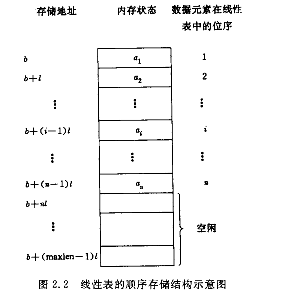

# 第二章 线性表
线性结构的特点是：在数据元素的非空有限集种，
1. 存在唯一的一个被称作第一个的数据元素。
2. 存在唯一的一个被称作最后一个的数据元素
3. 除第一个，每个数据元素都只有一个前驱。
4. 除最后一个，每个元素都只有一个后继

## 2.1 线性表的类型定义
线性表：n个数据元素的有限序列。

复杂的线性表：一个元素可以由若干**数据项**组成，这种情况下把数据元素成为**记录**，含有大量记录的线性表称为**文件**。

| 姓名   | 学号 | 性别 | 班级 | 年龄 | 健康状况 |
| ------ | ---- | ---- | ---- | ---- | -------- |
| 文铁铁 | 9527 | 男   | 12   | 23   | 良好     |

上述例子中，每个学生都是一个记录，每个记录中由6个数据项。类比数据库中的记录和字段，或js的对象组成的数组，每个对象是一个学生，数组是学生的集合，每个学生有几个不同的字段。

不同线性表中的元素可以是不同的，但是同一线性表中的元素必定是有相同的特性的。

##### 线性表的操作：

访问、插入、删除等

##### 抽象数据类型线性表

```
ADT List {
	数据对象：D
	数据关系：R
	基本操作： {
		InitList： 构造一个空的线性表
		DestoryList： List已存在，销毁list
		ClearList：List已存在，将List置为空
		ListEmpty：返回线性表是否为空
		ListLength：线性表的长度
		GetElement(i)：返回第i个元素
		...
	}
}
// 还可以进行更加复杂的操作，例如将两个或以上的线性表合并等
```

## 2.2 线性表的顺序表示和实现

**顺序表示**：用一组地址连续的存储单元依次存储线性表的数据元素。

假设每个元素占用`l`个存储单元，并以第一个单元的存储地址作为存储位置，则第`i`个和第`i+1`个元素的存储位置满足一下关系：
**<p style="text-align: center">LOC(a<sub>i+1</sub>)= LOC(a<sub>i</sub>) + l</p>**

**线性表存储结构示意如下：**
<div style="display: flex;justify-content: center;"></div>    
由于高级语言中数组类型有随机存取的特性，通常用数组描述数据结构中的顺序存储结构。

```c
#define LIST_INIT_SIZE 100 //线性表存储空间初始分配量
#define LISTINCREMENT 10 // 线性表的存储空间增量
typedef struct {
    ElemType *elem; // 空间分配地址
    int length; // 当前长度
    int listsize; // 容量
}SqList;
```

