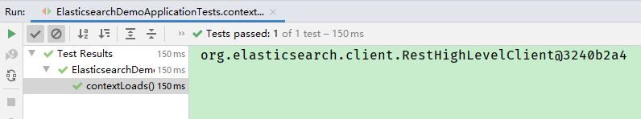
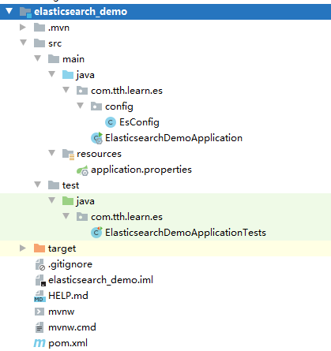

# 7 Java API 操作 es

> 官方文档

https://www.elastic.co/guide/en/elasticsearch/client/java-rest/7.8/java-rest-high.html

## 7.1 搭建Elasticsearch项目

### 7.1.1 创建elasticsearch_demo工程

使用SpringBoot创建elasticsearch_demo项目

### 7.1.2 编写pom.xml文件
```xml
<?xml version="1.0" encoding="UTF-8"?>
<project xmlns="http://maven.apache.org/POM/4.0.0" xmlns:xsi="http://www.w3.org/2001/XMLSchema-instance"
	xsi:schemaLocation="http://maven.apache.org/POM/4.0.0 https://maven.apache.org/xsd/maven-4.0.0.xsd">
	<modelVersion>4.0.0</modelVersion>
	<parent>
		<groupId>org.springframework.boot</groupId>
		<artifactId>spring-boot-starter-parent</artifactId>
		<version>2.4.4</version>
		<relativePath/> <!-- lookup parent from repository -->
	</parent>
	<groupId>com.tth.learn</groupId>
	<artifactId>elasticsearch_demo</artifactId>
	<version>0.0.1-SNAPSHOT</version>
	<name>elasticsearch_demo</name>
	<description>Elasticsearch Demo project for Spring Boot</description>
	<properties>
		<java.version>8</java.version>
		<fastjson.version>1.2.83</fastjson.version>
	</properties>
	<dependencies>

		<!--elasticsearch依赖-->
		<dependency>
			<groupId>org.springframework.boot</groupId>
			<artifactId>spring-boot-starter-data-elasticsearch</artifactId>
		</dependency>

		<!--测试依赖-->
		<dependency>
			<groupId>org.springframework.boot</groupId>
			<artifactId>spring-boot-starter-test</artifactId>
			<scope>test</scope>
		</dependency>

		<!--配置注解执行器：当执行类中已经定义了对象和该对象的字段后，在配置文件中对该类赋值时，便会非常方便的弹出提示信息-->
		<dependency>
			<groupId>org.springframework.boot</groupId>
			<artifactId>spring-boot-configuration-processor</artifactId>
		</dependency>

		<dependency>
			<groupId>com.alibaba</groupId>
			<artifactId>fastjson</artifactId>
			<version>${fastjson.version}</version>
		</dependency>

		<dependency>
			<groupId>org.projectlombok</groupId>
			<artifactId>lombok</artifactId>
		</dependency>
	</dependencies>

	<build>
		<plugins>
			<plugin>
				<groupId>org.springframework.boot</groupId>
				<artifactId>spring-boot-maven-plugin</artifactId>
			</plugin>
		</plugins>
	</build>

</project>
```

### 7.1.3 编写配置文件application.properties

```properties
elasticsearch.host=localhost
elasticsearch.port=9200
elasticsearch.scheme=http
```

### 7.1.4 创建Elasticsearch配置类

```java
@Configuration
public class EsConfig extends AbstractElasticsearchConfiguration {
    @Value(value = "${elasticsearch.host}")
    private String host;

    @Value(value = "${elasticsearch.port}")
    private Integer port;

    @Value(value = "${elasticsearch.scheme}")
    private String scheme;


    @Override
    public RestHighLevelClient elasticsearchClient() {
        RestHighLevelClient client = new RestHighLevelClient(RestClient.builder(new HttpHost(host, port, scheme)));
        return client;
    }
}
```

### 7.1.5 创建测试类

```java
/**
 * springboot2.4.0之后spring-boot-starter-test去掉了Junit4，改为支持Junit5。
 * Junit5使用@ExtendWith(SpringExtension.class)表明运行环境，
 * 而Junit4使用@RunWith(SpringRunner.class)表明运行环境。
 */
@ExtendWith(SpringExtension.class)
@SpringBootTest
class ElasticsearchDemoApplicationTests {

	@Qualifier("elasticsearchClient")
	@Autowired
	RestHighLevelClient restHighLevelClient;

	@Test
	void contextLoads() {
		System.out.println(restHighLevelClient);
	}

}
```

>测试方法测试结果：



### 7.1.6 项目结构

