# Spring5源码
# 1、Spring框架概念

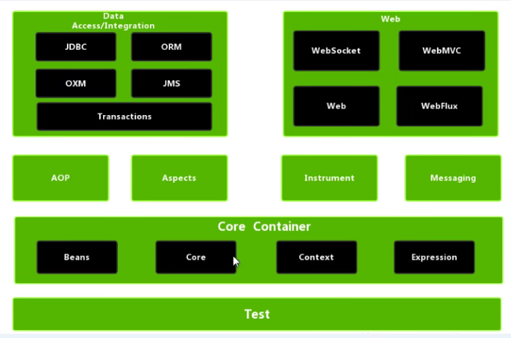

# 2、IOC概念与原理

## 2.1 什么是IOC

- IOC即控制反转，把对象创建和对象之间的调用过程，交给Spring进行挂你
- 使用IOC的目的：降低耦合度

## 2.2 IOC底层原理

IOC底层主要用到xml解析、工厂模式、反射来实现

## 2.3IOC接口

- IOC思想基于IOC容器完成，IOC容器底层就是对象工厂

- Spring为IOC容器的实现提供了两种方式（即两个接口）：

  - BeanFactory：是Spring框架最核心的接口，提供了高级IOC的配置机制。一般来说，BeanFactory被称为IOC容器。

  - ApplicationContext：建立在BeanFactory基础之上，提供了更多面向应用的功能。他提供了国际化支持和框架事件体系，更易于创建实际应用。一般来说，ApplicationContext被称为应用上下文，有时也直接称为Spring容器。

    > 总结

    BeanFactory是Spring框架的基础设施， 面向Spring本身；ApplicationContext面向使用Spring框架的开发者，几乎所有的应用场合都可以直接使用ApplicationContext而非BeanFactory。此外，BeanFactory创建对象过程中（默认情况下），在加载配置文件这一步骤，是不会创建对象的，只有在获取对象/使用对象的时候才去创建；但是ApplicationContext是在加载配置文件的时候就会把在配置文件中的对象创建出来。

## 2.4 IOC操作Bean

- 什么是Bean管理？

  答：Bean管理指的是两个操作：创建对象和注入属性

- Bean管理操作的两种实现方式？

  答：基于xml配置文件方式实现、基于注解方式实现

- 什么是DI？

  答：DI即依赖注入，就是注入属性。是在使用xml创建对象时，给属性赋值用到的。DI是IOC的一个具体体现。在Spring中支持两种注入方式，一个是使用set方法注入，另一个是使用有参构造注入。

## 2.5XML管理Bean

### 2.5.1 set方法注入属性（字符串/基本数据类型）

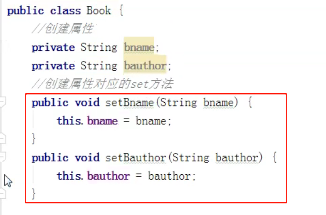
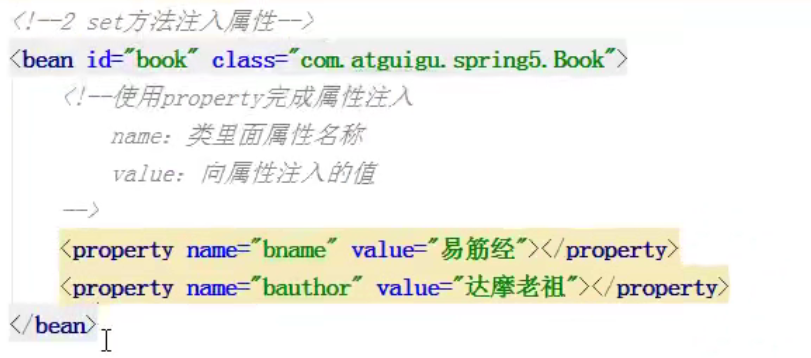

### 2.5.2 有参构造注入属性（字符串/基本数据类型）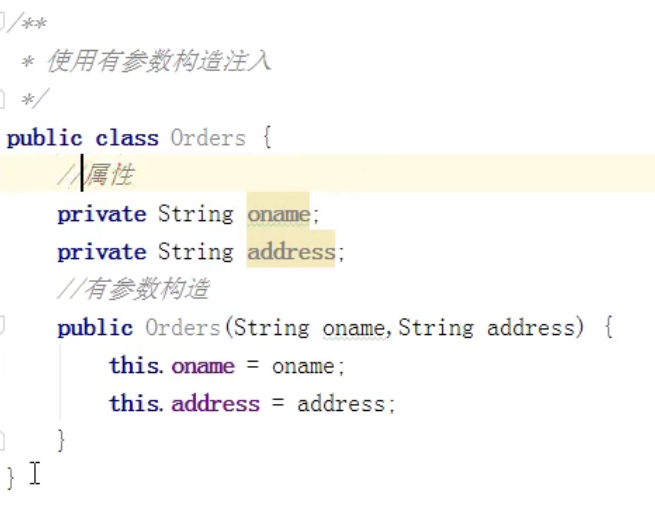

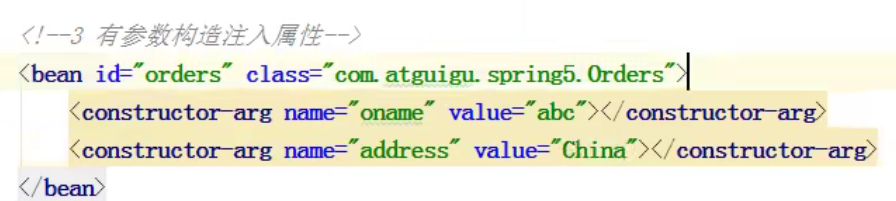

### 2.5.3 p名称空间注入（字符串/基本数据类型）

可以简化基于xml配置方式。

==其实底层还是基于set方法实现的。==

Step1.添加p名称空间

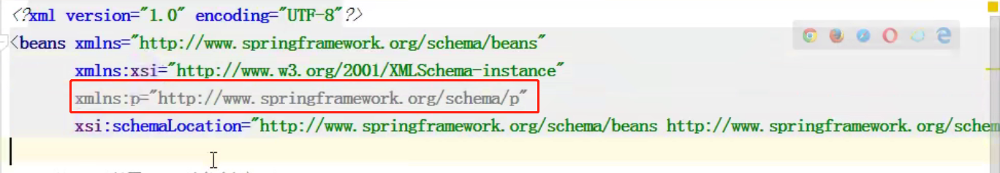

Step2.在bean标签中进行属性注入

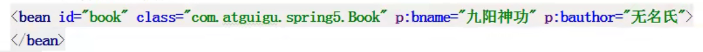

### 2.5.4 xml注入其他类型属性

#### 2.5.4.1 注入null

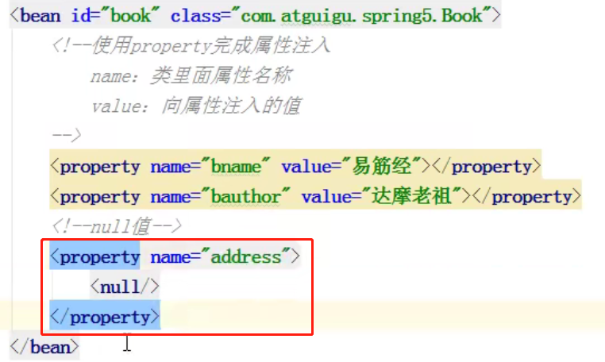

#### 2.5.4.2 属性值包含特殊符号

 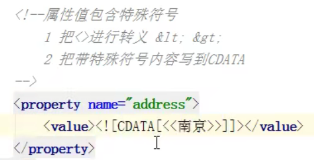

#### 2.5.4.3 注入外部bean

比如说serviceImpl调用dao中的方法。

Step1.在serviceImpl中创建Dao类型属性，并生成set方法

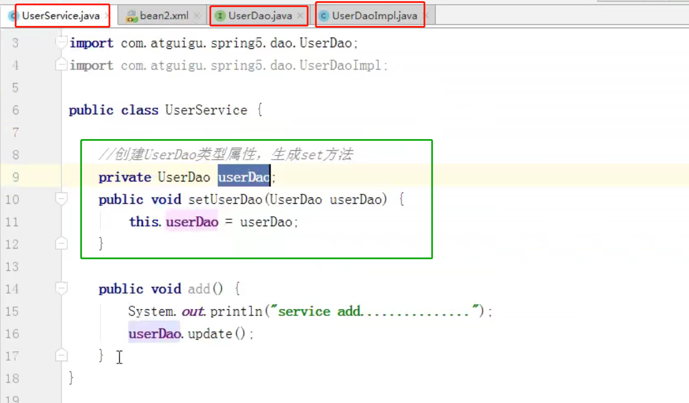

Step2.在xml中配置serviceImpl和daoImpl

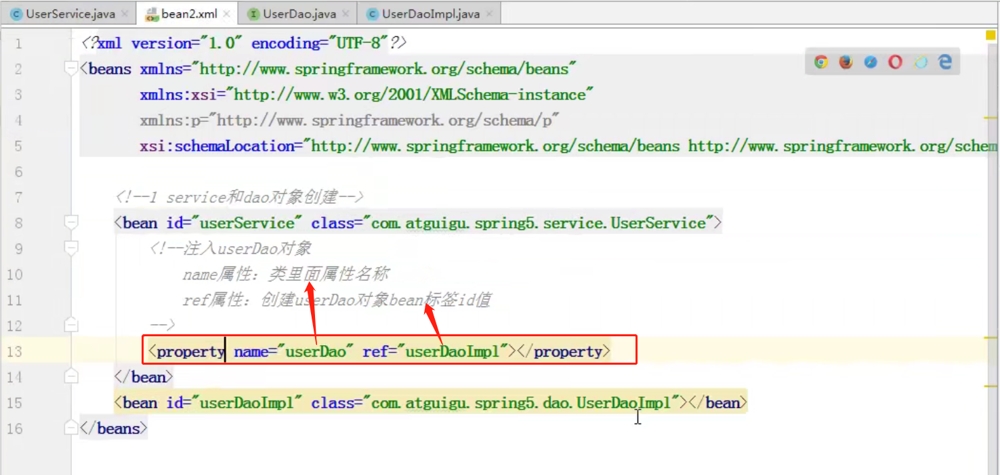

#### 2.5.4.4 注入内部bean

> 数据库表一对多关系：部门和员工

一个部门可以有多个员工，一个员工只属于一个部门。

Step1.部门和员工实体类

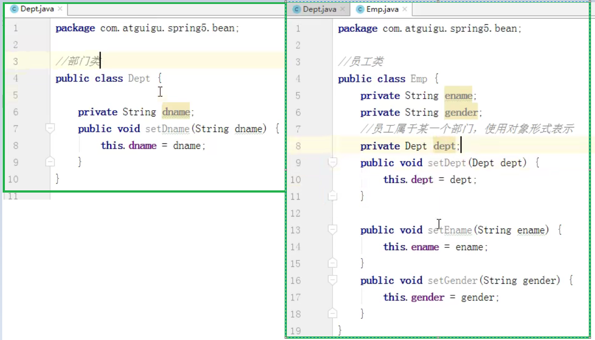

Step2.在xml中配置Emp和Dept

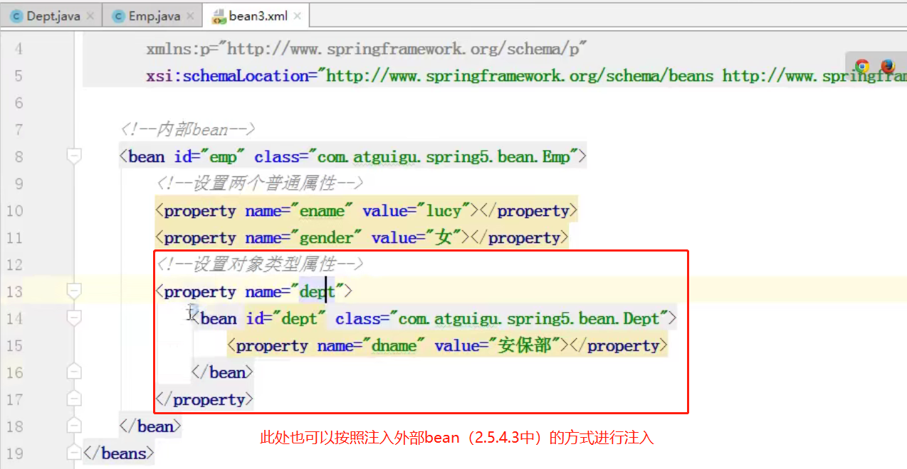

#### 2.5.4.5 级联赋值

第一种写法：

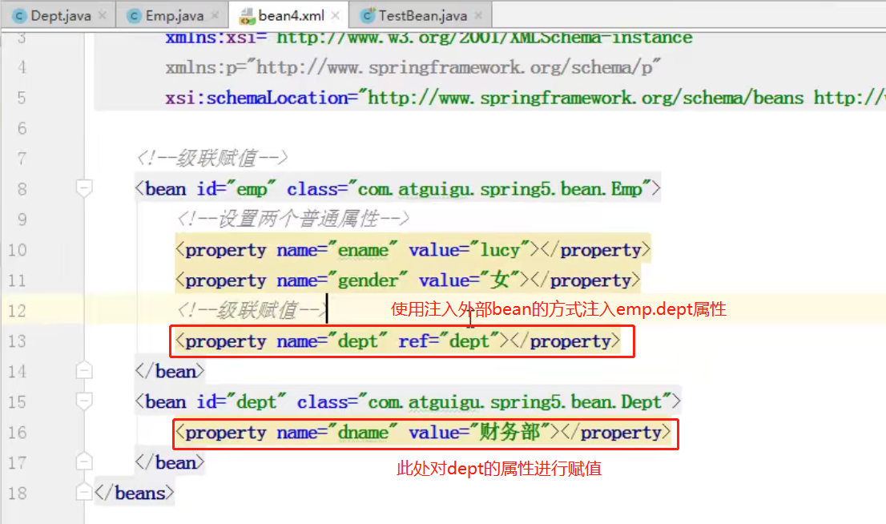

第二种写法：

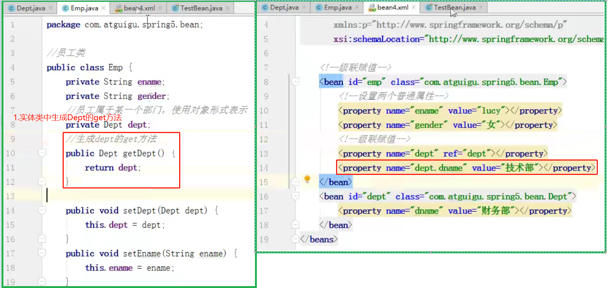

==级联赋值和注入外部bean的区别：==级联赋值比注入外部bean多了个给外部bean赋值的操作。

#### 2.5.4.6 注入简单集合类型属性

- Stu类

  ```java
  package com.tth.spring5learn.collectiontype;
  
  import java.util.Arrays;
  import java.util.List;
  import java.util.Map;
  import java.util.Set;
  
  public class Stu {
      // 1.数组类型的属性
      private String[] courses;
      // 2.List集合类型的属性
      private List<String> list;
      // 3.map集合类型的属性
      private Map<String, Object> map;
      // 4.set集合类型的属性
      private Set<String> set;
      // 5.集合中的元素是对象类型
      private List<Course> courseList;
  
      public void setCourseList(List<Course> courseList) {
          this.courseList = courseList;
      }
  
      public void setCourses(String[] courses) {
          this.courses = courses;
      }
  
      public void setList(List<String> list) {
          this.list = list;
      }
  
      public void setMap(Map<String, Object> map) {
          this.map = map;
      }
  
      public void setSet(Set<String> set) {
          this.set = set;
      }
  
      public void test() {
          System.out.println(Arrays.toString(courses));
          System.out.println(list);
          System.out.println(map);
          System.out.println(set);
          System.out.println(courseList);
      }
  }
  
  ```

- Course类

  ```java
  package com.tth.spring5learn.collectiontype;
  
  public class Course {
  
      private String cname;
  
      public void setCname(String cname) {
          this.cname = cname;
      }
  
      @Override
      public String toString() {
          return "Course{" +
                  "cname='" + cname + '\'' +
                  '}';
      }
  }
  ```

- bean1.xml

  ```xml
  <?xml version="1.0" encoding="UTF-8"?>
  <beans xmlns="http://www.springframework.org/schema/beans"
         xmlns:xsi="http://www.w3.org/2001/XMLSchema-instance"
         xsi:schemaLocation="http://www.springframework.org/schema/beans http://www.springframework.org/schema/beans/spring-beans.xsd">
  
      <bean id="stu" class="com.tth.spring5learn.collectiontype.Stu">
          <!-- 数组类型属性注入 -->
          <property name="courses">
              <array>
                  <value>java课程</value>
                  <value>mysql课程</value>
              </array>
          </property>
  
          <!-- list类型属性注入 -->
          <property name="list">
              <list>
                  <value>8点-10点上java课</value>
                  <value>14点-16点上mysql课</value>
              </list>
          </property>
  
          <!-- map类型属性注入 -->
          <property name="map">
              <map>
                  <entry key="早饭" value="粥"></entry>
                  <entry key="午饭" value="面"></entry>
                  <entry key="晚饭" value="盖饭"></entry>
              </map>
          </property>
  
          <!-- set类型属性注入 -->
          <property name="set">
              <set>
                  <value>跑步</value>
                  <value>跳绳</value>
              </set>
          </property>
  
          <!-- 对象型集合 -->
          <property name="courseList">
              <list>
                  <ref bean="course1"></ref>
                  <ref bean="course2"></ref>
              </list>
          </property>
      </bean>
  
      <!-- 创建多个course对象 -->
      <bean id="course1" class="com.tth.spring5learn.collectiontype.Course">
          <property name="cname" value="Spring5框架"></property>
      </bean>
      <bean id="course2" class="com.tth.spring5learn.collectiontype.Course">
          <property name="cname" value="Mybatis框架"></property>
      </bean>
  </beans>
  ```

> list 的提取

- Book类

  ```java
  package com.tth.spring5learn.collectiontype;
  
  import java.util.List;
  
  public class Book {
      private List<String> list;
  
      public void setList(List<String> list) {
          this.list = list;
      }
  
      public void test() {
          System.out.println(list);
      }
  }
  ```

- bean.xml

  ```xml
  <?xml version="1.0" encoding="UTF-8"?>
  <beans xmlns="http://www.springframework.org/schema/beans"
         xmlns:xsi="http://www.w3.org/2001/XMLSchema-instance"
         xmlns:util="http://www.springframework.org/schema/util"
         xsi:schemaLocation="http://www.springframework.org/schema/beans http://www.springframework.org/schema/beans/spring-beans.xsd
                             http://www.springframework.org/schema/util http://www.springframework.org/schema/util/spring-util.xsd">
  
      <!-- 1.提取list集合类型属性注入 -->
      <util:list id="bookList">
          <value>图书1</value>
          <value>图书2</value>
          <value>图书3</value>
      </util:list>
  
      <!-- 2.提取的list集合类型属性的使用-->
      <bean id="book" class="com.tth.spring5learn.collectiontype.Book">
          <property name="list" ref="bookList"></property>
      </bean>
  </beans>
  ```

## 2.6 FactoryBean

> 普通bean和FactoryBean的区别：

- 普通bean：在配置文件（xml文件）中定义的bean类型就是返回类型

  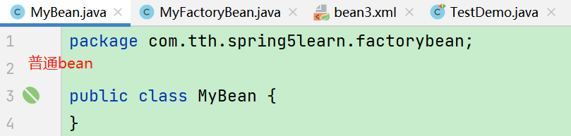

  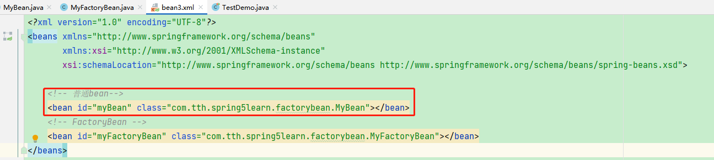

  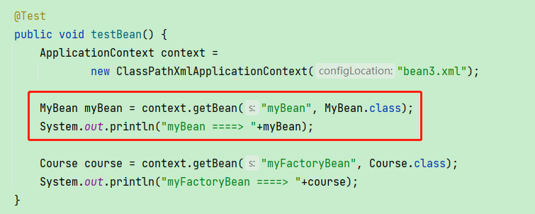

- FactoryBean：在配置文件（xml文件）中定义的bean类型可以和返回类型不一样

  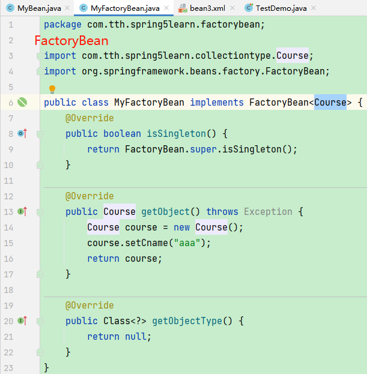

  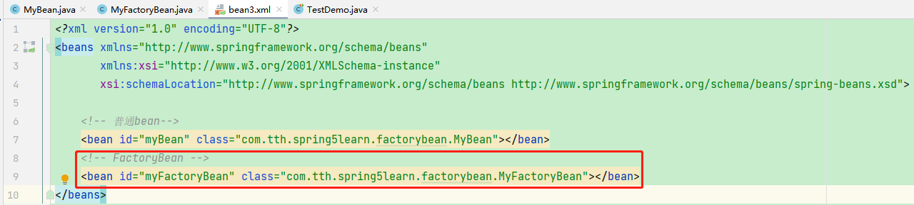

  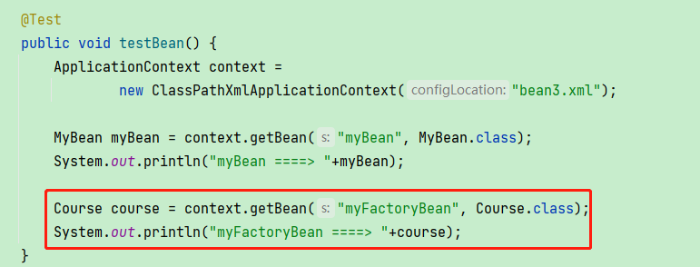

