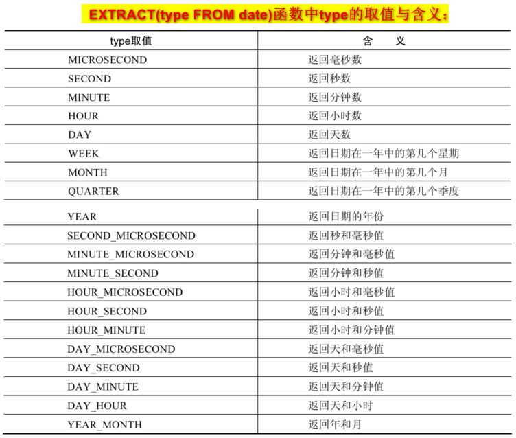
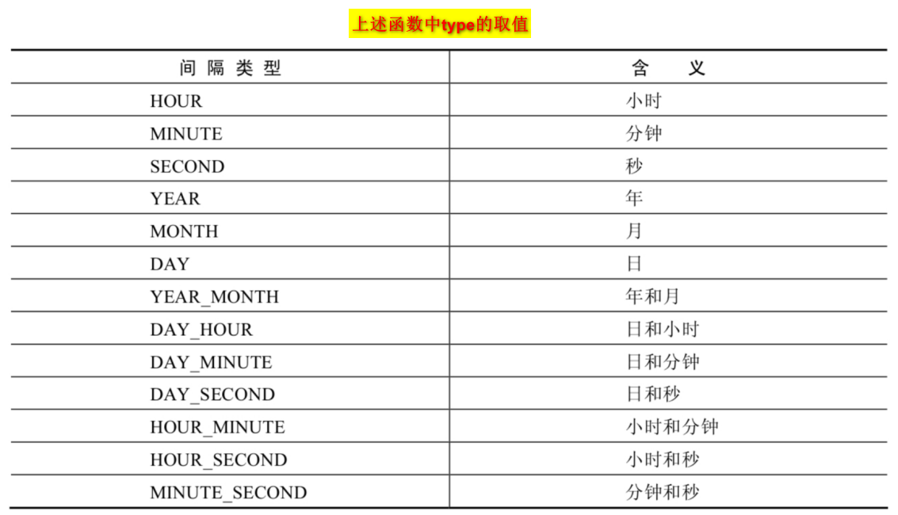
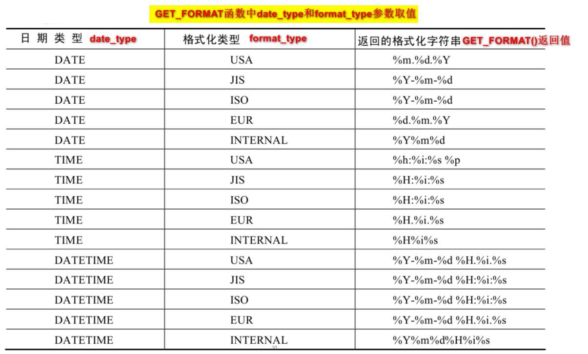

# MySQL学习之基础篇

## 1 MySQL数据库概述

==MySQL是一个开源的、关系型数据库==

### 1.1 为什么要使用数据库

- 持久化(persistence)：把数据保存到可掉电式存储设备中以供之后使用。大多数情况下，特别是企 业级应用，数据持久化意味着将内存中的数据保存到硬盘上加以”固化”，而持久化的实现过程大多 通过各种关系数据库来完成。
- 持久化的主要作用是将内存中的数据存储在关系型数据库中，当然也可以存储在磁盘文件、XML数 据文件中。

### 1.2 数据库相关概念

- ==DB==：`数据库`（Database） 即存储数据的“仓库”，其本质是一个文件系统。它保存了一系列有组织的数据。
- ==DBMS==：数据库管理系统（Database Management System） 是一种操纵和管理数据库的大型软件，用于建立、使用和维护数据库，对数据库进行统一管理和控 制。用户通过数据库管理系统访问数据库中表内的数据。
- ==SQL==：结构化查询语言（Structured Query Language） 专门用来与数据库通信的语言。

### 1.3 SQL分类

SQL语言在**功能**上主要分为如下3大类：

- `DDL`：数据定义语言。这些语句定义了不同的数据库、表、视图、索 引等数据库对象，还可以用来创建、删除、修改数据库和数据表的结构。

  主要的语句关键字包括 **CREATE** 、 **DROP** 、 **ALTER**、**TURNCATE** 等。 

- `DML`：数据操作语言。用于添加、删除、更新和查询数据库记 录，并检查数据完整性。 

  主要的语句关键字包括 **INSERT** 、 **DELETE** 、 **UPDATE** 、 **SELECT** 等。 SELECT是SQL语言的基础，最为重要。

- `DCL`：数据控制语言。用于定义数据库、表、字段、用户的访问权限和 安全级别。 

  主要的语句关键字包括 **GRANT** （赋予权限）、 **REVOKE**（回收权限）、 **COMMIT** 、 **ROLLBACK** 、 **SAVEPOINT** 等。

### 1.4 MySQL特点

- 开放源代码，使用成本低。 
- 性能卓越，服务稳定。 
- 软件体积小，使用简单，并且易于维护。
- 历史悠久，社区用户非常活跃，遇到问题可以寻求帮助。 
- 许多互联网公司在用，经过了时间的验证。

### 1.5 Oracle vs MySQL

- Oracle 更适合大型跨国企业的使用，因为他们对费用不敏感，但是对性能要求以及安全性有更高的要 求。 
- MySQL 由于其体积小、速度快、总体拥有成本低，可处理上千万条记录的大型数据库，尤其是开放源码 这一特点，使得很多互联网公司、中小型网站选择了MySQL作为网站数据库

## 2 关系型数据库与非关系型数据库

### 2.1 关系型数据库RDBMS

> 定义

关系型数据库模型是把复杂的数据结构归结为简单的 二元关系 （即二维表格形式）。

- 关系型数据库以 **行(row)** 和 **列(column)** 的形式存储数据，以便于用户理解。这一系列的行和列被称为 **表(table)** ，一组表组成了一个**库(database)**。
- 表与表之间的数据记录有**关系(relationship)**。现实世界中的各种实体以及实体之间的各种联系均用 **关系模型** 来表示。**关系型数据库**，就是建立在关系模型基础上的数据库

> 优势

- **复杂查询**： 可以用SQL语句方便的在一个表以及多个表之间做非常复杂的数据查询。
- **事务支持**： 使得对于安全性能很高的数据访问要求得以实现。

### 2.2 非关系型数据库NoSQL

> 定义

**非关系型数据库**，可看成传统关系型数据库的功能 **阉割版本** ，基于键值对存储数据，不需要经过SQL层 的解析， **性能非常高** 。同时，通过减少不常用的功能，进一步提高性能。

> 分类

- **键值型数据库**
  - 定义：键值型数据库通过 Key-Value 键值的方式来存储数据，其中 Key 和 Value 可以是简单的对象，也可以是复杂的对象。Key 作为唯一的标识符
  - 优点：查找速度快
  - 缺点：无法 像关系型数据库一样使用条件过滤（比如 WHERE），如果你不知道去哪里找数据，就要遍历所有的键， 这就会消耗大量的计算
  - 使用场景：内存缓存
  - 举例：Redis
- **文档型数据库**
  - 定义：在数据库中文档作为处理信息的基本单位， 一个文档就相当于一条记录。文档数据库所存放的文档，就相当于键值数据库所存放的“值”。
  - 使用场景：存放并获取文档，可以是XML、JSON等格式
  - 举例：MongoDB
- **搜索引擎数据库**
  - 定义：搜索引擎数据库是应用在搜索引擎领域的数据存储形式，由于搜索引擎会爬取大量的数据，并以特定的格式进行存储，这样在检 索的时候才能保证性能最优
  - 使用场景：搜索引擎领域
  - 举例：Solr、Elasticsearch、Splunk
- **列式数据库**
  - 定义：列式数据库是将数据按照列存储到数据库中
  - 优点：可以大量降低系统的 I/O
  - 缺点：功能相对行式数据库有限
  - 使用场景：分布式文件系统
  - 举例：HBase
- **图形数据库**：
  - 定义：是一种存储图形关系的数据库。它利用了图这种数据结构存储了实体（对象） 之间的关系
  - 优点：能高效地解决复杂的关系问题
  - 使用场景：存储复杂的实体关系，如社交网络中人与人的关系
  - 举例：Neo4J、InfoGrid

## 3 关系型数据库设计原则

> 前言

- 关系型数据库的典型数据结构就是 **数据表** ，这些数据表的组成都是**结构化的（Structured）**。 
- 将数据放到表中，表再放到库中。 
- 一个数据库中可以有多个表，每个表都有一个名字，用来标识自己。
- 表名具有唯一性。 表具有一些特性，这些特性定义了数据在表中如何存储，类似Java和Python中 “类”的设计。

### 3.1 表、记录、字段

- **E-R**（entity-relationship，实体-联系）模型中有三个主要概念是： `实体集` 、 `属性` 、 `联系集 `。 
- 一个实体集（class）对应于数据库中的一个**表（table**），一个实体（instance）则对应于数据库表 中的一**行（row）**，也称为一条**记录（record）**。一个属性（attribute）对应于数据库表中的一**列 （column）**，也称为一个**字段（field）**。
- ORM思想 (Object Relational Mapping)体现： 
  - 数据库中的一个表 <---> Java或Python中的一个类 
  - 表中的一条数据 <---> 类中的一个对象（或实例） 
  - 表中的一个列 <----> 类中的一个字段、属性(field)

### 3.2 表的关联关系

> 概述

- 表与表之间的数据记录有关系(relationship)。现实世界中的各种实体以及实体之间的各种联系均用 关系模型来表示。 
- 分类：一对一关联、一对多关联、多对多关联、自我引用

> 一对一关联（one-to-one） 

- 在实际的开发中应用不多，因为一对一可以创建成一张表。 
- 举例：设计 `学生表` ：学号、姓名、手机号码、班级、系别、身份证号码、家庭住址、籍贯、紧急 联系人、... 
  - 拆为两个表：两个表的记录是一一对应关系。 
  - 基础信息表 （常用信息）：学号、姓名、手机号码、班级、系别 
  - 档案信息表 （不常用信息）：学号、身份证号码、家庭住址、籍贯、紧急联系人、...
- ==两种建表原则==： 
  - 外键唯一：主表的主键和从表的外键（唯一），形成主外键关系，外键唯一。 
  - 外键是主键：主表的主键和从表的主键，形成主外键关系。

> 一对多关系（one-to-many）

- 常见实例场景： 客户表和订单表 ， 分类表和商品表 ， 部门表和员工表 。 
- 举例： 员工表：编号、姓名、...、所属部门 部门表：编号、名称、简介 
- ==一对多建表原则==：在从表(多方)创建一个字段，字段作为外键指向主表(一方)的主键

> 多对多（many-to-many）

- 定义：要表示多对多关系，必须创建第三个表，该表通常称为 **联接表** ，它将多对多关系划分为两个一对多关 系。将这两个表的主键都插入到第三个表中。
- 举例：
  - 学生和课程（一个学生可以选多门课程，一个课程可以被多名学生选择）：学生表、课程表、学生选课信息表
  - 产品和订单（一个产品可以出现在多个订单中，一个订单可以有多个产品）：产品表、订单表、订单明细表

> 自我引用(Self reference)

- 举例：员工表中属性：员工编号，员工姓名，员工主管编号，...。其中员工主管编号就是员工主管的员工编号。表中字段指向了另一个字段。

## 4 MySQL的登录

### 4.1 服务的启动与停止

- 方式1：使用图形界面工具 

  - 步骤1：打开windows服务 
  - 步骤2：找到MySQL（点击鼠标右键）→ 启动或停止（点击） 

- 方式2：使用命令行工具（需要管理员权限） 

  ```sh
  # 启动 MySQL 服务命令：
  net start MySQL服务名
  # 停止 MySQL 服务命令：
  net stop MySQL服务名
  ```

### 4.2 使用命令行登录MySQL

> 登录MySQL

```sh
mysql -h主机名 -P端口号 -u用户名 -p密码
```

连接成功后，有关于MySQL Server服务版本的信息，还有第几次连接的id标识

> 查看MySQL Server服务版本信息

- 登录前：

  `c:\> mysql -V`或`c:\> mysql --version`

- 登录后

  `mysql> select version();`

> 退出登录

`exit`或`quit`

## 5 一些常用命令

### 5.1 查看所有的数据库

```mysql
show databases;
```

- “information_schema”是 MySQL 系统自带的数据库，主要保存 MySQL 数据库服务器的系统信息， 比如数据库的名称、数据表的名称、字段名称、存取权限、数据文件 所在的文件夹和系统使用的 文件夹，等等
- “performance_schema”是 MySQL 系统自带的数据库，可以用来监控 MySQL 的各类性能指标。
- “sys”数据库是 MySQL 系统自带的数据库，主要作用是以一种更容易被理解的方式展示 MySQL 数据 库服务器的各类性能指标，帮助系统管理员和开发人员监控 MySQL 的技术性能。
- “mysql”数据库保存了 MySQL 数据库服务器运行时需要的系统信息，比如数据文件夹、当前使用的 字符集、约束检查信息，等等

### 5.2 查看库、表的创建信息

```mysql
# 查看库的创建信息
show create database 库名;
# 查看表的创建信息
show create table 表名称;
```

### 5.3 显示表结构

`describe 表名`或`desc 表名`

```mysql
mysql> describe dw_project; #也可以使用d
+-------------+--------------+------+-----+---------+-------+
| Field       | Type         | Null | Key | Default | Extra |
+-------------+--------------+------+-----+---------+-------+
| id          | int          | NO   | PRI | NULL    |       |
| Source_Name | varchar(255) | YES  |     | NULL    |       |
| Fund_Usd    | varchar(100) | YES  |     | NULL    |       |
+-------------+--------------+------+-----+---------+-------+
3 rows in set (0.01 sec)
```

### 5.4 分页

`limit`

- 语法： `limit 位置偏移量, 行数`，其中位置偏移量可省（省略时表示从0开始）
- **limit字句必须放在select语句的最后！**
- ==MySQL8.0新特性==：`limit 行数 offset 位置偏移量` 和  `limit 位置偏移量, 行数`效果一致
- 使用limit的优点：
  - 减少表的网格传输量，提升查询效率。
  - 当知道返回结果只有1条时，就可以使用`limit 1`，这样不需扫描整张表，从而提升效率

### 5.5 多表查询


- `inner join ... on`或`join ... on`：内连接。`A inner join B ... on`表示取A和B的交集

- `left outer join ... on`或`left join ... on`：左外连接。`A left join B ... on`表示取所有满足条件的A中元素

- `right outer join ... on`或`right join ... on`：左外连接。`A right join B ... on`表示取所有满足条件的B中元素

- `union`或`union all`：合并查询结果。即将多条select的结果集组合成一个结果集。

  - `union`：返回两个查询结果集的并集，并**去除重复记录**。

  - `union all`：返回两个查询结果集的并集，**不去重，效率高**

    当明知道合并数据后的结果不存在重复数据，或者不需要去重的情况下，尽量使用`union all`。

- `natural join`：自然连接。==SQL99新特性==。会自动查询两张表中**所有同名的字段**，并对它们进行**等值连接**

  在SQL92标准中： 

  ```mysql
  SELECT employee_id,last_name,department_name
  FROM employees e 
  JOIN departments d ON e.`department_id` = d.`department_id` AND e.`manager_id` = d.`manager_id`;
  ```

  在 SQL99 中可以写成：

  ```mysql
  SELECT employee_id,last_name,department_name
  FROM employees e 
  NATURAL JOIN departments d;
  ```

- `join ... using(字段名)`：==SQL99新特性==。**指定数据表里的同名字段**进行**等值连接**，**只能配合join使用**。

  在SQL92标准中： 

  ```mysql
  SELECT employee_id,last_name,department_name
  FROM employees e 
  JOIN departments d ON e.`department_id` = d.`department_id`;
  ```

  在 SQL99 中可以写成：

  ```mysql
  SELECT employee_id,last_name,department_name
  FROM employees e 
  JOIN departments d USING (department_id);
  ```

> 注意

要**控制连接表的数量** 。多表连接就相当于嵌套 for 循环一样，非常消耗资源，会让 SQL 查询性能下 降得很严重，因此不要连接不必要的表。

阿里巴巴《Java开发手册》中，**超过三个表禁止 join**。

### 5.6 编码集设置

在**MySQL 8.0版本之前**，默认字符集为latin1，utf8字符集指向的是utf8mb3，如果没有修改编码，**会出现乱码问题**。但是从MySQL 8.0 开始，数据库的默认编码改为 utf8mb4，从而避免了乱码问题。因此，此处编码集设置是**针对MySQL5.7版本**。

> 问题再现

```mysql
mysql> INSERT INTO t_stu VALUES(1,'张三','男');
ERROR 1366 (HY000): Incorrect string value: '\xD5\xC5\xC8\xFD' for column 'sname' at
row 1
```

> 问题解决

- 步骤1：查看编码命令

  ```mysql
  show variables like 'character_%';
  show variables like 'collation_%';
  ```

- 步骤2：修改mysql的数据目录下的my.ini配置文件

  ```ini
  [mysql] #大概在63行左右，在其下添加
  ...
  default-character-set=utf8 #默认字符集
  [mysqld] # 大概在76行左右，在其下添加
  ...
  character-set-server=utf8
  collation-server=utf8_general_ci
  ```

- 步骤3：重启服务

- 步骤4：查看编码信息

  ```mysql
  mysql> show variables like 'character_%';
  +--------------------------+---------------------------------------------+
  | Variable_name            | Value                                       |
  +--------------------------+---------------------------------------------+
  | character_set_client     | utf8                                        |
  | character_set_connection | utf8                                        |
  | character_set_database   | utf8                                        |
  | character_set_filesystem | binary                                      |
  | character_set_results    | utf8                                        |
  | character_set_server     | utf8                                        |
  | character_set_system     | utf8                                        |
  | character_sets_dir       | D:\soft\mysql-8.0.23-winx64\share\charsets\ |
  +--------------------------+---------------------------------------------+
  8 rows in set, 1 warning (0.03 sec)
  
  mysql> show variables like 'collation_%';
  +----------------------+--------------------+
  | Variable_name        | Value              |
  +----------------------+--------------------+
  | collation_connection | utf8               |
  | collation_database   | utf8               |
  | collation_server     | utf8               |
  +----------------------+--------------------+
  ```

## 6 MySQL图形化管理工具

### 6.1 工具分类

- MySQL Workbench：MySQL 官方提供的图形化管理工具

  下载地址：https://dev.mysql.com/downloads/workbench/

- Navicat Preminum：

  下载地址：http://www.navicat.com/

- SQLyog：

  下载地 址：http://www.webyog.com/

### 6.2 常见问题

> Authentication plugin 'caching_sha2_password' cannot be loaded

有些图形界面工具，特别是旧版本的图形界面工具，在连接MySQL8时出现“Authentication plugin 'caching_sha2_password' cannot be loaded”错误。

`分析`:

出现这个原因是MySQL8之前的版本中加密规则是mysql_native_password，而在MySQL8之后，加密规则 是caching_sha2_password。

`解决`:

- 方法1：升级图形界面工具版本

- 方法2：把MySQL8 用户登录密码加密规则还原成mysql_native_password。

  ```mysql
  #使用mysql数据库
  USE mysql;
  #修改'root'@'localhost'用户的密码规则和密码
  ALTER USER 'root'@'localhost' IDENTIFIED WITH mysql_native_password BY '密码';
  #刷新权限
  FLUSH PRIVILEGES;
  ```

> root用户密码忘记--重置用户密码

- 通过任务管理器或者服务管理，关掉mysqld(服务进程) 

- 通过命令行+特殊参数开启mysqld mysqld -- defaults-file="D:\ProgramFiles\mysql\MySQLServer5.7Data\my.ini" --skip-grant-tables 。此时，mysqld服务进程已经打开。并且不需要权限检查 

- 另启动一 个客户端进行，通过mysql -uroot 无密码登陆服务器。 

- 修改密码

  ```mysql
  use mysql; 
  update user set authentication_string=password('新密码') where user='root' and Host='localhost'; 
  flush privileges;
  ```

- 重启mysql后，即可使用新密码登录root用户

## 6 运算符

### 6.1 算术运算符

==加 （+）、减（-）、乘（*）、除（/或DIV）和取模（%或MOD）==

> 加法与减法

- 整型 `+(-)` 整型 = 整型
- 整型 `+(-) `浮点型 = 浮点型
- `+`只表示数 值相加。如果遇到非数值类型，先尝试转成数值，如果转失败，就按0计算。（补充：MySQL 中字符串拼接要使用字符串函数CONCAT()实现）

> 乘法与除法

- 一个数 `*(/)` 整数1 = 原数
- 一个数 `*(/)`浮点数1 = 浮点数，且数值与原数相等
- 一个数 `/` 整数 = 浮点数
- 一个数 `/` 另一个数 = 浮点数，且当除不尽时，保留到小数点后4位
- 一个数 `/` 0 = null

### 6.2 比较运算符

比较运算符用来对表达式左边的操作数和右边的操作数进行比较，比较的**结果为真则返回1**，比较的**结果为假则返回0**，其他情况则返回NULL。

- `=`：判断等号两边的值、字符串或表达式是否相等

  - 如果等号两遍都为**字符串**，则MySQL会按照字符串进行比较，其**比较的是每个字符串中字符的ANSI编码是否相等**。 
  - 如果等号两边都是**整数**，则MySQL会按照整数来比较两个值的大小。 
  - 如果等号两边一个是整数，一个是字符串，则MySQL会将字符串转化为数字进行比较。 
  - 如果等号两边有一个为NULL，则比较结果为NULL

- `<=>`：安全等于运算符（<=>）与等于运算符（=）的作用是相似的，**唯一的区别**是`<=>`可 以用来**对NULL进行判断**。在两个操作数均为NULL时，其返回值为1；当一个操作数为NULL 时，其返回值为0。

- `<>`或`!=`：不等于运算符。

  - 不等于运算符不能判断NULL值。如果两边的值有任意一个为NULL， 或两边都为NULL，则结果为NULL

- `IS NULL`或`ISNULL(值)`：判断一个值是否为null

- `IS NOT NULL`：判断一个值是否不为null

- `LEAST(值1, 值2, ..., 值n)`：返回最小值

- `GREATEST(值1, 值2, ..., 值n)`：返回最大值

- `BETWEEN 值1 AND 值2`：判断一个值是否在闭区间[值1, 值2]之间

- `IN(值1, 值2, ..., 值n)`：判断一个值是否是（值1, 值2, ..., 值n）中的一个值

- `NOT IN(值1, 值2, ..., 值n)`：判断一个值是否不是（值1, 值2, ..., 值n）中的任意一个值

- `LIKE`：模糊匹配

  - 常和如下通配符配合使用：
    - `%`：匹配0个或多个字符
    - `_`：匹配单个字符

- `ESCAPE`：指定一个字符去替代转义字符("`\`")

  在mysql中，如果表中某个字段存储了一些特殊符号（如%、_等），在使用`LIKE`进行模糊查询时，需要对特殊字符进行转义。

  对特殊字符的转义有两种方法：①使用转义字符`\` ②使用关键字`ESCAPE`。使用方法如下

  ```mysql
  ### 查询名字带有%字符的用户---使用转义字符'\'
  -- % 转义前，%全查
  SELECT * FROM escape_test WHERE NAME LIKE CONCAT("%", "%", "%");
  -- % 转义后 只匹配含有%的
  SELECT * FROM escape_test WHERE NAME LIKE CONCAT("%", "\%", "%");
  
  
  ### 使用关键字escape
  ### 假设存在名字为 %a 和 %_ 两个的用户
  SELECT * FROM escape_test WHERE NAME LIKE "a%_" ESCAPE "a" ;    ### 查询到的结果包含 %a %_ 
  SELECT * FROM escape_test WHERE NAME LIKE "a%a" ESCAPE "a" ;    ### 查询到的结果只有 %a 
  SELECT * FROM escape_test WHERE NAME LIKE "a%a_" ESCAPE "a" ;   ### 查询到的结果只有：%_
  ```

- `REGEXP`：使用正则表达式来匹配字符串，语法格式`字符串 regexp 正则表达式`

  常用通配符如下：

  | 通配符          | 说明                                                         | 例子    | 匹配值示例                                 |
  | --------------- | ------------------------------------------------------------ | ------- | ------------------------------------------ |
  | `^`             | 匹配以该字符后面的字符**开头**的字符串                       | ^b      | <u>b</u>ig， <u>b</u>anana                 |
  | `$`             | 匹配以该字符前面的字符**结尾**的字符串                       | st$     | te<u>st</u>， persi<u>st</u>               |
  | `.`             | 匹配任何一个**单字符**                                       | b.t     | b<u>i</u>t， b<u>a</u>t                    |
  | `*`             | 匹配**零个或多个**在它**前面**的字符。<br>如果前面没有字符，表示匹配任何数量的任何字符串 | f*n     | fn， f<u>a</u>n，f<u>aa</u>n，f<u>abc</u>n |
  | `+`             | 匹配**1次或多次**在它**前面**的字符                          | ba+     | ba，bay，bare，battle                      |
  | `<字符串>`      | 匹配**包含指定字符串**的文本                                 | \<fa\>  | <u>fa</u>n， a<u>fa</u>，aaa<u>fa</u>bbb   |
  | `[字符串集合]`  | 匹配字符串集合中**任意一个字符**。<br/>可以使用一 个`-`表明命名字符的范围：<br/>`[a-z]`匹配任何字母,`[0-9]`匹配任何数字 | [xz]    | di<u>z</u><u>z</u>y，<u>x</u>-ray          |
  | `[^字符串集合]` | 匹配**不包含字符串集合中任意字符**的文本                     | [^abc]  | desk， k8s                                 |
  | `字符串{n,}`    | 匹配**至少n次**它**前面的字符串**                            | b{2}    | bb，bbb，bbbb，bbbbbbb                     |
  | `字符串{n,m}`   | 匹配**[n, m]次**它**前面的字符串**。<br>如果n为0，n可省      | b{2, 4} | bb，bbb，bbbb                              |

### 6.3 逻辑运算符

- `NOT`或`!`：逻辑非

  - 当给定的值为0时返回1；
  - 当给定的值为非0值时返回0； 
  - 当给定的值为NULL时，返回NULL

- `AND`或`&&`：逻辑与。

  - 当给定的所有值均为非0值，并且都不为NULL时，返回 1；
  - 当给定的一个值或者多个值为0时则返回0；
  - 否则返回NULL

- `OR`或`||`：逻辑或。

  - 当给定的值都不为NULL，并且任何一个值为非0值时，则返回1，否则返回0；
  - 当一个值为NULL，并且另一个值为非0值时，返回1，否则返回NULL；
  - 当两个值都为 NULL时，返回NULL

  ==`AND`的优先级高于`OR`==

- `XOR`：逻辑异或。

  - 当给定的值中任意一个是null时，返回null
  - 当两个非null的值都是0或者都不是0时，返回0
  - 当一个值为0，另一个不为0时，返回1

### 6.4 位运算符

- `&`：按位与。将给定值对应的二进制数进行逻辑与运算（逻辑与：两个二进制位都是1时返回1，其他返回0）。
- `|`：按位或。将给定值对应的二进制数进行逻辑或运算（逻辑或：两个二进制位全为0时返回0，其他返回1）。
- `^`：按位异或。将给定值对应的二进制数进行逻辑异或运算（逻辑异或：两个二进制位数值相同时返回1，否则返回0）。
- `~`：按位取反。将给定值对应的二进制数进行取反操作（取反：0变1，1变0）。
- `>>`：按位右移，语法`数值 >> 位数`。
- `<<`：按位左移，语法`数值 << 位数`。

## 7 函数

### 7.1 单行函数

#### 7.1.1 数值函数


| 函数                      | 用法                                                         |
| ------------------------- | ------------------------------------------------------------ |
| `SIGN(X) `                | 返回X的符号。正数返回1，负数返回-1，0返回0                   |
| `CEIL(x)`，`CEILING(x) `  | 对x向上取整                                                  |
| `FLOOR(x)`                | 对x向下取整                                                  |
| `LEAST(e1,e2,e3…)`        | 返回列表中的最小值                                           |
| `GREATEST(e1,e2,e3…) `    | 返回列表中的最大值                                           |
| `RAND() `                 | 返回0~1的随机数                                              |
| `RAND(x)`                 | 返回0~1的随机数。x是种子，相同的x值会产生相同的随机数        |
| `ROUND(x) `               | 对x四舍五入，得到一个整数                                    |
| `ROUND(x,y)`              | 对x进行四舍五入，并保留y位小数                               |
| `TRUNCATE(x,y) `          | 对x截断，保留y位小数                                         |
| `SQRT(x)`                 | 返回x的平方根。当X的值为负数时，返回NULL                     |
| `POW(x,y)`，`POWER(X,Y) ` | 返回x的y次方                                                 |
| `EXP(X) `                 | 返回e的x次方                                                 |
| `CONV(x,f1,f2) `          | 将x由f1进制数转为f2进制数。f1指明当前x是什么进制，f2指明想转成什么进制 |
| ...                       | ...                                                          |

#### 7.1.2 字符串函数

==MySQL中，字符串的位置是从1开始的==

| 函数                                                         | 用法                                                         |
| ------------------------------------------------------------ | ------------------------------------------------------------ |
| `CHAR_LENGTH(s) `,`与CHARACTER_LENGTH(s)`                    | 返回字符串s的字符数。                                        |
| `LENGTH(s)`                                                  | 返回字符串s的字节数，和字符集有关                            |
| `CONCAT(s1,s2,......,sn) `                                   | 连接s1,s2,......,sn为一个字符串                              |
| `CONCAT_WS(x, s1,s2,......,sn)`                              | 同CONCAT(s1,s2,...)函数，但是每个字符串之间要加上x           |
| `INSERT(str, idx, len, replacestr)`                          | 将字符串str从第idx位置开始，len个字符长的子串替换为字符串replacestr |
| `REPLACE(str, a, b)`                                         | 用字符串b替换字符串str中所有出现的字符串a                    |
| `UPPER(s)` ，` UCASE(s)`                                     | 将字符串s的所有字母转成大写字母                              |
| ` LOWER(s)` ，`LCASE(s)`                                     | 将字符串s的所有字母转成小写字母                              |
| `LEFT(str,n)`或`RIGHT(str,n)`                                | 返回字符串str最左边或最右边的n个字符                         |
| `LPAD(str, len, pad)`或`RPAD(str ,len, pad)`                 | 用字符串pad对str最左边或最右边进行填充，直到str的长度为len个字符 |
| `LTRIM(s)`或`RTRIM(s) `                                      | 去掉字符串s左侧或右的空格                                    |
| `TRIM(s)`                                                    | 去掉字符串s开始与结尾的空格                                  |
| `TRIM(s1 FROM s)`                                            | 去掉字符串s开始与结尾的s1                                    |
| `TRIM(LEADING s1 FROM s)`                                    | 去掉字符串s开始处的s1                                        |
| `TRIM(TRAILING s1 FROM s)`                                   | 去掉字符串s结尾处的s1                                        |
| `REPEAT(str, n)`                                             | 返回str重复n次的结果                                         |
| `SPACE(n)`                                                   | 返回n个空格                                                  |
| `STRCMP(s1,s2)`                                              | 比较字符串s1,s2的ASCII码值的大小                             |
| `SUBSTR(s,index,len)`,`SUBSTRING(s,n,len)`,`MID(s,n,len)`    | 返回从字符串s的index位置其len个字符                          |
| ` LOCATE(substr,str)`,`POSITION(substr IN str)`,`INSTR(str,substr)` | 返回字符串substr在字符串str中首次出现的位置。未找到，返回0   |
| `ELT(m,s1,s2,…,sn)`                                          | 返回指定位置的字符串。如 果m=n，则返回sn                     |
| `FIELD(s,s1,s2,…,sn) `                                       | 返回字符串s在字符串列表中第一次出现的位置                    |
| `FIND_IN_SET(s1,s2)`                                         | 返回字符串s1在字符串s2中出现的位置。其中，字符串s2是一个以逗号分 隔的字符串。完全匹配不是模糊匹配 |
| `REVERSE(s) `                                                | 反转s                                                        |
| `NULLIF(value1,value2)`                                      | 比较两个字符串，如果value1与value2相等，则返回NULL，否则返回 value1 |

#### 7.1.3 日期和时间

> 获取日期、时间

| 函数                                                         | 用法                            |
| ------------------------------------------------------------ | ------------------------------- |
| `CURDATE()` ，`CURRENT_DATE()`                               | 返回当前日期，只包含年、 月、日 |
| `CURTIME()` ，` CURRENT_TIME()`                              | 返回当前时间，只包含时、 分、秒 |
| `NOW()`,`SYSDATE()`,`CURRENT_TIMESTAMP()`, `LOCALTIME()`, `LOCALTIMESTAMP()` | 返回当前系统日期和时间          |

> 日期与时间戳的转换

| 函数                       | 用法                             |
| -------------------------- | -------------------------------- |
| `UNIX_TIMESTAMP()`         | 将当前时间以UNIX时间戳的形式返回 |
| `UNIX_TIMESTAMP(date)`     | 将时间date以UNIX时间戳的形式返回 |
| `FROM_UNIXTIME(timestamp)` | 将UNIX时间戳转换为普通格式的时间 |

> 日期的操作函数

| 函数                      | 用法                                                         |
| ------------------------- | ------------------------------------------------------------ |
| `EXTRACT(type FROM date)` | 返回指定日期中特定的部分，type指定返回的值，其取值与含义见下图 |

```mysql
mysql> SELECT now() curr, EXTRACT(MINUTE FROM NOW()) curr_minute, EXTRACT( WEEK FROM NOW()) curr_week, EXTRACT( QUARTER FROM NOW()) curr_quarter, EXTRACT( MINUTE_SECOND FROM NOW()) curr_minute_second;

+---------------------+-------------+-----------+--------------+--------------------+
| curr                | curr_minute | curr_week | curr_quarter | curr_minute_second |
+---------------------+-------------+-----------+--------------+--------------------+
| 2023-01-13 15:54:35 |          54 |         2 |            1 |               5435 |
+---------------------+-------------+-----------+--------------+--------------------+
1 row in set (0.00 sec)
```



> 计算日期和时间的函数--第1组

| 函数                                     | 用法                                                       |
| ---------------------------------------- | ---------------------------------------------------------- |
| `DATE_ADD(datetime, INTERVAL expr type)` | 在当前日期或时间上增加expr对应的时间（时间格式由type指定） |
| `DATE_SUB(datetime,INTERVAL expr type)`  | 在当前日期或时间上减去expr对应的时间（时间格式由type指定） |

```mysql
mysql> SELECT NOW() `now`,
    -> DATE_ADD(NOW(), INTERVAL 1 DAY) AS add_1_day,
    -> DATE_ADD(NOW(),INTERVAL 1 SECOND) AS add_1_second,
    -> DATE_ADD(NOW(),INTERVAL '1_1' MINUTE_SECOND) AS add_1_minute_1_second,
    -> DATE_ADD(NOW(), INTERVAL -1 YEAR) AS sub_1_year #可以是负数，相当于减
    -> ;
    
+---------------------+---------------------+---------------------+-----------------------+---------------------+
| now                 | add_1_day           | add_1_second        | add_1_minute_1_second | sub_1_year          |
+---------------------+---------------------+---------------------+-----------------------+---------------------+
| 2023-01-13 16:11:58 | 2023-01-14 16:11:58 | 2023-01-13 16:11:59 | 2023-01-13 16:12:59   | 2022-01-13 16:11:58 |
+---------------------+---------------------+---------------------+-----------------------+---------------------+
1 row in set (0.00 sec)
```



> 计算日期和时间的函数--第2组

| 函数                                            | 用法                                                         |
| ----------------------------------------------- | ------------------------------------------------------------ |
| `ADDTIME(time1,time2)`或`SUBTIME(time1,time2) ` | 返回time1加上或减掉time2后的时间。当time2为一个数字时，代表的是 **秒** ，可以为负数 |
| `DATEDIFF(date1,date2)`                         | 返回date1 - date2的日期间隔天数                              |
| ` TIMEDIFF(time1, time2)`                       | 返回time1 - time2的时间间隔                                  |
| `FROM_DAYS(N)`                                  | 返回从0000年1月1日起，N天以后的日期                          |
| ` TO_DAYS(date) `                               | 返回日期date距离0000年1月1日的天数                           |
| `LAST_DAY(date)`                                | 返回date所在月份的最后一天的日期                             |
| `MAKEDATE(year,n) `                             | 针对给定年份与所在年份中的天数返回一个日期                   |
| `MAKETIME(hour,minute,second)`                  | 将给定的小时、分钟和秒组合成时间并返回                       |
| `PERIOD_ADD(time,n)`                            | 返回time加上n个月后的时间。**其中time为YYMM或者YYYYMM**      |

```mysql
mysql> SELECT NOW() `now`,
    -> ADDTIME(NOW(),20) add_20_second,
    -> SUBTIME(NOW(),'1:1:3') sub_1h_1m_3s,
    -> DATEDIFF(NOW(),'2021-10-01') diff_date,
    -> TIMEDIFF(NOW(),'2021-10-25 22:10:10') diff_time
    -> ;
+---------------------+---------------------+---------------------+-----------+-----------+
| now                 | add_20_second       | sub_1h_1m_3s        | diff_date | diff_time |
+---------------------+---------------------+---------------------+-----------+-----------+
| 2023-01-13 16:36:13 | 2023-01-13 16:36:33 | 2023-01-13 15:35:10 |       469 | 838:59:59 |
+---------------------+---------------------+---------------------+-----------+-----------+
1 row in set, 1 warning (0.00 sec)

```

```mysql
mysql> SELECT NOW() `now`,
    -> FROM_DAYS(368) 368_date,
    -> TO_DAYS('0000-12-25') to_days,
    -> LAST_DAY(NOW()) curr_month_last_day,
    -> MAKEDATE(YEAR(NOW()),369) make_date,
    -> MAKETIME(52,21,23) make_time
    -> ;
+---------------------+------------+---------+---------------------+------------+-----------+
| now                 | 368_date   | to_days | curr_month_last_day | make_date  | make_time |
+---------------------+------------+---------+---------------------+------------+-----------+
| 2023-01-13 16:36:36 | 0001-01-03 |     359 | 2023-01-31          | 2024-01-04 | 52:21:23  |
+---------------------+------------+---------+---------------------+------------+-----------+
1 row in set (0.00 sec)
```

```mysql
mysql> SELECT PERIOD_ADD(201703, 5) ;
+-----------------------+
| PERIOD_ADD(201703, 5) |
+-----------------------+
|                201708 |
+-----------------------+
1 row in set (0.00 sec)
```

> 日期的格式化与解析

| 函数                                | 用法                                       |
| ----------------------------------- | ------------------------------------------ |
| `DATE_FORMAT(date,fmt)`             | 按照字符串fmt格式化日期date                |
| `TIME_FORMAT(time,fmt) `            | 按照字符串fmt格式化时间time                |
| `GET_FORMAT(date_type,format_type)` | 返回日期字符串的显示格式                   |
| `STR_TO_DATE(str, fmt)`             | 按照字符串fmt对str进行解析，解析为一个日期 |



#### 7.1.4 流程控制函数

| 函数                                                         | 用法                                             |
| ------------------------------------------------------------ | ------------------------------------------------ |
| `IF(value,value1,value2) `                                   | 如果value的值为TRUE，返回value1， 否则返回value2 |
| `IFNULL(value1, value2) `                                    | 如果value1不为NULL，返回value1，否 则返回value2  |
| `CASE WHEN 条件1 THEN 结果1 WHEN 条件2 THEN 结果2 .... [ELSE resultn] END` | 相当于Java的if...else if...else...               |
| `CASE expr WHEN 常量值1 THEN 值1 WHEN 常量值1 THEN 值1 .... [ELSE 值n] END` | 相当于Java的switch...case...                     |

#### 7.1.5 加密与解密函数

| 函数                           | 用法                                                         |
| ------------------------------ | ------------------------------------------------------------ |
| `PASSWORD(str) `               | 用户密码加密。加密结果**不可逆** ，常用于用户的密码加密 。==MySQL8.0中已移除该方法== |
| `MD5(str) `                    | MD5加密。若参数为 NULL，则会返回NULL                         |
| `SHA(str) `                    | SHA加密。当参数为 NULL时，返回NULL。 SHA加密算法比MD5更加安全 。 |
| `ENCODE(value,password_seed)`  | 返回使用password_seed作为加密密码**加密**value ==MySQL8.0中已移除该方法== |
| `DECODE(value,password_seed) ` | 返回使用password_seed作为加密密码**解密**value==MySQL8.0中已移除该方法== |

#### 7.1.6 MySQL信息函数

| 函数                                                         | 用法                                                      |
| ------------------------------------------------------------ | --------------------------------------------------------- |
| `VERSION() `                                                 | 返回当前MySQL的版本号                                     |
| `CONNECTION_ID() `                                           | 返回当前MySQL服务器的连接数                               |
| ` DATABASE()`，`SCHEMA()`                                    | 返回MySQL命令行当前所在的数据库                           |
| `USER()`，`CURRENT_USER()`、`SYSTEM_USER()`， `SESSION_USER()` | 返回当前连接MySQL的用户名，返回结果格式为 “主机名@用户名” |
| `CHARSET(value) `                                            | 返回字符串value自变量的字符集                             |
| `COLLATION(value)`                                           | 返回字符串value的比较规则                                 |

```mysql
mysql> SELECT CHARSET('ABC'), COLLATION('ABC');

+----------------+--------------------+
| CHARSET('ABC') | COLLATION('ABC')   |
+----------------+--------------------+
| utf8mb4        | utf8mb4_0900_ai_ci |
+----------------+--------------------+
1 row in set (0.00 sec)
```

#### 7.1.7 其他函数

| 函数                              | 用法                                                         |
| --------------------------------- | ------------------------------------------------------------ |
| `FORMAT(value,n)`                 | 返回对数字value进行格式化后的结果数据。n表示 **四舍五入** 后保留 到小数位数 |
| `INET_ATON(ipvalue)  `            | 将以点分隔的IP地址转化为一个数字                             |
| `INET_NTOA(value) `               | 将数字形式的IP地址转化为以点分隔的IP地址                     |
| `BENCHMARK(n,expr) `              | 将表达式expr重复执行n次。用于测试MySQL处理expr表达式所耗费的时间 |
| `CONVERT(value USING char_code) ` | 将value所使用的字符编码修改为char_code                       |

```mysql
SELECT CHARSET('mysql'), CHARSET(CONVERT('mysql' USING 'utf8'));

+------------------+----------------------------------------+
| CHARSET('mysql') | CHARSET(CONVERT('mysql' USING 'utf8')) |
+------------------+----------------------------------------+
| utf8mb4          | utf8                                   |
+------------------+----------------------------------------+
1 row in set, 1 warning (0.00 sec)
```

### 7.2 聚合函数

> 聚合函数类型

- `AVG()`：AVG(column)求column列的平均值。只能对**数值型数据**使用

- `SUM()`：SUM(column)求column列的和。只能对**数值型数据**使用

- `MAX()`：MAX(column)求column列的最大值。可以对**任意数据类型**的数据使用

- `MIN()`：MIN(column)求column列的最小值。可以对**任意数据类型**的数据使用

- `COUNT()`：返回表中记录总数。可以对**任意数据类型**的数据使用

  - ==用count(*)，count(1)，count(列名)谁好呢?==

    `答：`对于**MyISAM引擎**的表是没有区别的。这种引擎内部有一计数器在维护着行数。 **Innodb引擎**的表用count(*),count(1)直接读行数，复杂度是O(n)，因为innodb真的要去数一遍。但好于具体的count(列名)。

  - ==能不能使用count(列名)替换count(*)?==

    `答：`不要使用 count(列名)来替代 count(\*) 。**count(*)会统计值为 NULL 的行，而 count(列名)不会统计此列为 NULL 值的行**。

> 语法

==用在select子句中==

```mysql
SELECT column, 聚合函数(column)
FROM table
[WHERE condition]
[GROUP BY group_by_expression]
[ORDER BY column];
```

> 注意

- ==聚合函数不能嵌套使用==
- ==不能在where语句中使用聚合函数==

### 7.3 GROUP BY

> 语法

==用在where后order by前==

```mysql
SELECT column, group_function(column)
FROM table
[WHERE condition]
[GROUP BY group_by_expression]
[ORDER BY column];
```

> 注意事项

==在SELECT列表中所有未包含在组函数中的列都应该包含在 GROUP BY子句中==，但是包含在 GROUP BY 子句中的列不必包含在SELECT 列表中

> GROUP BY中使用WITH ROLLUP

- 使用 `WITH ROLLUP` 关键字之后，在所有查询出的分组记录之后**增加一条记录**，该记录用来求全部数据的sum、avg、count等
- 当使用ROLLUP时，不能同时使用ORDER BY子句进行结果排序，即**ROLLUP和ORDER BY是互相排斥 的**

```mysql
mysql> SELECT department_id, SUM(salary),AVG(salary),count(*)
    -> FROM employee
    -> GROUP BY department_id WITH ROLLUP;
    
+---------------+-------------+-------------+----------+
| department_id | SUM(salary) | AVG(salary) | count(*) |
+---------------+-------------+-------------+----------+
|             1 |    19600.00 | 9800.000000 |        2 |
|             2 |     3433.00 | 3433.000000 |        1 |
|          NULL |    23033.00 | 7677.666667 |        3 |
+---------------+-------------+-------------+----------+
3 rows in set (0.00 sec)
```

### 7.4 HAVING

> 作用

过滤分组

> 语法

- 使用时，确保行已被分组
- ==使用了聚合函数==
- ==和GROUP BY搭配使用，用在GROUP BY后order by前==

```mysql
SELECT column, group_function(column)
FROM table
[WHERE condition]
[GROUP BY group_by_expression]
[HAVING group_condition]
[ORDER BY column];
```

> 例子

```mysql
mysql> SELECT department_id, MAX(salary)
    -> FROM employee
    -> GROUP BY department_id
    -> HAVING MAX(salary) > 2222
    -> ORDER BY department_id desc;
    
    
+---------------+-------------+
| department_id | MAX(salary) |
+---------------+-------------+
|             2 |     3433.00 |
|             1 |    10000.00 |
+---------------+-------------+
2 rows in set (0.00 sec)
```

### 7.5 SELECT执行过程

> SELECT语句的结构

```mysql
SELECT ...,....,...
FROM ...[, ..., ...]
[INNER / LEFT / RIGHT] JOIN ... ON ...多表的连接条件
WHERE 不包含组函数的过滤条件 [AND / OR 不包含组函数的过滤条件]
GROUP BY ...,...
HAVING 包含组函数的过滤条件
ORDER BY ..., ..., ... ASC / DESC
LIMIT ...,...
```

> SELECT语句的执行顺序

FROM （---> ON ---> JOIN ）---> WHERE ---> GROUP BY ---> HAVING ---> SELECT ---> DISTINCT ---> ORDER BY ---> LIMIT

> SELECT执行原理

- **执行FROM子句**，生成虚拟表**vt1**。如果是多表联查，还会经历如下几个步骤：
  - 先**求两个表的笛卡尔积**，生成虚拟表**vt1.1**
  - **执行ON语句**，对表vt1的数据进行筛选，生成表**vt1.2**
  - 如果是外连接（左连接/右连接/全连接），则对表vt1.2**添加外部行**，生成虚拟表**vt1.3**
- **执行WHERE语句**，对FROM语句中生成的虚拟表进行筛选，生成虚拟表**vt2**
- **执行GROUP BY语句**，对表vt2中的数据进行分组，生成虚拟表**vt3**
- **执行HAVING语句**，对表vt3中的数据再次进行筛选，生成虚拟表**vt4**。==HAVING语句中可以使用SELECT语句中的列以及列的别名==
- **执行SELECT语句**，在表vt4中选取需要的列，生成虚拟表**vt5**。
- **执行DISTINCT语句**，对表vt5中的数据去重，生成虚拟表**vt6**。
- **执行ORDER BY语句**，对表vt6中的数据进行排序，生成虚拟表**vt7**。==ORDER BY语句中可以使用SELECT语句中的列以及列的别名==
- **执行LIMIT语句**，在表vt7中取出指定的行记录，生成虚拟表**vt8**。

## 8 子查询

### 8.1 概述

#### 8.1.1 定义与语法

> 定义

子查询是指一个查询语句嵌套在另外一个查询语句内部

> 语法

子查询可以在`SELECT`、`WHERE`、`HAVING`、`CASE` 语句中使用。基本语法如下

```mysql
SELECT ..., ..., ...
FROM ...
WHERE 表达式左侧内容 操作符 (子查询)
```

==说明如下：==

- 子查询的结果被主查询使用

==注意事项：==

- 子查询要包含在一对小括号内
- 将子查询放在比较条件的右侧 ===> 美观
- 单行操作符对应单行子查询，多行操作符对应多行子查询，此外，多行子查询中也可以单行操作符和多行操作符一起使用。

#### 8.1.2 子查询分类

> 分类方式1：==按照子查询的返回结果是一条和多条记录分==

- **单行子查询**：子查询的返回结果是一条记录
- **多行子查询**：子查询的返回结果是多条记录

> 分类方式2：==按照子查询的执行是否依赖主查询分==

- **相关子查询**：子查询的执行依赖外部情况，通常是指**子查询使用了外部的表，并进行了条件关联**。每执行一次外部查询，子查询都要重新计算一次。
- **不相关子查询**

### 8.2 单行子查询

#### 8.2.1 单行比较操作符

| 操作符 | 含义     |
| ------ | -------- |
| =      | 等于     |
| >      | 大于     |
| >=     | 大于等于 |
| <      | 小于     |
| <=     | 小于等于 |
| <>     | 不等于   |

#### 8.2.2 示例

```mysql
# 查询工资比公司平均工资高的员工的员工号，姓名和工资。
SELECT employee_id, last_name, salary
FROM employees
WHERE salary > (
                    SELECT AVG(salary)
                    FROM employees
                )
```

#### 8.2.3 其他说明

- 如果子查询的结果为空，主查询也不会报错
- 当子查询返回多行记录时，如果只使用单行比较操作符，会报错

### 8.2 多行子查询

#### 8.2.1 多行比较操作符

| 操作符 | 含义                                                         |
| ------ | ------------------------------------------------------------ |
| IN     | 等于列表中的**任意一个**                                     |
| ANY    | <u>需要和单行比较操作符一起使用</u>，和子查询返回的**某一个值**比较 |
| ALL    | <u>需要和单行比较操作符一起使用</u>，和子查询返回的**所有值**比较 |
| SOME   | 实际上是ANY的别名，作用相同，一般常使用ANY                   |

#### 8.2.2 示例

```mysql
# 选择工资大于所有JOB_ID = 'SA_MAN'的员工的工资的员工的last_name, job_id, salary
SELECT last_name, job_id, salary
FROM employees
WHERE salary > ALL (
                        SELECT salary
                        FROM employees
                        WHERE job_id = 'SA_MAN'
                    )
```

#### 8.2.3 其他说明

无

### 8.3 相关子查询

#### 8.3.1 概述

> 相关子查询与不相关子查询

相关子查询和不相关子查询的区别是，**相关子查询中的子查询使用了外部的表，并进行了条件关联**。

比如：查询员工工资高于**部门平均工资**的员工信息，是相关子查询；查询员工工资高于**公司平均工资**的员工信息，是不相关查询。

#### 8.3.2 示例

```mysql
# 查询员工中工资大于本部门平均工资的员工的last_name,salary和其department_id
SELECT last_name, salary, department_id
FROM employees o
WHERE department_id IS NOT NULL
AND salary > (
                SELECT AVG(salary)
                FROM employees i
                WHERE i.department_id = o.department_id
            ) 
							
```

#### 8.3.3 EXISTS 与 NOT EXISTS关键字

> 概述

相关子查询通常会和**EXISTS**操作符一起来使用，用来检查在子查询中是否存在满足条件的行：

- **如果当前查询不满足条件**，此时返回false，并继续在子查询中查找；
- **如果找到了满足条件的行**，此时返回true，结束查找

==注意：==EXISTS操作符后的子查询中SELECT语句中的列，不会返回，只会返回true或者false。具体说明见示例代码。

> 示例

```mysql
# 查询departments表中，不存在于employees表中的部门的department_id和department_name
SELECT d.department_id, d.department_name
FROM departments d
WHERE NOT EXISTS (
                    SELECT e.department_id 
                    FROM employees e
                    WHERE e.department_id = d.department_id
                ) 
```

如上**子查询**的` SELECT e.department_id `，也可以写成` SELECT * ` 、 ` SELECT 'x' `等。**只要满足子查询条件就会返回true，不会返回SELECT中的列**。

### 8.4 相关更新

#### 8.4.1 基本语法

```mysql
UPDATE 数据库表1 表别名1
SET column = (SELECT 字段名
FROM 数据库表2 表别名2
WHERE 表别名1.列名 = 表别名2.列名);
```

#### 8.4.2 示例

```mysql
# 在employees中增加一个department_name字段，数据为员工对应的部门名称
# 1）
ALTER TABLE employees ADD(department_name VARCHAR2(14));
# 2）
UPDATE employees e
SET department_name = (
    SELECT department_name
	FROM departments d
	WHERE e.department_id = d.department_id
);
```

### 8.5 相关删除

#### 8.5.1 基本语法

```mysql
DELETE FROM 数据库表1 表别名1
WHERE 列名 操作符 (
    SELECT expression
	FROM 数据库表2 表别名2
	WHERE 表别名1.列名 = 表别名2.列名
);
```

#### 8.5.2 示例

```mysql
# 删除表employees中，其与emp_history表皆有的数据
DELETE FROM employees e
WHERE employee_id in (
    SELECT employee_id
	FROM emp_history
	WHERE employee_id = e.employee_id
);
```

## 9 创建和管理数据库、数据库表

### 9.1 创建和管理数据库

#### 9.1.1 创建数据库

```mysql
CREATE DATABASE IF NOT EXISTS 数据库名 CHARACTER SET 'utf8mb4';
```

==说明==：

- **IF NOT EXISTS**，表示如果要创建的数据库不存在，才会创建成功。如果存在，不会创建，也不会报错。
- 如果不指明字符编码集CHARACTER，会使用数据库管理系统默认字符编码集

#### 9.1.2 修改数据库

**企业开发中一般不会修改。改的话，也是只能改字符集，数据库名无法修改。**

```mysql
# 更改数据库字符集
ALTER DATABASE 数据库名 CHARACTER SET 'gbk';
```

#### 9.1.3 删除数据库

```mysql
# 删除数据库（IF EXISTS：如果要删除的数据库存在，则删除成功。如果不存在，也不会报错）
DROP DATABASE IF EXISTS 数据库名;
```

#### 9.1.4 数据库其他操作

```mysql
# 查看当前连接中的所有数据库
SHOW DATABASES;

# 查看创建数据库的语句的结构
SHOW CREATE DATABASE 数据库名;

# 切换数据库
USE 数据库名;

# 查看当前数据库中所有的表
SHOW TABLES;

# 查看指定数据库中所有的表
SHOW TABLES FROM 数据库名;

# 查看当前使用的数据库
SELECT DATABASE();
```

### 9.2 创建和管理数据库表

#### 9.2.1 创建表

- 方式1：“白手起家”式

  ```mysql
  CREATE TABLE [IF NOT EXISTS] 表名(
  	字段1, 数据类型 [约束条件] [默认值],
      字段2, 数据类型 [约束条件] [默认值],
      字段3, 数据类型 [约束条件] [默认值],
      ……
      [表约束条件]
  );
  ```

  ==说明：==

  - **IF NOT EXISTS**，表示如果要创建的表不存在，才会创建成功。如果存在，不会创建，也不会报错。
  - 如果不指明字符编码集CHARACTER，会使用当前数据库默认的字符编码集

- 方式2：基于已有的表创建

  ```mysql
  CREATE TABLE 表名
  AS 
  SELECT 列名1, 列名2, 列名3, ...
  FROM 已存在的表名
  ```

  ==说明：==

  - 这种方式是基于已有的表创建，或者是基于已有的表经过一系列的查询出来的数据来创建。**AS**后边加上一个SELECT查询语句即可。查询语句中的列名或者列的别名就作为新表的列名。
  - 这种方式在创建表时，还会在新表中导入符合条件的数据。
  - 除了非空约束，其他约束不能被赋值过来

#### 9.2.2 修改表

**修改表指的是修改数据库中已经存在的数据表的结构**，分为如下4中情况：

- 添加新的列
- 修改已有的列
- 删除已有的列
- 重命名已有的列

实现以上功能的关键字，**ALTER TABLE**。

> 添加新的列

```mysql
ALTER TABLE 表名 ADD 字段名 字段类型 [约束条件] [字段位置： FIRST 或 AFTER 字段名];
```

==说明==：

- 关键字：**ALTER TABLE** 和 **ADD**
- 约束条件是可选的，用来对添加的字段进行约束。
- 字段位置，也是可选的。不同的值代表的意义如下：
  - `不写`：表示在表的末尾追加新的列
  - `FIRST`：在表的开头添加新的列
  - `AFTER 字段名`：在“字段名”**之后**插入新的列

> 修改已有的列

**修改列指的是修改列的字段类型、默认值、在表中的位置。**

```mysql
ALTER TABLE 表名 MODIFY 字段名1 字段类型 [DEFAULT 默认值][FIRST|AFTER 字段名2]
```

==说明：==

- 关键字：**ALTER TABLE** 和 **MODIFY**
- 默认值是可选的。
- 字段位置，也是可选的。不同的值代表的意义如下：
  - `不写`：表示还在原来位置不变
  - `FIRST`：表示将该列移到表的开头
  - `AFTER 字段名`：表示将该列移动到“字段名2”**之后**

> 重命名已有的列

```mysql
ALTER TABLE 表名 CHANGE 列名 新列名 新数据类型;
```

==说明：==

- 关键字：**ALTER TABLE** 和 **CHANGE**

> 删除已有的列

```mysql
ALTER TABLE 表名 DROP 列名
```

==说明：==

- 关键字：**ALTER TABLE** 和 **DROP**

#### 9.2.3 重命名表

- 方式1：**RENAME**

  ```mysql
  RENAME TABLE 表名 TO 新表名
  ```

- 方式2：**ALTER**

  ```mysql
  ALTER TABLE 表名 RENAME [TO] 新表名
  ```

#### 9.2.4 删除表

> 说明

- 当一张表**没有与其他任何数据表形成关联关系**时，才可删除
- 删除表时，所有正在运行的相关事务被提交
- 删除表时，所有相关索引被删除

> 语法

```mysql
DROP TABLE [IF EXISTS] 数据表1 [, 数据表2, …, 数据表n];
```

==说明：==

- **DROP TABLE 语句不能回滚！！！**删表前，做好备份工作。
- DROP之后，删除表数据、表结构，释放表空间

#### 9.2.5 清空表

> 语法

- 方式1：使用**TRUNCATE**

  ```mysql
  TRUNCATE 表名
  ```

- 方式2：使用不带WHERE的**DELETE**

  ```mysql
  DELETE FROM 表名
  ```

> DROP、DELETE和TRUNCATE的区别

- DROP会删掉表结构，DELETE和TRUNCATE是删除表数据，保留表结构
- DELETE是DML（数据库操作语言），TRUNCATE是DDL（数据库定义语言）。因此**DELETE可以回滚，TRUNCATE不可以回滚**
- **使用DELETE，删除数据后表空间还在**（在系统重启前，还可以恢复），**TRUNCATE是将数据和表空间都删除了**
- **DELETE可以操作table、view，TRUNCATE只能操作table**
- 如果表中id是自增型且步长为1，使用**delete**后，**新插入的数据的id会原数数据的id上继续累加**。使用**TRUNCATE**后，新**插入的数据的id会从1开始**

#### 9.2.7 DCL中的COMMIT和ROLLBACK

- ==COMMIT==：提交数据。一旦执行COMMIT，则数据就被永久的保存在了数据库中，意为着数据不可以回滚
- ==ROLLBACK==：回滚数据。一旦ROLLBACK，则可以实现数据的回滚。**回滚到最近的一次COMMIT之后**。

#### 9.2.8 DDL和DML的说明

- ① DDL的操作一旦执行，就不可以回滚。DDL操作执行完成后，会自动执行COMMIT操作，因此指令`SET autocommit= FALSE`对DML无效。
- ② DML的操作默认情况下，一旦执行，也是不可回滚。但是如果在执行DML之前，执行了`SET autocommit= FALSE`，则执行的DML操作就可以实现回滚

#### 9.2.9 表的其他操作

```mysql
# 查看表结构
DESC 表名;

# 查看创建表的语句结构
SHOW CREATE TABLE 表名;
```

#### 9.2.10 MySQL8.0新特性：DDL的原子化

> 概述

- 在MySQL 8.0版本中，**InnoDB**表的DDL支持事务完整性，即 `DDL操作要么成功要么回滚` 。
- DDL操作回滚日志写入到data dictionary数据字典表mysql.innodb_ddl_log（该表是隐藏的表，通过show tables无法看到）中，用于回滚操作。通过设置参数，可将DDL操作日志打印输出到MySQL错误日志中。
- 原子DDL操作这一特性，支持表相关操作，也支持非表相关操作。
  - **表相关操作：**drop、create、alter(操作对象是databases, tablespaces, tables, and indexes)语法、truncate语法
  - **非表相关操作**：create、drop、alter(操作对象是trigger、event、views)

>例子1：DROP表

在数据库中创建表book1，同时保证当前数据库中没有book2表。执行`DROP TABLE book1, book2;`，观察在MySQL5.7和MySQL8.0中的结果。

`结果：`MySQL5.7中book1被删除，MySQL8.0中book1仍然存在。

```mysql
# 创建数据库
CREATE DATABASE mytest;

# 使用数据库
USE mytest;

# 创建book1表
CREATE TABLE book1 (
	id INT,
	`name` VARCHAR(30) 
);

# 显示数据库中的表
SHOW TABLES; # 结果为book1，表book1创建成功

# 删除book1，book2。其中book2不存在，删除会报错
DROP TABLE book1, book2; # Unknown table 'mytest.book2'

# 再次显示数据库中的表
SHOW TABLES; # NySQL5.7中，显示为空，表book1成功删除 
			 # NySQL8.0中，结果为book1，表book1删除失败
```

> 例子2：使用子查询创建表CREATE TABLE ... SELECT ...

  从**MySQL8.0.21**开始，在支持原子DDL的存储引擎上，当使用基于row的复制模式时，**CREATE TABLE...SELECT...，该语句作为一个事务记录在二进制日志中**。**之前的版本中，它被记录为两个事务**，一个用于create表，另一个用于insert数据。两个事务之间或插入数据时发生服务器故障**可能导致复制了一张空表**。通过引入原子DDL支持，CREATE TABLE ...SELECT语句现在对于基于行的复制是安全的，并且允许与基于GTID的复制一起使用。

## 10 数据处理之增删改

### 10.1 插入数据

> 为表的所有字段插入数据

```mysql
INSERT INTO 表名
VALUES (value1, value2, value3, ...);  
```

**值列表中值的顺序必须和表中字段定义的顺序保持一致**

> 为表中指定的字段插入数据

```mysql
INSERT INTO 表名(column1 [, column2, column3, ...])
VALUES (value1 [, value2, value3, ...]);  
```

**INSERT字句中的列名顺序可以随意，但值列表中值的顺序必须和其保持一致**

> 同时插入多条数据

```mysql
INSERT INTO 表名
VALUES 
	(value1, value2, value3, ...),
	(value1, value2, value3, ...),
	(value1, value2, value3, ...),
	...
	;  
```

或

```mysql
INSERT INTO 表名(column1 [, column2, column3, ...])
VALUES 
	(value1 [, value2, value3, ...]),
	(value1 [, value2, value3, ...]),
	(value1 [, value2, value3, ...]),
	...
	;  
```

> 将查询结果插入到表中

**不必写VALUES字句**

```mysql
INSERT INTO 表1(column1 [, column2, column3, ...])
SELECT column1 [, column2, column3, ...] # 查询的字段一定要与添加到的表的字段一一对应
FROM 表2
WHERE ...
```

说明：表1中要添加数据的字段的长度不能低于表2中查询的字段的长度。否则，就有添加不成功的风险。

> 小结：插入多条数据 VS 多个单行插入

同时插入多条数据比多个单行插入**效率更高**。因为MySQL在执行单条插入语句时比使用多条插入语句快，所以**在插入多条记录时，最好选择使用一个INSERT语句同时插入多条数据**。

### 10.2 更新数据

如果需要回滚数据，需要保证在DML之前，进行设置：**SET AUTOCOMMIT = FALSE;**

```mysql
UPDATE 表名
SET 列名1 = 新值1 [, 列名2 = 新值2, ...]
[WHERE 查询条件];
```

修改数据时，是可能存在不成功的情况的。（可能是由于约束的影响造成的）

### 10.3 删除数据

如果需要回滚数据，需要保证在DML之前，进行设置：**SET AUTOCOMMIT = FALSE;**

```mysql
DELETE 
FROM 表名
[WHERE 查询条件];
```

**如果省略查询条件，表示将表中的数据全部删除。**

在删除数据时，也有可能因为约束的影响，导致删除失败。

### 10.4 MySQL8新特性：计算列

> 定义

计算列，就是指某一列的值是通过别的列计算得来的。是在创建表的时候来定义计算列

> 举例

```mysql
CREATE TABLE tb1(
id INT,
a INT,
b INT,
c INT GENERATED ALWAYS AS (a + b) VIRTUAL # 字段c即为计算列
);
```

## 11 MySQL中的数据类型

### 11.1 概述

> MySQL中的数据类型分类

| 类型             | 类型举例                                                     |
| ---------------- | ------------------------------------------------------------ |
| 整数类型         | TINYINT、SMALLINT、MEDIUMINT、INT(或INTEGER)、BIGINT         |
| 浮点类型         | FLOAT、DOUBLE                                                |
| 定点类型         | DECIMAL                                                      |
| 位类型           | BIT                                                          |
| 日期时间类型     | YEAR、TIME、DATE、DATETIME、TIMESTAMP                        |
| 文本字符串类型   | CHAR、VARCHAR、TINYTEXT、TEXT、MEDIUMTEXT、LONGTEXT          |
| 枚举类型         | ENUM                                                         |
| 集合类型         | SET                                                          |
| 二进制字符串类型 | BINARY、VARBINARY、TINYBLOB、BLOB、MEDIUMBLOB、LONGBLOB      |
| JSON类型         | JSON对象、JSON数组                                           |
| 空间数据类型     | 单值类型：GEOMETRY、POINT、LINESTRING、POLYGON； <br>集合类型：MULTIPOINT、MULTILINESTRING、MULTIPOLYGON、 GEOMETRYCOLLECTION |

> 常见数据类型的属性

| MySQL关键字            | 含义                     |
| ---------------------- | ------------------------ |
| NULL                   | 数据列可以包含NULL值     |
| NOT NULL               | 数据列不允许有NULL值     |
| DEFAULT                | 默认值                   |
| PRIMARY KEY            | 主键                     |
| AUTO_INCREMENT         | 自动递增，适用于整数类型 |
| UNSIGNED               | 无符号                   |
| CHARACTER SET '字符集' | 指定一个字符集           |

### 11.2 整型

#### 11.2.1 类型介绍

| **类型**     | **字节** | 有符号数取值范围                         | 无符号数取值范围       |
| ------------ | -------- | ---------------------------------------- | ---------------------- |
| TINYINT      | 1        | -128~127                                 | 0~255                  |
| SMALLINT     | 2        | -32768~32767                             | 0~65535                |
| MEDIUMINT    | 3        | -8388608~8388607                         | 0~16777215             |
| INT、INTEGER | 4        | -2147483648~2147483647                   | 0~4294967295           |
| BIGINT       | 8        | -9223372036854775808~9223372036854775807 | 0~18446744073709551615 |

#### 11.2.2 可选属性

- `M`：表示显示宽度，需要配合`ZEROFILL`使用，表示当存储的数值不足M位时，用0进行填充

  - 如果设置了显示宽度，插入的数据超过了宽度范围，但是仍在当前类型的取值范围内，该数值不会被截断或插入失败，而是能够正常插入。如：

    ```mysql
    # 创建表
    create table int_test1(
    	f1 int(3)
    );
    
    # 插入数据
    insert into int_test1(f1)
    values (1), (123), (1234); # 插入成功
    
    # 查询
    select * from int_test1;
    # 结果显示：
    +---------------|
    |      f1       |
    +---------------|
    |             1 |
    |           123 |
    |          1234 |---------- 超过宽度3位，不会被截断
    +---------------|
    3 rows in set (0.00 sec)
    ```

  - **从MySQL8.0.17开始，整数数据类型不推荐使用显示宽度属性。**

- `UNSIGNED`：无符号类型（表示非负数）。

  使用举例

  ```mysql
  create table int_test2(
  	f1 int unsigned
  )
  ```

- `ZEROFILL`：0填充，需要配合`M`属性使用，表示当不够`M`位时，用0在左侧填充。

  如果指定了某列是ZEROFILL，**MySQL会自动为当前列添加UNSIGNED属性**

  ```mysql
  # 创建表
  create table int_test3(
  	f1 int(3) ZEROFILL
  );
  
  # 插入数据
  insert into int_test3(f1)
  values (1), (123), (1234); # 插入成功
  
  # 查询
  select * from int_test3;
  # 结果显示：
  +---------------|
  |      f1       |
  +---------------|
  |           001 |---------- 不足宽度3位，在最左边开始用0填充
  |           123 |
  |          1234 |---------- 超过宽度3位，不会被截断
  +---------------|
  3 rows in set (0.00 sec)
  ```

#### 11.2.3 使用场景

- `TINYINT`：一般用于枚举数据，比如系统设定取值范围很小且固定的场景
- `SMALLINT`：可以用于较小范围的统计数据
- `MEDIUMINT`：用于较大整数的计算
- `INT、INTEGER`：取值范围足够大，一般情况下不用考虑朝鲜问题，用的最多。比如商品的编号
- `BIGINT`：处理特别巨大的整数时用到。如双十一的交易量，大型门户网站的点击量，证券公司衍生产品持仓等

`小结`：在评估使用哪种整数类型的时候，需要考虑**存储空间**和**可靠性**的平衡问题。**首先在确保数据不会超过取值范围的前提下，再去考虑如何节省内存空间**。

### 11.3 浮点型

#### 11.3.1 类型介绍

| **类型** | **字节数** | 有符号取值范围                                               | 无符号取值范围                                          |
| -------- | ---------- | ------------------------------------------------------------ | ------------------------------------------------------- |
| FLOAT    | 4          | -3.402823466E+38～-1.175494351E-38，<br>0，<br>1.175494351E-38～3.402823466E+38 | 0，<br>1.175494351E-38～3.402823466E+38                 |
| DOUBLE   | 8          | -1.7976931348623157E+308～-2.2250738585072014E-308，<br>0，<br>2.2250738585072014E-308~1.7976931348623157E+308 | 0，<br/>2.2250738585072014E-308~1.7976931348623157E+308 |

==说明==：

- 除了FLOAT和DOUBLE之外，还有一种浮点类型--`REAL`。REAL默认为DOUBLE。如果把SQL模式设定位启用`REAL_AS_FLOAT`模式，REAL的默认值就变成了FLOAT。

  ```mysql
  # 启用REAL_AS_FLOAT模式
  SET sql_mode = "REAL_AS_FLOAT";
  ```

- **浮点数无符号数取值范围相当于有符号数取值范围的一半，即相当于有符号数取值范围中大于等于0的部分**。这是因为在MySQL中存储浮点数的格式为：`符号（S）`、`尾数（M）`、`阶码（E）`，无论有没有符号，MySQL的浮点数在存储时都会保留出符号位。

- **FLOAT和DOUBLE不用特意的声明为UNSIGNED**，因为浮点数无符号数取值范围相当于有符号数取值范围的一半。

#### 11.3.2 数据精度说明

- MySQL允许使用**非标准语法**（其他数据库未必支持，因此如果涉及到数据迁移，则最好不要这么 用）：` FLOAT(M,D)` 或` DOUBLE(M,D) `。这里，**M称为精度** ，**D称为标度** 。(M,D)中 **M=整数位+小数位，D=小数位**。 D<=M<=255，0<=D<=30。

- FLOAT和DOUBLE类型在不指定(M,D)时，默认会按照实际的精度（由实际的硬件和操作系统决定） 来显示

- 不管是否显式设置了精度(M,D)，这里MySQL的处理方案如下：

  - 如果存储时，**整数部分超出了范围，MySQL就会报错**，不允许存这样的值 

  - 如果存储时，**小数点部分若超出范围**，就分以下情况： 

    - **若四舍五入后，整数部分没有超出范围，则只警告，但能成功操作并四舍五入删除多余的小数位后保存**。

      例如在FLOAT(5,2)列内插入999.009，近似结果是999.01。 

    - **若四舍五入后，整数部分超出范围，则MySQL报错，并拒绝处理**。

      如FLOAT(5,2)列内插入 999.995和-999.995都会报错。 

- **从MySQL 8.0.17开始，FLOAT(M,D) 和DOUBLE(M,D)用法在官方文档中已经明确不推荐使用**，将来可能被移除。

- **从MySQL 8.0.17开始，关于浮点型FLOAT和DOUBLE的UNSIGNED也不推荐使用了**，将来也可能被移除。

#### 11.3.3 精度误差说明

**浮点数类型有个缺陷，就是不精准**，详情见如下例子：

```mysql
# 创建表
CREATE TABLE test_double2(
f1 DOUBLE
);

# 插入数据
INSERT INTO test_double2
VALUES(0.47),(0.44),(0.19);

# 查询以上数据的和
mysql> SELECT SUM(f1)
-> FROM test_double2;
# 结果如下：
+--------------------+
| SUM(f1) |
+--------------------+
| 1.0999999999999999 |
+--------------------+
1 row in set (0.00 sec)
```

例子中，对0.47、 0.44、 0.19三个数进行SUM()操作，结果返回1.0999999999999999，但是实际0.47 +  0.44 + 0.19 = 1.1，此时就产生了误差。

**为什么会存在这样的误差呢？**问题还是出在 MySQL 对浮点类型数据的存储方式上。 MySQL 用 4 个字节存储 FLOAT 类型数据，用 8 个字节来存储 DOUBLE 类型数据。无论哪个，都是采用二 进制的方式来进行存储的。比如 9.625，用二进制来表达，就是 1001.101，或者表达成1.001101×2^3。如 果尾数不是 0 或 5（比如 9.624），你就无法用一个二进制数来精确表达。进而，就只好在取值允许的范 围内进行四舍五入。

因此，在编程中，如果用到浮点数，要特别注意误差问题，**因为浮点数是不准确的，所以我们要避免使用“=”来 判断两个数是否相等**。同时，**在一些对精确度要求较高的项目中，千万不要使用浮点数**，不然会导致结 果错误，甚至是造成不可挽回的损失。那么，MySQL 有没有精准的数据类型呢？当然有，这就是定点数 类型： `DECIMAL` 。

### 11.4 定点数

#### 11.4.1 类型介绍

| 类型         | 字节数  | 说明                                            |
| ------------ | ------- | ----------------------------------------------- |
| DECIMAL(M,D) | M+2字节 | 有效范围由M和D决定。未指定M和D时，默认M=10，D=0 |

==说明==：

- DECIMAL(M,D)，M=整数位数+小数位数，D=小数位数。M取值范围是[0,65]，D取值范围是[0,30]，且D<M。
- DECIMAL 的存储空间并不是固定的，由精度值M决定，总共占用的存储空间为M+2个字节。
- 定点数在MySQL内部是以**字符串**的形式进行存储，这就决定了它一定是精准的。
- 存储数值时：
  - 小数位不足会自动补0
  - 首位数字为0自动忽略
  - 整数超出存储范围会报错
  - 小数超出会截断，发出警告，并按四舍五入处理

#### 11.4.2 使用场景

在涉及对小数求和，特别是涉及到金额的时候，推荐使用DECIMAL。

## 11.5 位类型

#### 11.5.1 类型介绍

| 类型   | 字节数          | 说明                                                    |
| ------ | --------------- | ------------------------------------------------------- |
| BIT(M) | 约(M+7)/8个字节 | M表示二进制的位数，取值范围是[1,64]。未指定M时，默认M=1 |

==说明==：

- BIT类型中存储的是二进制值

#### 11.5.2 使用

```mysql
# 创建表
CREATE TABLE test_bit1(
f1 BIT,		# 默认M为1，只能1位二进制数，转为十进制只能存储0和1，比1大时要报错
f2 BIT(5),	# 能存储5位二进制数，转为十进制，最大能存储31，比31大时要报错
f3 BIT(64)	# 能存储64位二进制数。且M最大只能是64
);

# 插入数据
INSERT INTO test_bit1(f1) VALUES(1);

# 插入数据报错：Data too long for column 'f1' at row 1
INSERT INTO test_bit1(f1) VALUES(2);

# 插入数据
INSERT INTO test_bit1(f2)VALUES(30);

# 查询数据
SELECT * FROM test_bit1;
# 在cmd控制台中，用十六进制的数示
+------------+------------+------------+
| f1         | f2         | f3         |
+------------+------------+------------+
| 0x01       | NULL       | NULL       |
| NULL       | 0x1E       | NULL       |
+------------+------------+------------+
2 rows in set (0.00 sec)

# 查询数据，分别使用二进制、十六进制、十进制的数来显示
mysql> SELECT BIN(f2) '二进制',HEX(f2) '十六进制', f2+0 '十进制' FROM test_bit1;
+-----------+--------------+-----------+
| 二进制    | 十六进制     | 十进制    |
+-----------+--------------+-----------+
| NULL      | NULL         |      NULL |
| 11110     | 1E           |        30 |
+-----------+--------------+-----------+
2 rows in set (0.00 sec)

```

## 11.6 日期与时间

#### 11.6.1 类型介绍

| 类型      | 字节 | 描述                 | 格式                | 最小值                  | 最大值                 |
| --------- | ---- | -------------------- | ------------------- | ----------------------- | ---------------------- |
| YEAR      | 1    | 年                   | YYYY或YY            | 1901                    | 2155                   |
| TIME      | 3    | 时分秒               | HH:MM:SS            | -838:59:59              | 838:59:59              |
| DATE      | 3    | 年月日               | YYYY-MM-DD          | 1000-01-01              | 9999-12-03             |
| DATETIME  | 8    | 年月日时分秒         | YYYY-MM-DD HH:MM:SS | 1000-01-01 00:00:00     | 9999-12-31 23:59:59    |
| TIMESTAMP | 4    | 带时区的年月日时分秒 | YYYY-MM-DD HH:MM:SS | 1970-01-01 00:00:00 UTC | 2038-01-19 03:14:07UTC |

#### 11.6.2 YEAR

==YEAR用来表示年份==，在MySQL中有如下几种存储格式：

- 以**4位**字符串或数字格式表示，格式为`YYYY`，最小值为1901，最大值为2155
- 以**2位**字符串或数字格式表示，最小值为00，最大值为99
  - 当取值为`01~69`，表示`2001~2069`
  - 当取值为`70~99`，表示`1970~1999`
  - 当取值为**整数**的`0`或者`00`，表示是`0000`
  - 当取值是**字符串**`0`或者`00`，表示是`2000`

#### 11.6.3 TIME

==TIME用来表示时分秒==，在MySQL中有如下几种存储格式：

- **使用带有冒号的字符串**，如`D HH:MM:SS`、`HH:MM:SS`、`HH:MM`、`D HH:MM`、`D HH`、`SS`格式。其中D表示天，取值范围是[0,34]，插入时，D会被转化为小时
- **使用不带冒号的字符串或者数字**，如`HHMMSS`。
  - 如果插入的字符串或者数字不合法，会将其转化为00:00:00存储
  - 假如插入的是1210，存储后的时间是**00:12:10**，而不是12:10:00
- 使用`CURRENT_TIME()` 、`CURTIME()`或者` NOW()`等，可以**插入当前系统时间**

#### 11.6.4 DATE

==DATE表示年月日==，在MySQL中有如下几种存储格式：

- `YYYY-MM-DD`或`YYYYMMDD`格式。最小取值1000-01-01，最大取值9999-12-03。YYYYMMDD格式会被转化为YYYY-MM-DD
- `YY-MM-DD`或`YYMMDD`格式。
  - 当年份(YY)取值为[00,69]，会被转化为[2000,2069]
  - 当年份(YY)取值为[70,99]，会被转化为[1970,1999]
- 使用`CURRENT_DATE()` 、`CURDATE()`或者` NOW()`等，可以**插入当前系统日期**

#### 11.6.5 DATETIME

==DATETIME表示年月日 时分秒==，在MySQL中有如下几种存储格式：

- `YYYY-MM-DD HH:MM:SS`或`YYYYMMDDHHMMSS`格式。最小取值1000-01-01 00:00:00，最大取值9999-12-03 23:59:59
- 使用函数`CURRENT_TIMESTAMP()`和`NOW()`等，可以**插入系统的当前日期和 时间**。

#### 11.6.6 TIMESTAMP

==TIMESTAMP表示**带时区的**年月日 时分秒==，存储格式与DATETIME相同。

> TIMESTAMP VS DATETIME

- TIMESTAMP只需要4个字节，存储的时间范围比DATETIME小很多。只能存储 “1970-01-01 00:00:01 UTC”到“2038-01-19 03:14:07 UTC”之间的时间。其中，UTC表示世界统一时间，也叫 作世界标准时间。
- 底层存储方式不同，TIMESTAMP底层存储的是毫秒值，距离1970-1-1 0:0:0 0毫秒的毫秒值。
- 两个日期比较大小或日期计算时，TIMESTAMP更方便、更快。
- **使用TIMESTAMP存储的同一个时间值，在不同的时区查询时会显示不同的时间。**而DATETIME不同时区显示的是同一时间。

### 11.7 文本字符串类型

#### 11.7.1 类型介绍

| 类型       | 长度范围        | 长度单位 | 占用的存储空间                                               |
| ---------- | --------------- | -------- | ------------------------------------------------------------ |
| CHAR(M)    | [0, 255]        | 字符     | M个字符                                                      |
| VARCHAR(M) | [0, 65535]      | 字节     | MySQL4.0之前，M的单位是字节；<br><br/>MySQL5.0之后，M的单位是字符。<br/>最大的字符数需要通过编码来算，按照不超过行65535个字节 |
| TINYTEXT   | [0, 255]        | 字节     | L+2个字节，最多能存255/3=85个UTF8编码的字符                  |
| TEXT       | [0, 65535]      | 字节     | L+2个字节，最多能存65535/3个UTF8编码的字符                   |
| MEDIUMTEXT | [0, 16777215]   | 字节     | L+3个字节，最多能存16777215/3个UTF8编码的字符                |
| LONGTEXT   | [0, 4294967295] | 字节     | L+4个字节，最多能存4294967295/3个UTF8编码的字符              |

#### 11.7.2 CHAR与VARCHAR

CHAR和VARCHAR类型都可以存储比较短的字符串。

> CHAR类型

- CHAR(M)是固定长度，一般需要先指定字符串的长度。如果不指定，默认长度是1个字符
- 如果保存时，数据的实际长度比CHAR类型声明的长度小，则会在**右侧填充空格**已达到指定的长度。
- **当检索时，CHAR类型的字段会去除尾部的空格。**
- 定义CHAR类型的字段时，声明的**字段长度即为**CHAR类型字段所占的存储空间的**字符数**。

> VARCHAR类型

- VARCHAR(M) 定义时，**必须指定长度M**，否则报错。

- MySQL4.0版本以下，varchar(20)：指的是20字节，如果存放UTF8汉字时，只能存6个（每个汉字3字 节） ；MySQL5.0版本以上，varchar(20)：指的是20字符。

- **检索VARCHAR类型的字段数据时，会保留数据尾部的空格**。

- VARCHAR类型的字段所占用的存储空间为字符串实际长度加1或2个字节。

- ==VARCHAR最大存储长度的计算理论：==

  虽然VARCHAR类型最大长度是65535个字节，但是真实存储的时候，并不能存这么多数据。VARCHAR的真实存储长度，需要按照如下规则计算：

  - **①一行记录的最大字节数不得超过65535字节**；

  - **②VARCHAR本身需要1到2个字节来存储数据长度**（如果列声明的长度超过255，则使用2个字节来存储长度，否则1个）；

  - **③VARCHAR字段允许为空时，NULL值标识需要1个字节**。

- ==VARCHAR最大存储长度的计算例子：==

  以MySQL8.0为例，以下表都使用 **utf8mb4 编码，一个字符最大能占用 4 个字节**。

  - 例子1：`CREATE TABLE t1 (name varchar(M) NULL) CHARSET=utf8mb4;`，其中M最大是多少？

    M = (行最大字节数 -  数据的长度 - NULL标识) / utf8mb4 编码最大字节数

    ​	 = (65535 - 2 - 1) / 4 = 16383

    **结论：**M最大为16383

  - 例子2：`CREATE TABLE t2 (name varchar(M) NOT NULL) CHARSET=utf8mb4;`，其中M最大是多少？

    M = (行最大字节数 -  数据的长度) / utf8mb4 编码最大字节数

    ​	 = (65535 - 2) / 4 = 16383.25

    ​	对16383.25向下取整，得M=16383

    **结论：**M最大为16383

  - 例子3：`CREATE TABLE t3 (name varchar(M) NULL, age int) CHARSET=utf8mb4;`，其中M最大是多少？

    M = (行最大字节数 -  数据的长度 - NULL标识 - int字段所占字节) / utf8mb4 编码最大字节数

    ​	 = (65535 - 2 - 1 - 4) / 4 = 16382 

    **结论：**M最大为16382 

> CHAR 和 VARCHAR 的对比（MySQL5.0以上）

|          | char(M)                        | varchar(M)                          |
| -------- | ------------------------------ | ----------------------------------- |
| 最大长度 | M最大是255个字符               | M最大值需要按照一定规则计算（见上） |
| 是否定长 | 定长，不足的部分尾部用空格补齐 | 不定长，保留实际字符                |
| 空间使用 | 可能浪费                       | 更加节省                            |
| 查找效率 | 高                             | 低                                  |
| 尾部空格 | 插入时会被忽略                 | 可以正常插入                        |

> CHAR 和 VARCHAR 的适用场景：

- 存储很短的信息，建议使用char。如门牌号

  假如使用varchar，还需要使用1个字节存储信息长度，得不偿失

- 存储固定长度的信息，建议使用char。如uuid

- 存储需要频繁改变的信息，建议使用char。

  varchar每次存储都需要额外的计算长度等信息，如果频繁改变，需要很多的精力用于计算

- 考虑具体存储引擎中的情况：

  - `MyISAM`：**最好使用char**。这样使得整个表静态化，从而使数据检索更快，用空间换时间
  - `MEMORY`：无论使用char和varchar，**底层都是作为char类型处理的**
  - `InnoDB`：建议使用varchar。InnoDB数据表，内部的行存储格式并没有区分固定长度和可变长度列，所有数据行都是用指向数据列值的头指针，而且主要影响性能的因素是数据行使用的存储总量。由于char平均占用的空间多于varchar，所以**处理简短并且固定长度的使用char，其他考虑varchar**。这样节省空间，对磁盘I/O和数据存储总量比较好

> 附：字符、字节、位之间的关系

- **位：**数据存储的最小单位。每个二进制数字0或者1就是1个位；

- **字节：**8个位构成一个字节；

  即：1 byte (字节)= 8 bit(位)；

  ​		1 KB = 1024 B(字节)；

  ​		1 MB = 1024 KB;  (2^10 B)
  ​		1 GB = 1024 MB; (2^20 B)
  ​		1 TB = 1024 GB;  (2^30 B)

- **字符：**

  - a、A、中、+、*、の......均表示1个字符
  - 一般 **utf-8** 编码下，一个**汉字字符**占用 **3 个 字节**；**数字**属于汉字，和汉字占用一样字节
  - 一般 **utf8mb4 ** 编码下，一个**汉字字符**占用 **4 个 字节**
  - 一般 **gbk** 编码下，一个**汉字字符**占用 **2 个 字节**

#### 11.7.3 TEXT类型

- TEXT类型分为4种，分别为TINYTEXT、TEXT、MEDIUMTEXT、LONGTEXT
- 在向TEXT类型的字段保存和查询数据时，系统自动按照实际长度存储，不需要预先定义长度。与VARCHAR类型相同
- 由于实际存储的长度不确定，**MySQL 不允许 TEXT 类型的字段做主键**
- 开发中的经验：
  - TEXT文本类型，可以存比较大的文本段，**搜索速度稍慢**，因此如果不是特别大的内容，建议使用CHAR， VARCHAR来代替
  - TEXT类型**不用加默认值**，加了也没用
  - text和blob类型的数据删除后容易导致 “空洞”，使得文件碎片比较多，所以**频繁使用的表不建议包含TEXT类型字段**，建议单独分出去，单独用 一个表

### 11.8 ENUM类型

#### 11.8.1 类型介绍

| 类型 | 长度 | 长度范围    | 占用的存储空间 |
| ---- | ---- | ----------- | -------------- |
| ENUM | L    | 1<=L<=65535 | 1或2个字节     |

==说明：==

- ENUM类型的**取值范围需要在定义字段时进行指定**。
- 设置字段值时，ENUM 类型**只允许从成员中选取单个值**，不能一次选取多个值。
- 当ENUM类型包含1～255个成员时，需要1个字节的存储空间
- 当ENUM类型包含256～65535个成员时，需要2个字节的存储空间。
- ENUM类型的成员个数的上限为65535个。

#### 11.8.2 使用

```mysql
# 创建表
CREATE TABLE test_enum(
season ENUM('春','夏','秋','冬','unknow')
);

# 插入数据--成功
INSERT INTO test_enum VALUES('春'),('秋');

# 允许按照角标的方式获取指定索引位置的枚举值
INSERT INTO test_enum VALUES('1'),(3);

# 忽略大小写。最终插入的是大写还是小写，以定义字段时候的值为准
INSERT INTO test_enum VALUES('UNKNOW');

# 当ENUM类型的字段没有声明为NOT NULL时，插入NULL也是有效的
INSERT INTO test_enum VALUES(NULL);

# 不允许插入不在定义时指定的字段。Data truncated for column 'season' at row 1
INSERT INTO test_enum VALUES('ab');

# 只能插入单个值。Data truncated for column 'season' at row 1
INSERT INTO test_enum VALUES('春,秋');
```

### 11.9 SET类型

#### 11.9.1 类型介绍

当SET类型包含的成员个数不同时，其所占用的存储空间也是不同的，具体如下：

| 成员个数范围（L表示实际成员个数） | 占用的存储空间 |
| --------------------------------- | -------------- |
| 1 <= L <= 8                       | 1个字节        |
| 9 <= L <= 16                      | 2个字节        |
| 17 <= L <= 24                     | 3个字节        |
| 25 <= L <= 32                     | 4个字节        |
| 33 <= L <= 64                     | 8个字节        |

==说明：==

- SET表示一个字符串对象，可以包含0个或多个成员，成员上线为64
- SET存储多个成员时，成员之间用英文逗号隔开
- SET类型在存储数据时成员个数越多，其占用的存储空间越大。

#### 11.9.2 使用

```mysql
# 创建表
CREATE TABLE test_set(
	s SET ('A', 'B', 'C')
);

# 可以插入0个或多个数据
INSERT INTO test_set (s) VALUES ('A'), ('A,B');
# 插入时，忽略大小写。最终插入结果以定义的时候为准
INSERT INTO test_set (s) VALUES ('a')

#插入重复的SET类型成员时，MySQL会自动删除重复的成员
INSERT INTO test_set (s) VALUES ('A,B,C,A');

#向SET类型的字段插入SET成员中不存在的值时，MySQL会抛出错误。Data truncated for column 's' at row 1
INSERT INTO test_set (s) VALUES ('A,B,C,D');

# 当SET类型的字段没有声明为NOT NULL时，插入NULL也是有效的
INSERT INTO test_set (s) VALUES (NULL);
```

### 11.10 二进制字符串类型

#### 11.10.1 类型介绍

- MySQL中的二进制字符串类型主要存储一些二进制数据，比如可以存储图片、音频和视频等二进制数 据。
- MySQL中支持的二进制字符串类型主要包括`BINARY`、`VARBINARY`、`TINYBLOB`、`BLOB`、`MEDIUMBLOB` 和` LONGBLOB`类型。

#### 11.10.2 BINARY与VARBINARY

> 类型介绍

| 类型         | 特点     | 值的长度             | 占用空间  |
| ------------ | -------- | -------------------- | --------- |
| BINARY(M)    | 固定长度 | M （0 <= M <= 255）  | M个字节   |
| VARBINARY(M) | 可变长度 | M（0 <= M <= 65535） | M+1个字节 |

==说明：==

- BINARY和VARBINARY类似于CHAR和VARCHAR，只是它们存储的是二进制字符串
- BINARY (M)为固定长度的二进制字符串，M表示最多能存储的字节数。如果未 指定(M)，表示只能存储 1个字节
- BINARY(M)如果字段值不足(M)个字 节，将在右边填充'\0'以补齐指定长度
- VARBINARY (M)为可变长度的二进制字符串，M表示最多能存储的字节数，**总字节数不能超过行的字节长 度限制65535**，另外**还要考虑额外字节开销**，VARBINARY类型的数据除了存储数据本身外，还需要1或2个字节来存储数据的字节数
- VARBINARY类型**必须指定(M)** 

> 使用

```mysql
# 创建表
CREATE TABLE test_binary1(
	f1 BINARY,
	f2 BINARY(3),
#	f3 VARBINARY,
	f4 VARBINARY(10)
);

# 插入成功
INSERT INTO test_binary1(f1,f2) VALUES('a','a');

# 插入成功，但是查询出来是乱码
INSERT INTO test_binary1(f2) VALUES('一');

# 插入成功
INSERT INTO test_binary1(f2,f4) VALUES('ab','ab');

# 在f2、f4插入'ab'时，对应的LENGTH(f2) = 3, LENGTH(f4) = 2
SELECT LENGTH(f2), LENGTH(f4) FROM test_binary1;
```

#### 11.10.3 BLOB

> 类型介绍

| 类型       | 长度范围                          | 占用空间     |
| ---------- | --------------------------------- | ------------ |
| TINYBLOB   | 0 <= L <= 255                     | L + 1 个字节 |
| BLOB       | 0 <= L <= 65535（相当于64KB）     | L + 2 个字节 |
| MEDIUMBLOB | 0 <= L <= 16777215 （相当于16MB） | L + 3 个字节 |
| LONGBLOB   | 0 <= L <= 4294967295（相当于4GB） | L + 4个字节  |

==说明：==

- BLOB是一个**二进制大对象** ，可以容纳可变数量的数据。
- BLOB类型可以存储一个二进制的大对象，比如**图片** 、**音频**和**视频**等
- 但是实际工作中，图片等一般都保存在服务器的磁盘上，数据库存储的是图片等的访问路径

> 使用

```mysql
# 创建表
CREATE TABLE test_blob1(
    id INT,
    img MEDIUMBLOB
);
```

> TEXT和BLOB的使用注意事项

在使用text和blob字段类型时要注意以下几点，以便更好的发挥数据库的性能。

-  ① 在执行了大量的删除或更新操作的时候，删除text和blob类型的值会在数据表中留下很大的"`空洞`"，以后填入这些"空洞"的记录可能长度不同。为了提高性能，建议定期使用`OPTIMIZE TABLE`功能对这类表进行**碎片整理** 。 
-  ② 尽量**避免检索大型的BLOB或TEXT值**。如果需要对大文本字段进行模糊查询，MySQL 提供了`前缀索引` 。
-  ③ 把BLOB或TEXT列**分离到单独的表** 中。这样做的好处是：减少主表中的碎片 ，并且当主数据表上运行 SELECT * 查询的时候不会通过 网络传输大量的BLOB或TEXT值。

### 11.11 JSON类型

> 使用

```mysql
# 创建表
CREATE TABLE test_json (
	f1 JSON
);

# 插入数据
INSERT INTO test_json VALUES ('{"name": "tth", "age": 18, "address": {"province": "山东", "city": "济南"}}')
# 查询
SELECT * FROM test_json;

# 查询json类型字段中的具体属性的值
# 方法一：使用->
SELECT f1 -> '$.name' NAME, f1 -> '$.age' age, f1 -> '$.address.province' province, f1 ->'$.address.city' city
FROM test_json; # NAME、province、city中带有""
# 方法二：使用->>
SELECT f1 ->> '$.name' NAME, f1 ->> '$.age' age, f1 ->> '$.address.province' province, f1 ->>'$.address.city' city
FROM test_json; # NAME、province、city中不带""
```

### 11.12 空间类型

略

### 11.13 小结

**阿里巴巴《Java开发手册》之MySQL数据库：**

- 任何字段如果为非负数，必须是 UNSIGNED 
- 【 **强制** 】小数类型为 DECIMAL，禁止使用 FLOAT 和 DOUBLE。
  -  说明：在存储的时候，FLOAT 和 DOUBLE 都存在精度损失的问题，很可能在比较值的时候，得 到不正确的结果。
  -  如果存储的数据范围超过 DECIMAL 的范围，建议将数据拆成整数和小数并 分开存储。 
- 【 **强制** 】如果存储的字符串长度几乎相等，使用 CHAR 定长字符串类型。 
- 【 **强制** 】VARCHAR 是可变长字符串，不预先分配存储空间，长度不要超过 5000。如果存储长度大 于此值，定义字段类型为 TEXT，独立出来一张表，用主键来对应，避免影响其它字段索引效率。

## 12 约束

### 12.1 概述

#### 12.1.1 为什么需要约束

`数据完整性（Data Integrity）`是指数据的精确性（Accuracy）和可靠性（Reliability）。它是防止数据库中存在不符合语义规定的数据和防止因错误信息的输入输出造成无效操作或错误信息而提出的。

为了保证数据的完整性，SQL规范以约束的方式对**表数据进行额外的条件限制**，从以下4个方面考虑：

- `实体完整性（Entity Integrity）`：例如，同一个表中不能存在两条完全相同无法区分的数据
- `域完整性（Domain Integrity）`：例如，年龄范围0~120；再如，性别范围“男/女”
- `引用完整性（Referential Integrity）`：例如，员工所在部门，要在部门表中能找到这个部门
- `用户自定义完整性（User-defined Integrity）`：例如，用户名唯一、密码不能为空等；再如，本部门经历的工资不得高于本部门职工的平均工资的5倍

==需要约束的原因：==保证数据的完整性

#### 12.1.2 什么是约束

约束是对表中字段的限制，是表级的强制规定。

可以在**创建表时规定约束（通过CREATE TABLE语句）**，或者**在表创建之后通过ALTER TABLE语句规定约束**。

#### 12.1.3 约束的分类

- 按照`约束数据列的限制`分：
  - **单列约束**：每个约束只约束一列
  - **多列约束**：每个约束可约束多列
- 按照`约束的作用范围`分：
  - **列级约束**：只能作用在一个列上。在列的定义后面指明约束
  - **表级约束**：可以作用在多个列上。不与列的定义在一起，而是单独定义
- 按照`约束的作用`分：
  - **NOT NULL**：非空约束。规定字段值不能为空
  - **UNIQUE**：唯一约束。规定字段值在整个表中是唯一的
  - **PRIMARY KEY**：主键约束。是非空和唯一约束的组合
  - **FOREIGN KEY**：外键约束
  - **CHECK**：检查约束
  - **DEFAULT**：默认值约束

#### 12.1.4 查看指定表已有的约束

```mysql
#information_schema数据库名（系统库）
#table_constraints表名称（专门存储各个表的约束）
SELECT * 
FROM information_schema.table_constraints
WHERE table_name = '表名称';
```

### 12.2非空约束

#### 12.2.1 作用

**限定某个字段的值不允许为空**

#### 12.2.2 关键字

**NOT NUL**

#### 12.2.3 特点

- 默认情况下，所有的类型都是可以为NULL的。包括INT、FLOAT等
- 非空约束只能是列级约束，不能组合非空
- 一个表可以有多个字段分别限制非空
- 空字符、0都不等于NULL
- 如果某字段原有**默认值约束**，并且想在添加非空约束后还想**保留默认值约束**，则需要在MODIFY语句中保留默认值约束

#### 12.2.4 添加非空约束

> 方式一：在创建表时添加非空约束

==NOT NULL只能是列级约束，不能添加表级约束==

```mysql
CREATE TABLE 表名称(
字段名 数据类型,
字段名 数据类型 NOT NULL, # 非空约束，列级
字段名 数据类型 NOT NULL, # 非空约束，列级
    ...
);
```

> 方式二：在建表后添加非空约束

```mysql
ALTER TABLE 表名 MODIFY 字段名 数据类型 NOT NULL;
```

#### 12.2.5 删除非空约束

```mysql
ALTER TABLE 表名 MODIFY 字段名 数据类型 NULL; # 将该字段的NOT NULL改为NULL，允许为空
```

或

```mysql
ALTER TABLE 表名 MODIFY 字段名 数据类型; # 去掉该字段的 NOT NULL，默认该字段允许为空
```

#### 12.2.6 面试题

> 为什么建表时，加 not null default '' 或 default 0

`答：`不想让表中出现null值。

> 为什么不想要 null 的值

`答：`

- ① 不好比较。null是一种特殊值，比较时只能用专门的is null 和 is not null来比较。碰到运算符，通常返回null。 

- ② 效率不高。影响提高索引效果。因此，我们往往在建表时 not null default '' 或 default 0

### 12.3 唯一性约束

#### 12.3.1 作用

**用来限制某个字段的值不能重复。**

#### 12.3.2 关键字

**UNIQUE**

#### 12.3.3 特点

- 同一个表可以有多个唯一约束
- 唯一性约束可以是一个列的值唯一，也可以是多个列组合的值唯一
- 唯一性约束允许列值为空，且允许多列为空值
- 在创建唯一约束的时候，如果不给唯一性约束命名，就默认和列名相同
- **MySQL会给唯一性约束的列上默认创建一个唯一索引**

#### 12.3.4 添加唯一性约束

> 方式一：在创建表是添加唯一性约束

```mysql
create table 表名称(
	字段名 数据类型,
	字段名 数据类型 UNIQUE, # 列级约束
	字段名 数据类型 UNIQUE KEY,
	字段名 数据类型,
    ...
    [CONSTRAINT 约束名] UNIQUE KEY(字段名[, 字段名2, 字段名3, ...]) # 表级约束
);
```

> 方式二：建表后添加唯一性约束

- ALTER ... ADD方式

  ```mysql
  ALTER TABLE 表名 ADD [CONSTRAINT 约束名] UNIQUE KEY (字段名列表)
  ```

- ALTER ... MODIFY方式

  ```mysql
  ALTER TABLE 表名 MODIFY 字段名 字段类型 UNIQUE;
  ```

#### 12.3.5 删除唯一性约束

> 说明

- 添加唯一性约束的列也会**自动创建唯一索引**

- 删除唯一性约束**只能通过删除唯一索引的方式删除**

- **删除时需要指定唯一索引名**，唯一索引名和唯一约束名一样

- 如果创建唯一约束时未指明名称，如果是单列，就默认和列名相同；如果是组合列，默认为第一个列名。此外也可以自定义唯一性约束名

- **查看指定表中都有哪些索引**

  ```mysql
  SHOW INDEX FROM 表名;
  ```

> 删除唯一性约束

```mysql
ALTER TABLE 表名 DROP INDEX 唯一索引名;
```

### 12.4 主键约束

#### 12.4.1 作用

**非空且唯一，用来唯一标识表中的一行记录**

#### 12.4.2 关键字

**PRIMARY KEY**

#### 12.4.3 特点

- 主键约束**相当于唯一约束+非空约束的组合**。主键约束列不允许重复，也不允许出现空值
- **一个表最多只能有一个主键约束**
- 建立主键约束，既可以在列级创建，也可以在表级创建
- **主键约束对应着表中的一列或者多列（复合主键）**
- 如果是多列组合的**复合主键约束**，那么**这些列都不允许为空，且`组合的值`不允许重复**
- **MySQL的主键约束名总是PRIMARY**，自己命名的无效
- 当创建主键约束时，会默认创建**主键索引**。如果删除主键约束了，那么其对应的主键索引也自动删除了
- **不要修改主键字段的值**。因为主键是数据记录的唯一标识，如果修改了主键的值，就有可能破坏数据的完整性

#### 12.4.4 添加主键约束

> 方式一：在创建表时添加主键约束

- 列级约束

  ```mysql
  CREATE TABLE 表名 (
  	字段名 字段类型 PRIMARY KEY, # 列级约束
  	字段名 字段类型,
  	字段名 字段类型
      ...
  );
  ```

- 表级约束

  ```mysql
  CREATE TABLE 表名 (
  	字段名 字段类型,
  	字段名 字段类型,
  	字段名 字段类型
      ...
      PRIMARY KEY (字段名列表) # 表级约束
  );
  ```

> 方式二：在创建表后添加主键约束

- ALTER ... ADD方式

  ```mysql
  ALTER TABLE 表名 ADD PRIMARY KEY (字段名列表)
  ```

- ALTER ... MODIFY方式

  ```mysql
  ALTER TABLE 表名 MODIFY 字段名 字段类型 PRIMARY KEY;
  ```

#### 12.4.5 删除主键约束

==实际开发中不会删除主键约束！！！==

```mysql
ALTER TABLE 表名 DROP PRIMARY KEY;
```

**主键约束被删除后，该列的非空属性仍保留**

### 12.5 自增约束

#### 12.5.1 作用

**使得指定字段的值进行自增**

#### 12.5.2 关键字

**AUTO_INCREMENT**

#### 12.5.3 特点和要求

- 一个表**最多只能有一个自增长的列**
- 当需要产生唯一标识或者顺序值时，可以设置自增长
- 设置为自增长的列**必须是主键约束列或者唯一性约束列**
- 自增约束的列的数据类型**必须是整数类型**
- 在插入数据时，如果自增长列设置为0或者null，会在当前列最大值的基础上递增；如果手动指定了非0、非null的值，则直接赋值为该值

#### 12.5.4 添加自增约束

> 方式一：在创建表的时候添加自增约束

```mysql
CREATE TABLE 表名(
	字段名 字段类型 PRIMARY KEY AUTO_INCREMENT, # 被AUTO_INCREMENT修饰的列必须是PRIMARY KEY列或者UNIQUE列
	字段名 字段类型,
    ...
)
```

> 方式二：在建表后添加自增约束

只能使用ALTER...MODIFY方式

```mysql
ALTER TABLE 表名 MODIFY 字段名 字段类型  AUTO_INCREMENT;
```

#### 12.5.5 删除自增约束

**去掉auto_increment相当于删除**

```mysql
ALTER TABLE 表名 MODIFY 字段名 字段类型; 
```

#### 12.5.6 MySQL8.0新特性

==自增变量的持久化==。

在MySQL5.7和MySQL8.0中分别执行以下操作：

```mysql
# ①创建表，主键自增
CREATE TABLE test(
id INT PRIMARY KEY AUTO_INCREMENT
);

# ② 插入4个空值
INSERT INTO test9 VALUES(0),(0),(0),(0);

# ③ 查询，此时id的值为1,2,3,4
SELECT * FROM test9;

# ④ 删除id为4的记录，此时id的值为1,2,3
DELETE FROM test9 WHERE id = 4;

# ⑤ 再次插入一条记录，此时id的值为1,2,3,5
INSERT INTO test9 VALUES(0);

# ⑥ 删除id为5的记录，此时id的值为1,2,3
DELETE FROM test9 WHERE id = 5;

# ⑦ 重启MySQL服务器

# ⑧ 查询，此时id的值为1,2,3
SELECT * FROM test9;

# ⑨ 再次插入一条记录。在这里MySQL5.7和MySQL8.0插入后的结果不一样了。
INSERT INTO test9 VALUES(0);
```

执行为步骤⑨后，再次查询，**MySQL5.7查询到的id值为1,2,3,4，MySQL8.0查询到的id值为1,2,3,6**。

`原因：`

- 在**MySQL 5.7**系统中，对于自增主键的分配规则，是由InnoDB数据字典内部一个**计数器**来决定的，而该计数器**只在内存中维护** ，并不会持久化到磁盘中。**当数据库重启时，该计数器会被初始化**；
- **MySQL 8.0将自增主键的计数器持久化到 `重做日志` 中**。每次计数器发生改变，都会将其写入重做日志 中。**如果数据库重启，InnoDB会根据重做日志中的信息来初始化计数器的内存值**。

#### 12.5.7 面试题

> 带AUTO_INCREMENT约束的字段值是从1开始的吗？

`答：`在MySQL中，**默认AUTO_INCREMENT的初始值是1**，每新增一条记录，字段值自动加1。此外，还可以通过如下两种方法设置自增属性的起始值：

- ① 在建表时指定AUTO_INCREMENT的值：

  ```mysql
  CREATE TABLE 表名(
  	字段名 字段类型 PRIMARY KEY AUTO_INCREMENT,
  	字段名 字段类型,
      ...
  )AUTO_INCREMENT = 自定义默认值;
  ```

- ② 在使用ALTER TABLE ... 时修改指定表的AUTO_INCREMENT的默认值：

  ```mysql
  # 首先，需要给指定字段设置为自增列
  CREATE TABLE 表名(
  	字段名 字段类型 PRIMARY KEY AUTO_INCREMENT,
  	字段名 字段类型,
      ...
  );
  
  # 然后，修改指定表的AUTO_INCREMENT的默认值
  ALTER TABLE 表名 AUTO_INCREMENT = 默认值;
  ```

- ② 指定第 一条插入记录的自增字段的值。这样新插入的记录的自增字段值从初始值开始递增。

  如在表中插入第一 条记录，同时指定id值为5，则以后插入的记录的id值就会从6开始往上增加

### 12.6 外键约束

#### 12.6.1 作用

**限定某个表的某个字段的引用完整性**。 比如：员工表的员工所在部门的选择，必须在部门表能找到对应的部分。

#### 12.6.2 关键字

**FOREIGN KEY**

#### 12.6.3 主表和从表

- 主表（父表）：被引用的表，被参考的表
- 从表（子表）：引用别人的表，参考别人的表

#### 12.6.4 特点

- 从表的外键列，必须引用/参考主表的主键或唯一约束的列

  `原因：`因为被引用/参考的值必须是唯一的

- 在创建外键约束时，如果不给外键约束命名，**默认名不是列名，而是自动产生一个外键名**（如student_ibfk_1）

- 如果在创建表时就指定外键，需要**先创建主表，再创建子表**

- **删除表时，先删子表，再删主表**

- **当主表的记录被参考时，主表记录将不允许删除**。如果要删除数据，需要先删除从表中依赖该记录的数据，然后才可删除主表数据

- **从表中，一个表可以建立多个外键约束**

- 从表的外键列与主表被参照列**名字可以不同，但是数据类型必须一样，逻辑意义一致**

- **删除外键约束时，必须`手动`删除对应的索引**

- **外键约束不可以跨引擎使用**

#### 12.6.4 添加外键约束

> 方式一：建表时添加外键约束

```mysql
CREATE TABLE 从表名(
	字段名 字段类型,
	字段名 字段类型,
	...
	[CONSTRAINT 约束名] FOREIGN KEY (从表字段名) REFERENCES 主表(主表字段列表)
);
```

> 方式二：建表后添加外键约束

只能通过ALTER TABLE ... ADD方式添加

```mysql
ALTER TABLE 从表名 ADD [CONSTRAINT 约束名 ]FOREIGN KEY (从表字段名) REFERENCES 主表名(主表字段列表)
```

#### 12.6.5 删除外键约束

==流程如下：==

- ① 查看表中约束，以确定外键约束名（如果已知外键约束名，此步骤可省）

  **CONSTRAINT_NAME列对应的是约束名**

  ```mysql
  SELECT *
  FROM information_schema.table_constraints
  WHERE table_name = "表名"
  ```

- ② 删除外键约束

  ```mysql
  ALTER TABLE 表名 DROP FOREIGN KEY 约束名;
  ```

- ③ 查看外键约束对应的普通索引名

  ```mysql
  SHOW INDEX FROM 表名;
  ```

- ④ 删除索引（**外键约束对应的索引，只能手动删除**）

  ```mysql
  ALTER TABLE 表名 DROP INDEX 索引名;
  ```

==至此，外键约束删除完成。==

#### 12.6.6 约束等级

- `Cascade方式`：在父表中update或delete记录时，同步update或delete子表的匹配记录
- `Set null方式`：在父表中update或delete记录时，将子表上匹配记录的列设为null，此时需要注意子表的外键列不能是not null
- `No action方式`：如果子表中有匹配的记录，不允许对父表对应候选键进行update或delete操作
- `Restrict方式`：同no action方式，都是立即检查外键约束
- `Set default方式`：父表有变更时，子表将外键列设置成一个默认值，但InnoDB不能识别

 ==说明：==

- **如果没有指定等级，相当于Restrict方式。**

- **对于外键约束，最好是采用`ON UPDATE CASCADE ON DELETE RESTRICt`的方式：**

  ```mysql
  CREATE TABLE 从表名(
  	字段名 字段类型,
  	字段名 字段类型,
  	...
  	[CONSTRAINT 约束名] FOREIGN KEY (从表字段名) REFERENCES 主表(主表字段列表) ON UPDATE CASCADE ON DELETE RESTRICT 
  );
  ```

#### 12.6.7 开发中的常见问题

- `问题1`：如果两个表之间有关联关系，如员工表和部门表，是否一定要建外键约束？

  `答：`不一定

- `问题2`：建和不建外键约束有什么区别？

  `答：`①创建外键约束，创建表、删除表、添加记录、修改记录、删除记录会在**语法**方面受到限制。比如，在员工表中添加员工时，该员工所在的部门不允许在部门表中找不到；②不创建外键约束，创建表、删除表、添加记录、修改记录、删除记录不会受到限制。但是要保证数据的**引用完整性**，只能依靠**程序员的自觉**（但自觉一般都没用），或者**在Java程序中进行限定**。

- `问题3`：建和不建外键约束和查询有没有关系？

  `答：`没有

> 小结：

在 MySQL 里，**外键约束**是有成本的，需要消耗系统资源**。对于大并发的 SQL 操作，有可能会不适 合**。比如大型网站的中央数据库，可能会 因为外键约束的系统开销而变得非常慢 。所以， **MySQL 允许不使用系统自带的外键约束，在 应用层面完成检查数据一致性的逻辑**。也就是说，即使你不 用外键约束，也要想办法通过应用层面的附加逻辑，来实现外键约束的功能，确保数据的一致性。

#### 12.6.8 阿里开发规范

【**强制**】不得使用外键与级联，一切外键概念必须在应用层解决。

说明：（概念解释）学生表中的 student_id 是主键，那么成绩表中的 student_id 则为外键。如果更新学生表中的 student_id，同时触发成绩表中的 student_id 更新，即为**级联更新**。外键与级联更新适用于**单机低并发** ，不适合**分布式**、 **并发集群**；*级联*更新是**强阻塞**，存在数据库**更新风暴** 的风险；*外键*影响数据库的**插入速度** 。

### 12.7 检查约束

#### 12.7.1 作用

**检查某个字段的值是否符合指定要求**。一般指的是值的范围

 检查约束在MySQL8.0中才开始有作用（MySQL5.7中已存在，但是没有起作用）。

#### 12.7.2 关键字

**CHECK**

#### 12.7.3 添加检查约束

> 方式一：在建表时添加约束

- 列级约束

  ```mysql
  CREATE TABLE 表名(
  	字段名 字段类型,
  	字段名 字段类型,
  	字段名 字段类型 CHECK(字段值需要满足的条件)
      ...
  );
  ```

- 表级约束

  ```mysql
  CREATE TABLE 表名(
  	字段名 字段类型,
  	字段名 字段类型,
  	字段名 字段类型,
  	...
  	CONSTRAINT 约束名 CHECK(字段值需要满足的条件)
  );
  ```

> 方式2：建表后添加约束

```mysql
ALTER TABLE 表名 ADD CONSTRAINT 约束名 CHECK(字段值需要满足的条件);
```

`例1`：salary不得小于2000

```mysql
CREATE TABLE test_check1(
	id INT,
	`name` VARCHAR(15),
	salary DECIMAL(10, 2) CHECK(salary > 2000)
);
```

`例2`：sex只能是男或女

```mysql
CREATE TABLE test_check3(
	id INT,
	`name` VARCHAR(15),
	sex CHAR,
    CONSTRAINT ck_tc3_sex CHECK(sex in('男','女'))
);
```

#### 12.7.4 删除检查约束

```mysql
# ① 查询约束名
SELECT * FROM information_schema.TABLE_CONSTRAINTS WHERE table_name = '表名'
# ② 删除检查约束
ALTER TABLE 表名 DROP CONSTRAINT 约束名;
```

### 12.8 默认值约束

#### 12.8.1 作用

**为给定字段指定默认值**。插入数据时，如果该字段没有显示赋值，则赋值为默认值

#### 12.8.2 关键字

**DEFAULT**

#### 12.8.3 特点

- 在建表后给字段**添加**默认值约束时，**如果该字段原有NOT NULL约束，并且仍旧想保留NOT NULL，那么需要在MODIFY语句中保留非空约束**
- 在建表后将字段的默认值约束**删除**时，**如果该字段原有NOT NULL约束，并且仍旧想保留NOT NULL，那么需要在MODIFY语句中保留非空约束**

#### 12.8.4 添加默认值约束

> 方式1：建表时添加默认值约束

```mysql
CREATE TABLE 表名(
	字段名 字段类型,
	字段名 字段类型 DEFAULT 默认值
    ...
);
```

> 方式2：建表后添加默认值约束

```mysql
ALTER TABLE 表名 MODIFY 字段名 字段类型 DEFAULT 默认值 [NOT NULL];
```

==说明：==

- 如果该字段原来有**非空约束**，并且在添加默认值约束后还想**保留非空约束**，则需要在MODIFY语句中保留非空约束

- 同理，如果某字段原有**默认值约束**，并且想在添加非空约束后还想**保留默认值约束**，则需要在MODIFY语句中保留默认值约束。

  这就是以如下代码报错的原因。

  ```mysql
  CREATE TABLE test_default2(
  	id INT,
  	`name` VARCHAR(15),
  	sex CHAR NOT NULL
  );
  DESC test_default2;
  # 插入报错：Field 'sex' doesn't have a default value
  INSERT INTO test_default2(id, `name`) VALUES(1, 'Tom');
  ```

#### 12.8.5 删除默认值约束

- 如果该字段原有非空约束，只需删除默认值约束时，需要保留原有非空约束：

```mysql
ALTER TABLE 表名 MODIFY 字段值 字段类型 NOT NULL;
```

- 删除字段值的默认约束的同时，也删除其非空约束：

```mysql
ALTER TABLE 表名 MODIFY 字段值 字段类型;
```

## 13 视图

### 13.1 常见的数据库对象

| 对象                  | 描述                                                         |
| --------------------- | ------------------------------------------------------------ |
| 表（TABLE）           | 表是存储数据的逻辑单元，以行和列的形式存在。列就是字段，行就是记录 |
| 数据字典              | 就是系统表，存放数据库相关信息的表。系统表的数据通常由数据库系统维护，程序员一般不可修改，只能查看 |
| 约束（CONSTRAINT）    | 执行数据校验的规则，用于保证数据的完整性                     |
| 视图（VIEW）          | 一个或者多个数据表里的数据的逻辑显示，视图本身并不存储数据   |
| 索引（INDEX）         | 用于提高查询性能，相当于书的目录                             |
| 存储过程（PROCEDURE） | 用于完成一次完整的业务处理，没有返回值。但可以通过传出参数将多个值传给调用环境 |
| 存储函数（FUNCTION）  | 用于完成一次特定的计算，具有一个返回值                       |
| 触发器（TRIGGER）     | 相当于一个事件监听器，当数据库发生特定事件后，触发器被触发，完成相应的处理 |

### 13.2 视图概述

- 视图是一个**虚拟表**，本身**不存储数据**，占用很少的内存空间
- **视图建立在已有表的基础上**，视图赖以建立的表被称为**基表**
- 视图的创建和删除只影响视图本身，不影响对应的基表
- 针对视图中的数据做DML操作，会影响到对应的基表中的数据。反之亦然
- **视图的应用场景**：针对于小型项目，不推荐使用视图。针对于大型项目，可以考虑使用视图
- **视图的优点**：简化查询; 控制数据的访问

### 13.3 创建视图

#### 13.3.1 完整语法

```mysql
CREATE [OR REPLACE]
[ALGORITHM = {UNDEFINED | MERGE | TEMPTABLE}]
VIEW 视图名称 [(字段列表)]
AS 
查询语句
[WITH [CASCADED|LOCAL] CHECK OPTION]
```

==说明：==

- `OR REPLACE`：表示**如果没有就创建，如果有就修改**

- `ALGORITHM`（了解）：它表示**使用何种算法来处理视图**。是MySQL对标准SQL进行的功能扩展。

  ALGORITHM有如下3个值可选：

  - `MERGE`：会将引用视图的语句的文本与视图定义合并起来，使得视图定义的部分替换语句的相应部分

    例子如下：

    - ① 创建视图

      ```mysql
      CREATE ALGORITHM = MERGE VIEW v_merge (vc1, vc2) 
      AS
      SELECT c1, c2 FROM t WHERE c3 > 100;
      ```

    - ② 使用视图进行查询

      ```mysql
      SELECT * FROM v_merge WHERE vc1 < 100;
      ```

    - ③ 最终执行的语句实际为：

      ```mysql
      SELECT c1, c2 FROM t WHERE (c3 > 100) AND (c1 < 100);
      # 注意：where中的条件是由(select WHERE)和（view WHERE）组合起来的，重点注意二者分别用()包裹着，并且使用AND连接
      ```

  - `TEMPTABLE`，视图的结果将被置于临时表中，然后使用它执行语句

  - `UNDEFINED`，MySQL选择使用哪种算法。如果可能，它倾向于`MERGE`而不是`TEMPTABLE`，这是因为`MERGE`通常更有效，而且如果使用了临时表，视图是不可更新的。

  - 如果没有ALGORITHM子句，默认算法由系统变量`optimizer_switch`的`derived_merge`标志的值确定。

- `查询语句`：既可以在表的基础上创建视图，也可以在视图的基础上创建视图

- `WITH [CASCADED|LOCAL] CHECK OPTION`：**确保视图数据的一致性**。即当通过视图更新或插入基表的一行记录时，MySQL都会确保插入或更新操作符合视图的定义（即确保该记录符合创建视图时SELECT字句中的WHERE条件）

  - `CASCADED`：**默认值**。表示MySQL会以**递归**方式检查视图的规则以及基础视图的规则（）

  - `LOCAL`：**在MySQL 5.7.6之前**，仅检查当前视图的规则，而不检查基础视图的规则；**在MySQL 5.7.6之后**，将检查带有`WITH LOCAL CHECK OPTION`和`WITH CASCADED CHECK OPTION`选项的视图规则（只检查带有这两个选项的视图规则）。

  - 例子：

    ```mysql
    # 1.建表
    DROP TABLE IF EXISTS t1;
    
    CREATE TABLE t1 (
        c INT
    );
    
    # 2.基于t1表创建一个名为v1的视图，以选择值大于10的行。
    CREATE OR REPLACE VIEW v1 
    AS
        SELECT 
            c
        FROM
            t1
        WHERE
            c > 10; 
    				
    # 3. 插入成功
    INSERT INTO v1(c) VALUES (5); 
    
    # 4.基于v1视图创建v2视图。这次，我们添加一个WITH CASCADED CHECK OPTION条款。
    CREATE OR REPLACE VIEW v2 
    AS
        SELECT 
            c
        FROM
            v1 
    WITH CASCADED CHECK OPTION; 
    
    # 5.插入失败：CHECK OPTION failed 'dbtest14.v2' ----> 因为它创建了一个不符合v2视图定义的新行。
    INSERT INTO v2(c) VALUES (5); 
    
    # 6.基于v2创建一个名为v3的新视图
    CREATE OR REPLACE VIEW v3 
    AS
        SELECT 
            c
        FROM
            v2
        WHERE
            c < 20; 
    
    # 7.插入失败：CHECK OPTION failed 'dbtest14.v3' ----> 因为v3视图依赖于v2视图，而v2视图具有WITH CASCADED CHECK OPTION。
    INSERT INTO v3(c) VALUES (8); 
    # 插入成功：因为：
    # 							①v3视图定义时没有WITH CHECK OPTION选项，所以不会匹配33是否符合v3视图的定义；
    #								②v2视图定义时有WITH CASCADED CHECK OPTION选项，此时需要匹配33是否符合v2视图的定义，刚好33符合
    #						综上，33插入成功
    INSERT INTO v3(c) VALUES (33); 
    
    
    # 8.我们更改v2视图以使用WITH LOCAL CHECK OPTION替代。
    ALTER VIEW v2 AS
        SELECT 
            c
        FROM
            v1 
    WITH CASCADED CHECK OPTION; 
    
    # 9.插入与步骤5相同的记录，插入成功。
    # 	插入成功原因：因为v2视图没有任何规则。v2视图取决于v1视图。但是，v1视图未指定检查选项，因此MySQL会跳过检查v1视图中的规则。
    INSERT INTO v2(c) VALUES (5); 
    
    # 10. 插入与步骤5相同的记录，插入成功。
    INSERT INTO v3(c) VALUES (8); 
    ```

#### 13.3.2 精简版语法

```mysql
CREATE VIEW 视图名
AS 
查询语句
```

- `查询语句`：既可以在表的基础上创建视图，也可以在视图的基础上创建视图

### 13.4 查看视图信息

> 查看数据库的表对象、视图对象

```mysql
SHOW TABLES;
```

> 看视图的结构

```mysql
DESC 视图名;
```

> 查看视图的属性信息（显示数据表的存储引擎、版本、数据行数和数据大小等）

```mysql
SHOW TABLE STATUS LIKE '视图名';
```

> 查看视图的详细定义信息

```mysql
SHOW CREATE VIEW 视图名;
```

### 13.5 更新视图中的数据

一般情况下，MySQL支持使用`INSERT`、`UPDATE`和`DELETE`语句对视图中的数据进行插入、更新和删除操作。当视图中的数据发生变化时，数据表中的数据也会发生变化，反之亦然。

但是，**在如下情况下，视图中的数据是不允许更新的**：

- 在定义视图时，指定了`ALGORITHM = TEMPTABLE`，该视图不支持*INSERT*和 *DELETE*操作
- 在定义视图时，指定了`WITH [CASCADED|LOCAL] CHECK OPTION`，且INSERT和UPDATE的记录不满足视图规则时，不能更新
- 视图中**不包含基表中所有被定义为NOT NULL且又未指定默认值的列**，该视图不支持*INSERT*操作
- 在定义视图的SELECT中使用了`JOIN联合查询`，该视图不支持 *INSERT*和 *DELETE*操作
- 在定义视图的SELECT语句后的**字段列表**中使用了`数学表达式`或`子查询`，该视图不支持*INSERT*操作，也不支持对使用了数学表达式和子查询的字段使用`UPDATE`操作
- 在定义视图的SELECT语句后的**字段列表**中使用了`DISTINCT`、`聚合函数`、`GROUP BY`、`HAVING`、`UNION`等
- 视图定义基于一个`不可更新视图`
- 常量视图

==综上：==虽然可以更新视图数据，但总的来说，视图作为`虚拟表`，主要用于`方便查询` ，不建议更新视图的数据。**对视图数据的更改，都是通过对实际数据表里数据的操作来完成的**。

### 13.6 修改视图

> 使用CREATE OR REPLACE VIEW子句修改视图

```mysql
CREATE OR REPLACE VIEW 视图名
AS
查询语句
```

>使用ALTER VIEW子句修改视图

```mysql
ALTER VIEW 视图名
AS
查询语句
```

### 13.7 删除视图

```mysql
DROP VIEW IF EXISTS 视图名称[, 视图名称2, 视图名称3, ...];
```

==说明：==

- 删除的是视图本身，而不会删除基表中的数据
- 假设视图c是基于视图a创建的，如果删除了视图a，会导致视图c查询失败，此时**需要手动删除视图c**。

### 13.8 视图的优缺点

#### 13.8.1 视图的优点

- **操作简单**

  将常用的查询操作定义为视图，可以使开发人员不需要关心视图对应的数据表结构、表与表之间的关联关系，只需要简单的操作视图即可，极大的简化了开发人员对数据库的操作

- **减少数据冗余**

  视图本身就是一条被保存起来的SELECT语句，本身不存储数据，从而减少了数据冗余

- **数据安全**

  用户不需要查询数据表，可以通过视图获取表中的数据。此外还可以限制用户对视图的操作权限，以保证数据的安全

- **适应灵活多变的需求**

  当业务系统的需求发生变化后，如果需要改动表的结构，此时工作量比较大。如果借助视图，则能减少改动的工作量

- **能够分解复杂的查询逻辑**

  数据库中如果存在复杂的逻辑查询，则可以将问题分解，创建多个视图获取数据，在将创建的多个视图结合起来，完成复杂的逻辑查询

#### 13.8.2 视图的缺点

- **维护比较困难，可读性不好**

  如果在实际数据表的基础上创建了视图，一旦基表的结构变更，必须及时对相关视图进行维护，特别是嵌套的视图，维护变得比较复杂，可读性不好，容易变成系统的潜在隐患。且创建视图的SQL查询可能会对字段重命名，也可能是包含复杂的逻辑，这些都会增加维护的成本。

#### 13.8.3 视图的使用场景

针对于小型项目，不推荐使用视图。针对于大型项目，可以考虑使用视图

## 14 存储过程与存储函数

### 14.1 概述

#### 14.1.1 存储过程

> 理解

存储过程(Stored Procedure)，就是一组经过`预先编译`的SQL语句的封装。它是预先存储在MySQL服务器上的，需要执行的时候，客户端只需要向服务器端发出调用存储过程的命令，服务器端就可以把预先存储好的一系列SQL语句全部执行。

> 优点

- 简化操作，提高了sql语句的重用性，减少了开发程序员的压力
- 减少操作过程中的失误，提高效率
- 减少网络传输量（客户端不需要把所有的sql通过网络发送个MySQL服务器）
- 减少了SQL语句暴露在网上的风险，也提高了数据查询的安全性

> 和视图的对比

- 相同点：存储过程和视图有着同样的优点，**清晰、安全，还可以减少网络传输量**。
- 不同点：
  - 视图是虚拟表，通常用来对基表的查询操作，不用于增删改操作；
  - 存储过程可以直接操作底层数据，能够实现一些复杂的数据处理。

> 存储过程的参数

存储过程的参数类型可以：

- `IN`：**默认值**。表示该参数是传入的参数。存储过程知识读取这个参数的值。
- `OUT`：表示该参数是传出的参数。当存储过程执行完毕后，存储过程的客户端或应用程序可以读取该参数的返回值
- `INOUT`：表示该参数既是传入的参数，又是传出的参数。

以上参数类型都可以在一个存储过程中带0个、1个或者多个。

> 分类

**存储过程可以按照参数类型进行分类：**

- 没有参数
- 仅带IN类型
- 仅带OUT类型
- 既带IN类型又带OUT类型
- 带OUT类型

#### 14.1.2 存储函数

MySQL支持自定义函数，定义好之后，调用方式与调用MySQL预定义的系统函数一样

#### 14.1.3 存储过程 VS 存储函数

|          | 关键字    | 调用语法                    | 返回值  | 应用场景                                   |
| -------- | --------- | --------------------------- | ------- | ------------------------------------------ |
| 存储过程 | PROCEDURE | CALL 存储过程名(参数列表)   | 无      | 一般用于更新                               |
| 存储函数 | FUNCTION  | SELECT 存储函数名(参数列表) | 只有1个 | 一般用于查询结果为一个值，并需要返回的场景 |

此外：

- **存储函数可以在查询语句中使用，存储过程不行**。
- 存储过程的功能比存储函数更强大，能执行对表的操作（如创建表、删除表）和事务操作，这些功能存储函数不具备。

### 14.2 创建存储过程

> 语法

```mysql
DELIMITER 新的结束标记（存储过程的结束标记）
CREATE PROCEDURE 存储过程名(IN|OUT|INOUT 参数名 参数类型,...)
[characteristics ...]
BEGIN 
	# 定义变量
	DECLARE 变量名 变量类型;
	...
	
	# 处理逻辑
	...
END 存储过程的结束标记
DELIMITER ;
```

==说明：==

- `DELIMITER`：用来设置新的结束标记。MySQL中默认的语句结束符号是";"。为了避免与存储过程中的SQL语句的结束符冲突，需要使用DELIMITER改变存储过程的结束符。

  - 第一个DELIMITER：用来表明存储的结束标记。
  - 第二个DELIMITER：将结束标记改为MySQL默认的存储标记。

  **常用的新的结束标记：**`$`、`//`

- `characteristics`：表示创建存储过程时指定的对存储过程的约束条件。

  **characteristics取值信息如下：**

  ```mysql
  LANGUAGE SQL
  | [NOT] DETERMINISTIC
  | { CONTAINS SQL | NO SQL | READS SQL DATA | MODIFIES SQL DATA }
  | SQL SECURITY { DEFINER | INVOKER }
  | COMMENT 'string'
  ```

  - `LANGUAGE SQL`：说明存储过程体是由SQL语句组成的，当前系统支持的语言是SQL。
  - `[NOT] DETERMINISTIC`：默认是`NOT DETERMINISTIC`。指明存储过程执行的结果是否是确定的，即同一输入是否能得到相同的输出。
  - `{ CONTAINS SQL | NO SQL | READS SQL DATA | MODIFIES SQL DATA }`：指明子程序使用SQL语句的限制。
    - `CONTAINS SQL`：**默认**。表示包含SQL语句，但是并不包含读写数据的SQL语句；
    - `NO SQL`：表示不包含任何SQL；
    - `READS SQL DATA`：包含读数据的SQL；
    - `MODIFIES SQL DATA`：包含写数据的SQL。
  - `SQL SECURITY { DEFINER | INVOKER }`：指明哪些用户可以执行当前存储过程。
    - `DEFINER `：表示只有创建者才能执行
    - `INVOKER `：表示有当前存储过程访问权限的用户都可以执行
  - `COMMENT 'string'`：string处可以写明该存储过程的一些注释信息

- `BEGIN ... END 存储过程体结束符`：存储过程的过程体要写在BEGIN ... END 之间。

  **存储过程体编写注意事项**：

  - 存储过程体如果只有一条SQL语句，BEGIN ... END可省。
  - 存储过程体中的**每个语句都要以";"作为结束符**。
  - `DECLARE`用来声明变量，且**变量的声明必须在其他语句使用之前进行**。
  - `SET 变量名 = 值`用来对变量赋值。
  - `SELECT ... INTO 变量名 [FROM ... WHERE ...]`也可以对变量进行赋值

> 举例：

```mysql
DELIMITER $
CREATE PROCEDURE test_proc1(IN emp_id INT)
BEGIN 
	# 定义变量
	DECLARE emp_year DOUBLE;
	DECLARE emp_sal DOUBLE;
	
	# 赋值
	SELECT DATEDIFF(CURRENT_DATE(), hire_date)/365, salary INTO emp_year, emp_sal
	FROM emps
	WHERE employee_id = emp_id;
	
	# 使用
	SELECT emp_year, emp_sal;

END $
DELIMITER ;
```

### 14.3 调用存储过程

> 语法

```mysql
CALL 存储过程名(参数列表)
```

> 例子

- 参数为`IN`类型：

  ```mysql
  CALL sp1(值);
  ```

- 调用`OUT`模式的参数：

  ```mysql
  # 方法一
  SET @num = 0; # = 也可替换为 :=
  CALL sp1(@num);
  SELECT @num;
  
  # 方法二
  CALL sp1(@num);
  SELECT @num;
  ```

- 调用`INOUT`模式的参数：

  ```mysql
  SET @num = 0; # = 也可替换为 :=
  CALL sp1(@num);
  SELECT @num;
  ```

### 14.4 创建存储函数

> 语法

```mysql
DELIMITER 新的结束标记（存储过程的结束标记）
CREATE FUNCTION 函数名(参数名 参数类型,...)
RETURNS 返回值类型
[characteristics ...]
BEGIN
函数体 #函数体中肯定有 RETURN 语句
END 新的结束标记
DELIMITER ;
```

==说明：==

- 存储函数的参数列表，总是默认为`IN`类型
- `RETURNS 返回值类型`存储函数必须指明返回值类型，函数体中必须包含一个`RETURN 返回值;`语句。
- `characteristic`指明对函数的约定，与创建存储过程的约束一致。
- `BEGIN ... END 新的结束标记`：函数体要写在BEGIN ... END之间。如果函数体只有一条语句，BEGIN ... END可省。

> 举例

```mysql
# 创建存储函数count_by_id()，参数传入dept_id，该函数查询dept_id部门的员工人数，并返回，数据类型为整型
DELIMITER $
CREATE FUNCTION count_by_id(dept_id INT)
RETURNS INT
	DETERMINISTIC
	READS SQL DATA
BEGIN
	DECLARE emps_num INT DEFAULT 0;
	SELECT COUNT(*) INTO emps_num FROM emps WHERE department_id = dept_id;
	RETURN emps_num;
END $
DELIMITER ;
```

==说明：==

对于创建函数时报错`This function has none of DETERMINISTIC, NO SQL, or READS SQL DATA in its declaration and binary logging is enabled (you *might* want to use the less safe log_bin_trust_function_creators variable)`的处理办法：

- 方式一：

  在创建函数时加上必要的函数约束`[NOT] DETERMINISTIC`和`{CONTAINS SQL | NO SQL | READS SQL DATA | MODIFIES SQL DATA}`

- 方式二：

  ```mysql
  # 修改全局参数
  SET GLOBAL log_bin_trust_function_creators = 1;
  ```

### 14.5 调用存储函数

> 语法

```mysql
SELECT 函数名(参数列表);
```

### 14.6 查看存储过程和存储函数

- 使用`SHOW CREATE`语句查看存储过程和函数的创建信息

  ```mysql
  SHOW CREATE {PROCEDURE | FUNCTION} 存储过程名或函数名
  ```

- 使用`SHOW STATUS`语句查看存储过程和函数的状态信息

  ```mysql
  SHOW {PROCEDURE | FUNCTION} STATUS [LIKE '模糊查询条件']
  ```

- 从`information_schema.Routines`表中查看存储过程和函数的信息

  ```mysql
  SELECT * 
  FROM information_schema.Routines
  WHERE ROUTINE_NAME='存储过程或函数的名' [AND ROUTINE_TYPE = {'PROCEDURE|FUNCTION'}];
  ```

### 14.7 修改存储过程和存储函数

修改存储过程和存储函数，**不能修改其存储过程体或者函数体，只能修改相关特性**。语法如下：

```mysql
ALTER {PROCEDURE | FUNCTION} 存储过程或函数的名 [characteristic ...]
```

==说明：==characteristic指定存储过程或函数的特性，其取值信息与创建存储过程、函数时的取值信息略有 不同，其取值如下：

```mysql
{ CONTAINS SQL | NO SQL | READS SQL DATA | MODIFIES SQL DATA }
| SQL SECURITY { DEFINER | INVOKER }
| COMMENT 'string'
```

### 14.8 删除存储过程和存储函数

```mysql
DROP {PROCEDURE | FUNCTION} [IF EXISTS] 存储过程或函数的名
```

### 14.9 存储过程的优缺点

尽管存储过程有诸多优点，但是对于存储过程的使用，**一直都存在着很多争议，**比如有些公司对于大型 项目要求使用存储过程，而有些公司在手册中明确禁止使用存储过程。

#### 14.9.1 存储过程的优点

- **一次编译多次使用，提高了SQL的执行效率**：存储过程只在创建时进行编译，之后的使用都不需要重新编译
- **减少开发工作量，保证代码结构清晰**：将代码封装成`模块`，模块间可以`重复使用`
- **存储过程的安全性强**：在创建存储过程时`设置用户的使用权限`，这样就和视图一样具有较强的安全性
- **减少网络传输量**：存储过程是保存在MySQL服务器端的，每次只需要调用存储过程即可，减少了SQL语句的网络传输
- **良好的封装性**：在进行相对复杂的数据库操作时，原本需要使用一条一条的SQL语句，可能需要多次连接数据库。如果使用存储过程，只需要连接一次

#### 14.9.2 存储过程的缺点

==《阿里开发规范》：【强制】禁止使用存储过程，存储过程难以调试和扩展，更没有移植性。==

- **可移植性差**：存储过程不能跨数据库移植。如在 MySQL、Oracle 和 SQL Server 里编写的存储过 程，在换成其他数据库时都需要重新编写。
- **调试困难**：对于复杂的存储过程，开发和维护都不容易，没有好用、免费的调试工具
- **存储过程的版本管理很困难**：比如数据表索引发生变化了，可能会导致存储过程失效。我们在开发 软件的时候往往需要进行版本管理，但是存储过程本身没有版本控制，版本迭代更新的时候很麻烦
- **不适合高并发场景**：高并发的场景需要减少数据库的压力，有时数据库会采用`分库分表`的方 式，而且对可扩展性要求很高，在这种情况下，存储过程会变得难以维护， 增加数据库的压力 ，显然就 不适用了

## 15 变量、流程控制与游标

### 15.1 变量

==变量的分类：==

- 系统变量

  - 全局系统变量
  - 会话系统变量（**默认**）

  ==说明：==有的变量，既是全局系统变量，又是会话系统变量

- 用户自定义变量

  - 会话用户变量
  - 局部变量

#### 15.1.1 系统变量

> 概述

- 定义：变量由系统定义，不是用户定义，属于服务器层面。启动MySQL服务，生成MySQL服务实例期间， MySQL将为MySQL服务器内存中的系统变量赋值，这些系统变量定义了当前MySQL服务实例的属性、特 征。这些**系统变量的值要么是 编译MySQL时参数的默认值，要么是 配置文件 （例如my.ini等）中的参数值**。
- 系统变量分为`全局系统变量`（需要添加` global` 关键字）以及`会话系统变量`（需要添加` session `关键字）。如果不写，**默认会话级别**。
- 有时也把全局系统变量简称为*全局变量*，有时也把会话系统变量称为*local变量*。
- `静态变量`（在 MySQL 服务实例运行期间它们的值不能使用 set 动态修改）**属于特殊的全局系统变量**。
- 全局系统变量针对于所有会话有效，但是**不能跨重启**
- 会话系统变量，只针对当前会话有效。
- 会话1针对某个全局系统变量值的修改，会导致会话2中同一个全局变量的值的修改。
- **有些系统变量只能是全局的**，例如 max_connections 用于限制服务器的最大连接数；**有些系统变量作用域既可以是全局又可以是会话**，例如 character_set_client 用于设置客户端的字符集；**有些系统变量的作用域只能是当前会话**，例如 pseudo_thread_id 用于标记当前会话的 MySQL 连接 ID

> 查看系统变量

- 查看所有或部分系统变量

  ```mysql
  #查看所有全局变量
  SHOW GLOBAL VARIABLES;
  #查看所有会话变量
  SHOW [SESSION] VARIABLES;
  
  #查看满足条件的部分系统变量。
  SHOW GLOBAL VARIABLES LIKE '模糊查询条件';
  #查看满足条件的部分会话变量
  SHOW [SESSION] VARIABLES LIKE '模糊查询条件';
  ```

- 查看指定系统变量

  ==系统变量以`@@`开头==，其中：

  - `@@global`开头表示全局系统变量
  - `@@session`开头表示会话系统变量
  - `@@`开头，首先会查询会话系统变量，如果会话系统不存在，再去查全局系统变量

  ```mysql
  #查看指定的系统变量的值
  SELECT @@global.变量名;
  
  #查看指定的会话变量的值
  SELECT @@session.变量名;
  
  #先匹配会话系统变量，不存在的话再去匹配全局系统变量
  SELECT @@变量名;
  ```

> 修改系统变量的值

- 方法一：

  修改MySQL 配置文件`my.ini` ，继而修改MySQL系统变量的值（该方法需要重启MySQL服务）

- 方法二：

  在MySQL服务运行期间，使用`set`命令重新设置系统变量的值，语法如下：

  ```mysql
  # 为全局系统变量赋值
  SET @@global.变量名=变量值;
  #方式2：
  SET GLOBAL 变量名=变量值;
  
  #为会话系统变量赋值
  #方式1：
  SET @@session.变量名=变量值;
  #方式2：
  SET SESSION 变量名=变量值;
  ```

> MySQL8.0新特性：全局变量的持久化

```mysql
SET PERSIST GLOBAL  全局系统变量名 = 值;
```

==说明：==

- 数据库重启后，值仍有效
- MySQL会将该命令的配置保存到数据目录下的`mysqld-auto.cnf`文件中，下次启动时会读取该文件，用其中的配置来覆盖默认配置

#### 15.1.2 用户变量

> 概述

- 定义：用户变量是用户自己定义的，作为 MySQL 编码规范，MySQL 中的用户变量以 `@` 开头。
- 分类：
  - `会话用户变量`：作用域是当前会话，只对当前连接有效
  - `局部变量`：只在存储过程或者存储函数的BEGIN ... END语句中有效。

> 用户变量的定义

- 会话级用户变量

  ```mysql
  # 定义
  # 方式1：使用“=”或者“:=”
  SET @用户变量 = 值;
  SET @用户变量:= 值;
  
  # 方式2：使用“:=”或者“INTO”关键字
  SELECT @用户变量 := 表达式 [FROM 子句];
  SELECT 表达式（或者字段名） INTO @用户变量 [FROM 子句];
  ```

- 局部变量

  ==只能用在存储过程或者存储函数的BEGIN ... END语句中。==**局部变量的声明必须放在其他语句前面**。

  ```mysql
  # 声明
  DECLARE 变量名 类型 [default 值]; # 如果没有DEFAULT子句，初始值为NULL
  
  # 赋值方式1：
  SET 变量名 = 值;
  # 赋值方式2：
  SELECT 表达式（或者字段名） INTO 变量名 [FROM 子句];
  ```

> 用户变量的查看

- 会话用户变量

  ```mysql
  SELECT @会话用户变量
  ```

- 局部变量

  ```mysql
  SELECT 局部变量名;
  ```

> 会话用户变量 VS 局部变量

|              | 作用域                     | 定义位置                        | 语法                      |
| ------------ | -------------------------- | ------------------------------- | ------------------------- |
| 会话用户变量 | 当前会话                   | 会话的任意位置                  | 使用@符号，不用指定类型   |
| 局部变量     | 声明的BEGIN ... END 语句中 | BEGIN ... END语句中的第一句代码 | 使用DECLARE，需要指定类型 |

### 15.2 定义条件与处理程序

`定义条件`是事先定义程序执行过程中可能遇到的问题，`处理程序`定义了在遇到问题时应当采取的处理方式，并且保证存储过程或函数在遇到警告或错误时能够继续执行。这样可以增强存储过程或者存储程序处理问题的能力，增强程序的健壮性，避免程序异常停止运行。**类似于Java的异常处理机制。**

#### 15.2.1 定义条件

> 定义

`定义条件`就是**给MySQL中的错误命名**，有助于存储的程序代码更清晰。它将一个`错误名字`和`错误条件`关联起来，随后可以被用在<u>定义处理程序</u>的`DECLARE HANDLER`语句中。

> 语法

```mysql
DECLARE 错误名字 CONDITION FOR 错误码|错误条件
```

==错误码的说明：==

- `MySQL_error_code`和`sqlstate_value`都可以表示MySQL的错误。
  - `MySQL_error_code`：是数值型的错误代码
  - `sqlstate_value`：是长度为5的字符串类型的错误代码
- `例子`：在“ERROR 1418 (HY000)”中，1418是MySQL_error_code，“HY000”是sqlstate_value。
- `例子`：在“ERROR 1142（42000）”中，1142是MySQL_error_code，“42000”是sqlstate_value。

> 定义条件举例

`例`定义“Field_Not_Be_NULL”错误名与MySQL中违反非空约束的错误类型是“ERROR 1048 (23000)”对应

```mysql
#方法1：使用MySQL_error_code
DECLARE Field_Not_Be_NULL CONDITION FOR 1048;

#方法2：使用sqlstate_value
DECLARE Field_Not_Be_NULL CONDITION FOR SQLSTATE '23000'
```

#### 15.2.2 定义处理程序

> 定义

可以为SQL执行过程中发生的某种类型的错误定义特殊的处理程序。

> 语法

```mysql
DECLARE 处理方式 HANDLER FOR 错误类型 处理语句
```

==说明：==

- **处理方式**：取值如下：

  - `CONTINUE`：表示遇到指定的错误类型不处理，继续执行
  - `EXIT`：表示遇到指定的错误类型马上退出
  - `UNDO`：表示遇到指定的错误类型后撤回之前的操作。**MySQL中暂时不支持该操作**

- **错误类型**：取值如下：

  - `SQLSTATE '字符串错误码'`：表示长度为5的字符串类型的错误代码
  - `MySQL_error_code错误代码`：匹配数值类型的错误码
  - `错误名称`：表示DECLARE ... CONDITION定义的错误条件名称
  - `SQLWARNING`：匹配所有以01开头的SQLSTATE错误代码
  - `NOT FOUND`：匹配所有以02开头的SQLSTATE错误代码；
  - `SQLEXCEPTION`：匹配所有没有被SQLWARNING或NOT FOUND捕获的SQLSTATE错误代码

- **处理语句**：如果出现上述条件之一，则采用对应的处理方式，并执行指定的处理语句。

  处理语句可以是` SET 变量 = 值 `这样的简单语句，也可以是`BEGIN ... END`编写的复杂语句

> 例子

```mysql
#方法1：捕获sqlstate_value
DECLARE CONTINUE HANDLER FOR SQLSTATE '42S02' SET @info = 'NO_SUCH_TABLE';

#方法2：捕获mysql_error_value
DECLARE CONTINUE HANDLER FOR 1146 SET @info = 'NO_SUCH_TABLE';

#方法3：先定义条件，再调用
DECLARE no_such_table CONDITION FOR 1146;
DECLARE CONTINUE HANDLER FOR NO_SUCH_TABLE SET @info = 'NO_SUCH_TABLE';

#方法4：使用SQLWARNING
DECLARE EXIT HANDLER FOR SQLWARNING SET @info = 'ERROR';

#方法5：使用NOT FOUND
DECLARE EXIT HANDLER FOR NOT FOUND SET @info = 'NO_SUCH_TABLE';

#方法6：使用SQLEXCEPTION
DECLARE EXIT HANDLER FOR SQLEXCEPTION SET @info = 'ERROR';
```

### 15.3 流程控制

> 流程的分类

- **顺序结构**：程序从上往下依次执行
- **分支结构**：程序按照条件进行选择执行，从两条或者多条路径中选择一条执行
- **循环结构**：程序满足一定条件下，重复执行一组语句

> 流程控制语句的分类

==只能用于存储过程和存储函数中==

- **条件判断语句**：IF 语句或者 CASE 语句
- **循环语句**：LOOP 语句、WHILE 语句或者 REPEAT语句
- **跳转语句**：ITERATE 语句和 LEAVE 语句

#### 15.3.1 分支结构之 IF

> 语法

```mysql
IF 表达式1 THEN 操作1
[ELSEIF 表达式2 THEN 操作2]……
[ELSE 操作N]
END IF;
```

> 举例

`例`声明存储过程“update_salary_by_eid2”，定义IN参数emp_id，输入员工编号。判断该员工薪资如果低于9000元并且入职时间超过5年，就涨薪500元；否则就涨薪100元。

```mysql
# 定义存储过程
DELIMITER $
CREATE PROCEDURE update_salary_by_eid2(IN emp_id INT)
BEGIN
	DECLARE emp_salary DOUBLE;
	DECLARE emp_years DOUBLE;
	
	SELECT salary, DATEDIFF(CURRENT_DATE(), hire_date)/365 INTO emp_salary, emp_years
	FROM emps
	WHERE employee_id = emp_id;
	
	IF emp_salary < 9000 AND emp_years >= 5 
		THEN UPDATE emps SET salary = salary + 500 WHERE employee_id = emp_id;
	ELSE 
		UPDATE emps SET salary = salary + 100 WHERE employee_id = emp_id;
	END IF;
END $
DELIMITER ;

# 调用存储过程
CALL update_salary_by_eid2(104);
```

#### 15.3.2 分支结构之 CASE

> 语法1：类似于Java中的switch语句

```mysql
CASE 表达式
WHEN 值1 THEN 结果1或语句1(如果是语句，需要加分号)
WHEN 值2 THEN 结果2或语句2(如果是语句，需要加分号)
...
ELSE 结果n或语句n(如果是语句，需要加分号)
END CASE;  # 注意：如果是放在begin end中需要加上case，如果放在select后面不需要
```

>语法2：类似于Java中的多重if

```mysql
CASE
WHEN 条件1 THEN 结果1或语句1(如果是语句，需要加分号)
WHEN 条件2 THEN 结果2或语句2(如果是语句，需要加分号)
...
ELSE 结果n或语句n(如果是语句，需要加分号)
END CASE; # 注意：如果是放在begin end中需要加上case，如果放在select后面不需要
```

> 举例

`例`声明存储过程“update_salary_by_eid4”，定义IN参数emp_id，输入员工编号。判断该员工薪资如果低于9000元，就更新薪资为9000元；薪资大于等于9000元且低于10000的，但是奖金比例为NULL的，就更新奖金比例为0.01；其他的涨薪100元。

```mysql
# 声明存储过程	
DELIMITER $
CREATE PROCEDURE update_salary_by_eid4(IN emp_id INT)
BEGIN
	DECLARE emp_sal DOUBLE;
	DECLARE emp_bonus DOUBLE;
	
	SELECT salary, commission_pct INTO emp_sal, emp_bonus FROM emps WHERE employee_id = emp_id;
	
	CASE 
		WHEN emp_sal < 9000 
			THEN UPDATE emps SET salary = 9000 WHERE employee_id = emp_id;
		WHEN emp_sal >= 9000 AND emp_sal < 10000 AND emp_bonus IS NULL 
			THEN UPDATE emps SET commission_pct = 0.01 WHERE employee_id = emp_id;
		ELSE
			UPDATE emps SET salary = salary + 100 WHERE employee_id = emp_id;
	END CASE;
END $
DELIMITER ;

# 调用 
CALL update_salary_by_eid4(100)
```

#### 15.3.3 循环结构之 LOOP

==使用LEAVE跳出LOOP循环==

> 语法

```mysql
[loop_label]: LOOP
	循环体
END LOOP [loop_label];
```

==说明==：

- `loop_label`：当前LOOP循环语句的标注名称，在使用LEAVE跳出循环时会用到

> 举例

`例`当市场环境变好时，公司为了奖励大家，决定给大家涨工资。声明存储过程“update_salary_loop()”，声明OUT参数num，输出循环次数。存储过程中实现循环给大家涨薪，薪资涨为原来的1.1倍，直到全公司的平均薪资达到12000结束，并统计循环次数。

```mysql
# 声明存储过程
DELIMITER //
CREATE PROCEDURE update_salary_loop(OUT num INT)
BEGIN
	DECLARE avg_sal DOUBLE;
	SET num := 0;
	
	SELECT AVG(salary) INTO avg_sal FROM emps;
	
	add_salary:LOOP
			# 循环退出条件
			IF avg_sal >= 12000 THEN LEAVE add_salary; 
			END IF;
			
			# 统计循环次数
			SET num := num + 1; 
			
			# 更新薪资
			UPDATE emps SET salary = salary * 1.1; 
			
			# 查询更新后的平均薪资
			SELECT AVG(salary) INTO avg_sal FROM emps; 
	END LOOP add_salary;

END //
DELIMITER ;

# 调用存储过程
set @num := 0;
call update_salary_loop(@num);
SELECT @num;
```

#### 15.3.4 循环结构之 WHILE

WHILE在执行语句执行时，**先对指定的表达式进行判断**，如 果为真，就执行循环内的语句，否则退出循环。

> 语法

```mysql
[while_label:] WHILE 循环条件 DO
循环体
END WHILE [while_label];
```

==说明==：

- `while_label`：当前WHILE循环语句的标注名称。

> 例子

`例`市场环境不好时，公司为了渡过难关，决定暂时降低大家的薪资。声明存储过程“update_salary_while()”，声明OUT参数num，输出循环次数。存储过程中实现循环给大家降薪，薪资降为原来的90%。直到全公司的平均薪资达到5000结束，并统计循环次数。

```mysql
# 声明存储过程	
delimiter $
create procedure update_salary_while(out num int)
begin 
	# 声明变量
	declare avg_sal double; # 记录公司平均薪资
	declare loop_num int default 0; # 记录循环次数
	
	# 初始化avg_sal
	select avg(salary) into avg_sal from emps;
	
	# 循环降薪
	sub_salary: while avg_sal > 5000 DO
		# 降薪
		update emps set salary = salary * 0.9;
		# 记录循环次数
		set loop_num = loop_num + 1;
		# 重新计算平均工资
		select avg(salary) into avg_sal from emps;
	end while sub_salary;
	
	# 给out参数赋值
	set num = loop_num;
end $
delimiter ;

# 调用存储过程
call update_salary_while(@num);
select @num;
```

#### 15.3.5 循环结构之 REPEAT

REPEAT 循环**首先会执行一次循 环，然后在 UNTIL 中进行表达式的判断**，如果满足条件就退出，即 END REPEAT；如果条件不满足，则会 就继续执行循环，直到满足退出条件为止。

> 语法

```mysql
[repeat_label]:REPEAT
	循环体
	UNTIL 循环结束条件
END REPEAT [repeat_label];
```

==说明==：

- `repeat_label`：当前REPEAT循环语句的标注名称。

> 例子

`例`当市场环境变好时，公司为了奖励大家，决定给大家涨工资。声明存储过程“update_salary_repeat()”，声明OUT参数num，输出循环次数。存储过程中实现循环给大家涨薪，薪资涨为原来的1.15倍。直到全公司的平均薪资达到13000结束，并统计循环次数。

```mysql
# 声明存储过程	
delimiter $
create procedure update_salary_repeat(out num int)
begin
	declare avg_sal DOUBLE;
	declare repeat_count int default 0;
	
	select avg(salary) into avg_sal from emps;
	
	add_salary:repeat
		update emps set salary = salary * 1.15;
		set repeat_count = repeat_count + 1;
		select avg(salary) into avg_sal from emps;
		until avg_sal >= 13000
	end repeat add_salary;
	
	set num = repeat_count;
end $
delimiter ;

# 调用循环
call update_salary_repeat(@num);
select @num;
```

#### 15.3.6 LOOP、WHILE、REPEAT的对比

- **相同点**：

  三者都可以省略标注名称，但是如果在循环中添加了循环控制语句（LEAVE或ITERATE）则必须添加标注名称。

- **不同点**：

  - `LOOP`：一般用于实现简单的“死”循环
  - `WHILE`：先判断，后执行
  - `REPEAT`：先执行，后判断。无条件至少执行一次

#### 15.3.7 跳转语句之 LEAVE

> 作用

- 可以用在`BEGIN ... END`语句中，表示跳出程序体
- 可以用在循环体内，表示跳出循环

相当于`break`。

> 语法

```mysql
LEAVE 标记名
```

> 举例

`例`**跳出 BEGIN ... END 语句**。

```mysql
DELIMITER //
CREATE PROCEDURE leave_begin(IN num INT)
begin_label:BEGIN
	IF num <= 0
		THEN LEAVE begin_label; # 跳出程序体
	ELSEIF num = 1
		THEN SELECT AVG(salary) FROM emps;
	ELSEIF num = 2
		THEN SELECT MIN(salary) FROM emps;
	ELSE 
		SELECT MAX(salary) FROM emps;
	END IF;
	
	#查询总人数
	SELECT COUNT(*) FROM emps;
END //
DELIMITER ;

#调用
CALL leave_begin(1);
```

`例`**跳出while循环**

当市场环境不好时，公司为了渡过难关，决定暂时降低大家的薪资。声明存储过程“leave_while()”，声明OUT参数num，输出循环次数，存储过程中使用WHILE循环给大家降低薪资为原来薪资的90%，直到全公司的平均薪资小于等于10000，并统计循环次数。

```mysql
# 声明存储过程
delimiter $
create procedure leave_while(out num int)
begin
	declare avg_sal double;
	set num = 0;
	
	select avg(salary) into avg_sal from emps;
	sub_sal:while 1=1 do
			if avg_sal <= 10000
				then leave sub_sal;
			end if;
			update emps set salary = salary * 0.9;
			set num = num + 1;
			select avg(salary) into avg_sal from emps;
	 end while sub_sal;
end $
delimiter ;

# 调用
call leave_while(@num);
select @num;
```

#### 15.3.8 跳转语句之 ITERATE

> 作用

只能用在循环语句内，**表示重新开始循环，将执行顺序转到语句段的开头**。

相当于`continue`。

> 语法

```mysql
ITERATE 标记名称;
```

> 举例

`例`定义局部变量num，初始值为0。循环结构中执行num + 1操作。如果num < 10，则继续执行循环；如果num > 15，则退出循环结构。

```mysql
# 声明存储过程
delimiter $
create procedure test_iterate() 
begin
	declare num int default 0;
	loop_label:loop
		set num = num + 1;
		if num < 10
			then iterate loop_label; # 结束当前循环，开始下一次循环
		elseif num > 15
			then leave loop_label;
		end if;
		SELECT '学如逆水行舟，不进则退';
	end loop loop_label;
end $
delimiter ;

# 调用
call test_iterate()
```

### 15.4 游标

#### 15.4.1 概述

- **作用**：游标，让我们能够对结果集中的*每一条记录*进行定位，并对指向的记录中的数据进行操作的数据结构。**游标让 SQL 这种面向集合的语言有了面向过 程开发的能力。**
- 游标是一种临时的数据库对象，可以指向存储在数据库表中的数据行指针。这里游标`充当了指针`的作用。
- 游标可以在`存储过程`和`存储函数`中使用

#### 15.4.2 游标的使用

**使用游标，一般需要经历如下4个步骤：**

- 声明游标：游标的声明必须**在变量声明之后、处理程序之前**。

  ```mysql
  DECLARE 游标名 CURSOR FOR 查询语句;
  ```

- 开启游标

  ```mysql
  OPEN 游标名;
  ```

- 使用游标（从游标中获取数据）：

  ```mysql
  FETCH 游标名 INTO 变量名1 [, 变量名2, ...]
  ```

  ==说明：==

  **游标的查询结果集中的字段，必须和INTO后的变量保持一致**

- 关闭游标

  ```mysql
  CLOSE 游标名;
  ```

#### 15.4.3 举例

`例`创建存储过程“get_count_by_limit_total_salary()”，声明IN参数 limit_total_salary，DOUBLE类型；声明OUT参数total_count，INT类型。函数的功能可以实现累加薪资最高的几个员工的薪资值，直到薪资总和达到limit_total_salary参数的值，返回累加的人数给total_count。

```mysql
# 声明存储过程 
DELIMITER $
CREATE PROCEDURE get_count_by_limit_total_salary(IN limit_total_salary DOUBLE, OUT total_count INT)
BEGIN
	# 声明变量，存储薪资的和
	DECLARE sal_sum DOUBLE DEFAULT 0;
	# 声明变量，记录累加次数
	DECLARE emp_num INT DEFAULT 0;
	# 声明变量，记录游标指定行的salary信息
	DECLARE sal_tmp DOUBLE DEFAULT 0;
	# 声明游标
	DECLARE sal_cursor CURSOR FOR SELECT salary FROM emps ORDER BY salary DESC;
	# 打开游标
	OPEN sal_cursor;
	# 开始循环累加
	add_sal: WHILE sal_sum < limit_total_salary DO 
		# 使用游标
		FETCH sal_cursor INTO sal_tmp;
		SET sal_sum := sal_sum + sal_tmp;
		SET emp_num := emp_num + 1;
	END WHILE add_sal;
	# 关闭游标
	CLOSE sal_cursor;
	# 给传出参数赋值
	SET total_count := emp_num;
END $
DELIMITER ;

# 调用
CALL get_count_by_limit_total_salary(200000, @count);
SELECT @count;
```

#### 15.4.4 游标的优缺点

- **优点**：

  - 允许`逐条读取`结果集中的数据
  - 跟在应用层 面实现相同的功能相比，游标可以在存储程序中使用，效率高，程序也更加简洁。

- **缺点**：

  在使用游标的过程中，会对数据行进行`加锁`。这样在*业务并发量大* 的时候，不仅会<u>影响业务之间的效率</u>，还会<u>消耗系统资源</u> ，<u>造成内存不足</u>，这是因为游标是在内存中进 行的处理

==建议：==养成**用完就关闭**的习惯，这样才能提高系统的整体效率。

### 15.5 综合例子

`例`创建存储过程update_salary()，参数1为 IN 的INT型变量dept_id，表示部门id；参数2为 IN的INT型变量change_sal_count，表示要调整薪资的员工个数；参数3为OUT的VARCHAR(255)型变量result，记录程序是否正常结束。

查询指定id部门的员工信息，按照salary升序排列，根据hire_date的情况，调整前change_sal_count个员工的薪资。涨薪比例如下：

- 1995(含1995)年之前入职的，涨薪120%；
- 1995~1998（含1998）年入职的，涨薪115%；
- 1998~2001（含2001）年入职的涨薪110%；
- 其他涨薪105%

另外，关于参数3 result的值设计如下：

- 如果程序正常结束，result 值为 "success"；
- 当程序报错 “ERROR 1329 (02000)”时，result 值为 "The change_sal_count is more than the number of employees of the current department"

`分析：`用到的知识点有：

①创建存储过程；②分支结构；③循环结构；④游标；⑤定义条件与处理程序；⑥局部变量等

`代码`

```mysql
# 创建存储过程
delimiter $
create procedure update_salary(in dept_id int, in change_sal_count int, out result varchar(255))
begin
	# 创建变量，记录员工的id
	declare emp_id int;
	# 创建变量，记录员工入职年份
	declare hire_year year;
	# 创建变量，记录员工涨薪幅度
	declare sal_rate double;
	
	# 定义条件
	declare index_out condition for 1329;
	
	# 声明游标
	declare emp_cursor cursor for 
		select employee_id, year(hire_date)
		from emps 
		where department_id = dept_id 
		order by salary asc;
		
	# 定义处理类型
	declare exit handler for index_out set result = 'The change_sal_count is more than the number of employees of the current department';

	# 开启游标
	open emp_cursor;
	
	update_sal: while change_sal_count > 0 do
		# 使用游标
		fetch emp_cursor into emp_id, hire_year;
		# 获取涨薪率
		case
			when hire_year <= 1995 then set sal_rate = 1.2;
			when hire_year <= 1998 then set sal_rate = 1.15;
			when hire_year <= 2001 then set sal_rate = 1.10;
			else set sal_rate = 1.05;
		end case;
		# 涨薪
		update emps set salary = salary * sal_rate where employee_id = emp_id;
		# 更新迭代条件
		set change_sal_count = change_sal_count - 1;
	end while update_sal;
	
	# 关闭游标
	close emp_cursor;
	
	# 程序正常结束
	set result = 'success';
end $
delimiter ;

select employee_id, year(hire_date), salary
		from emps 
		where department_id = 90 
		order by salary asc;

# 调用
call update_salary(90, 2, @result);
select @result;
```

## 16 触发器

### 16.1 定义触发器

> 语法

```mysql
CREATE TRIGGER 触发器名称
{BEFORE|AFTER} {INSERT|UPDATE|DELETE} ON 表名
FOR EACH ROW
触发器执行的语句块;
```

==说明：==

- `BEFORE|AFTER`：二选一

  - `BEFORE`：表示在事件发生之前执行当前触发器
  - `AFTER`：表示在事件发生之后之执行触发器。**不允许在触发后更新new行和old行**

- `INSERT|UPDATE|DELETE`：三选一，表名事件类型

  - `INSERT`：使用`NEW`(或`new`)代表当前要插入的对象
  - `DELETE`：使用`OLD`(或`old`)代表当前要删除的对象
  - `UPDATE`：`NEW`(或`new`)和`OLD`(或`old`)都可以用。

- `FOR EACH ROW`：表示每一行都要执行触发器

- `触发器执行的语句块`：可以是一行sql语句，也可以是复杂的`BEGIN ... END`语句

- **同表的更新不能在触发器中使用update，而是直接使用set。相当于给new或old对象进行赋值操作**。

  例子：16.5-->`代码`--> ②和⑤

### 16.2 查看触发器

- 查看当前数据库所有的触发器

  ```mysql
  SHOW TRIGGERS;
  ```

- 查看当前数据库指定触发器的定义

  ```mysql
  SHOW CREATE TRIGGER 触发器名
  ```

- 从系统库information_schema的TRIGGERS表中查询触发器的信息

  ```mysql
  SELECT * FROM information_schema.TRIGGERS [WHERE 字句];
  ```

### 16.3 删除触发器

```mysql
DROP TRIGGER IF EXISTS 触发器名称;
```

### 16.4 中断触发器的执行

可以使用`SIGNAL`语句抛出异常，中断触发器的执行，并提供错误信息。

> 语法

```mysql
SIGNAL condition_value
    [SET condition_information_item_name = 值 [, condition_information_item_name = 值, ...]];
```

==说明：==

- `condition_value`可选值如下：
  - `SQLSTATE '长度为5的字符串类型的错误代码'`：其中'错误码'不能是00（表示成功）和01（表示警告）开头，因为二者不会中断执行。
  - `事先用DECLARE自定义的条件名称`
- `condition_information_item_name`可选值如下：
  - `MESSAGE_TEXT`：对应的值为错误描述信息
  - `MYSQL_ERRNO`：对应的值为数值型的错误代码
  - ...

==举例：==

```mysql
delimiter $
create trigger salary_check_trigger
before insert on emps
for each row
begin
	declare mgr_sal double;
	select salary into mgr_sal from emps where employee_id = NEW.manager_id;
	
	if NEW.salary > mgr_sal 
		then SIGNAL SQLSTATE 'HY000' SET MESSAGE_TEXT = '薪资高于领导薪资错误', MYSQL_ERRNO = 1644;
	end if;
end $
delimiter ;
```

### 16.5 触发器的优缺点

#### 16.5.1 优点

- **可以确保数据的完整性**
- **可以帮助我们记录日志操作**
- **可以在操作数据前，对数据进行合法性检查**

#### 16.5.2 缺点

- **可读性差**。因为触发器存储在数据库中，并且由事件驱动，这就意味着触发器有可能`不受应用层的控制`。

  比如，在给t_user表中插入用户信息时，需要更新t_user_log表。当t_user_log中的remark字段过长，触发器会报错。但是t_user表中并没有remark字段。如果你不了解这个触发器， 很可能会认为是更新语句本身的问题

- **相关数据的变更，可能会导致触发器出错。**特别是数据表结构的变更，都可能会导致触发器出错，进而影响数据操作的正常运行。这些都会由于触 发器本身的隐蔽性，影响到应用中错误原因排查的效率

### 16.6 触发器使用例子

`例`创建t_user表，t_user_log表。

- ①在插入用户信息后，使用触发器，自动插入create_time、update_time字段，并且在t_user_log表中插入日志
- ②在更新用户信息前，使用触发器，自动更新update_time字段，并且在t_user_log表中插入日志
- ③在删除用户信息后，使用触发器，在t_user_log表中插入日志

`代码`

- ①创建t_user表，t_user_log表

  ```mysql
  create table t_user(
  	id int primary key auto_increment,
  	user_name VARCHAR(25),
  	create_time datetime,
  	update_time datetime
  );
  create table t_user_log(
  	id int primary key auto_increment,
  	user_id int,
  	user_name_old varchar(25),
  	user_name_new varchar(25),
  	type enum('1', '2', '3') default '1' comment '1插入2更新3删除' ,
  	remark varchar(25),
  	create_time datetime
  );
  ```

- ②创建触发器`t_user_before_insert_trigger`，在插入用户信息时，自动填充create_time和update_time

  ==同表数据更新==

  ```mysql
  # 触发器作用：在插入用户信息时，自动填充create_time和update_time
  # 使用before的原因：不允许在触发后，更新new行和old行
  delimiter $
  create trigger t_user_before_insert_trigger
  before insert on t_user
  for each row
  begin 
  	# 同表的更新不能用update，而是直接使用set
  	# 可以理解为：
  	# 	①在插入之前中还没有当前记录，所以无法使用update（因为update需要根据id或其他字段定位）
  	# 	②使用set给当前对象（new）进行赋值，在插入时当前对象的create_time、update_time就有值了
  	set new.create_time = now(), new.update_time = now(); 
  end $
  delimiter ;
  ```

- ③创建触发器`t_user_after_insert_trigger`，在插入用户信息时，使用日志表t_user_log记录操作日志

  ```mysql
  # 触发器作用：在插入用户信息后，使用日志表t_user_log记录操作日志
  delimiter $
  create trigger t_user_after_insert_trigger
  after insert on t_user
  for each row
  begin
  	insert into t_user_log(user_id, user_name_new, type, remark, create_time)
  	values (new.id, new.user_name, 1, '插入用户信息', now());
  end $
  delimiter ;
  ```

- ④插入数据验证

  ```mysql
  # 插入数据
  insert into t_user(user_name) values('Tom');
  # 验证
  select * from t_user;
  select * from t_user_log;
  ```

- ⑤创建触发器`t_user_before_update_trigger`，在更新用户信息时，自动更新update_time

  ==同表数据更新==

  ```mysql
  # 触发器作用：在更新用户信息时，自动更新update_time
  # 使用before的原因：不允许在触发后更新new行和old行
  delimiter $
  create trigger t_user_before_update_trigger
  before update on t_user
  for each row
  begin
  	set new.update_time = now();
  end $
  delimiter ;
  ```

- ⑥创建触发器`t_user_after_update_trigger`，使用日志表t_user_log记录操作日志

  ```mysql
  # 触发器作用：在更新用户信息后，使用日志表t_user_log记录操作日志
  delimiter $
  create trigger t_user_after_update_trigger
  after update on t_user
  for each row
  begin
  	insert into t_user_log(user_id, user_name_old, user_name_new, type, remark, create_time)
  	values (new.id, old.user_name, new.user_name, 2, '更新用户信息', now());
  end $
  delimiter ;
  ```

- ⑦更新数据验证

  ```mysql
  # 更新数据
  update t_user set user_name = 'Tom1' where id = 1;
  # 验证
  select * from t_user;
  select * from t_user_log;
  ```

- ⑧创建触发器`t_user_after_delete_trigger`，在删除数据后，使用日志表t_user_log记录操作日志

  ```mysql
  # 触发器作用：在删除数据后，使用日志表t_user_log记录操作日志
  delimiter $
  create trigger t_user_after_delete_trigger
  after delete on t_user
  for each row
  begin
  	insert into t_user_log(user_id, user_name_old, type, remark, create_time)
  	values (old.id, old.user_name, 3, '删除用户信息', now());
  end $
  delimiter ;
  ```

- ⑨删除数据验证

  ```mysql
  # 删除数据
  delete from t_user where id = 1;
  # 验证
  select * from t_user;
  select * from t_user_log;
  ```

### 16.7 触发器使用注意事项

如果在子表中定义了*外键约束*，并且外键指定了`ON UPDATE`/`DELETE CASCADE`/`SET NULL`子句，此时*修改父表被引用的键值或删除父表被引用的记录行*时，也会引起子表的修改和删除操作，此时**基于子表的UPDATE和DELETE语句定义的触发器并不会被激活**

## 18 MySQL8.0新特性

### 18.1 MySQL80.0新特性概述

#### 18.1.1 MySQL8.0新增特性

- **更简便的NoSQL支持**。从5.6版本开始，MySQL就开始支持简单的NoSQL存储功能。MySQL8.0对这一功能做了优化，以更灵活的方式实现NoSQL，不再依赖模式。

- **更好的索引**。新增`隐藏索引`和`降序索引`。`隐藏索引`可以用来测试去掉索引对查询性能的影响；在查询中混合存在多列索引时，使用`降序索引`可以提高查询性能。

- **更完善的JSON支持**。从5.7版本开始支持原生json数据的存储，8.0进行了优化。

  - 增加了聚合函数`JSON_ARRAYGG`和`JSON_OBJECTAGG`，将参数聚合为JSON数组或对象；
  - 新增行内操作符`->>`，是列路径运算符`->`的增强，对JSON排序做了提升；
  - 优化了JSON的更新操作

- **安全和账户管理**。新增`caching_sha2_password`授权插件、角色、密码历史记录和FIPS模式支持。提高了数据库的安全性和性能，使数据库管理员能更灵活的进行账户管理工作。

- **InnoDB的变化**。`InnoDB是MySQL默认的存储引擎`，8.0在其自增、索引、加密、死锁、共享锁等方面做了大量的`改进和优化`，并且支持原子数据定义语言（DDL），提高了数据安全性，对事务提供更好的支持。

- **数据字典**。新增事务数据字典，用来存储数据库对象信息。数据字典存储在内部事务表中。

- **原子数据定义语言**，即`原子DDL`。目前只有InnoDB引擎支持。

  - 定义：原子数据定义语句（DDL）将与DDL操作相关的数据字典更新、存储引擎操作、二进制日志写入结合到一个单独的原子事务中。
  - 好处：即使服务器崩溃，事务也会提交或回滚。
  - 具体表现：使用支持原子DDL的引擎所创建的表，在执行`DROP TABLE`、`CREATE TABLE`、`ALTER TABLE`、`RENAME TABLE`、`TRUNCATE TABLE`、`CREATE TABLESPACE`、`DROP TABLESPACE`等操作时，都支持原子操作，即*事务要么完全操作成功，要么失败后回滚，不再进行部分提交*。

- **资源管理**。MySQL 8开始支持创建和管理`资源组`，允许将服务器内运行的线程分配给特定的分组，以便线程根据组内可用资源执行.

- **字符集支持**。MySQL 8默认字符集改为`utf8mb4` ，并首次增加了日语所特定使用的集 合，utf8mb4_ja_0900_as_cs。

- **优化器增强**。MySQL优化器开始支持隐藏索引和降序索引。隐藏索引不会被优化器使用，验证索引的必 要性时不需要删除索引，先将索引隐藏，如果优化器性能无影响就可以真正地删除索引。降序索引允许 优化器对多个列进行排序，并且允许排序顺序不一致。

- **公用表表达式**。公用表表达式（Common Table Expressions）简称为CTE，MySQL现在支持`递归`和`非递归`两种形式的CTE。

- **窗口函数**。在之前的版本中已存在的大部分 聚合函数 在MySQL 8中也可以 作为窗口函数来使用。

  ==窗口函数如下：==

  | 函数名称           | 描述                                                |
  | ------------------ | --------------------------------------------------- |
  | ROW_NUMBER()       | 顺序排序                                            |
  | RANK()             | 并列排序，会跳过重复的序号，如1、1、3               |
  | DENSE_RANK()       | 并列排序，不会跳过重复的序号，如1、1、2             |
  | PERCENT_RANK       | 等级值百分比                                        |
  | CUME_DIST()        | 累积分布值                                          |
  | LAG(expr, n)       | 返回当前行的往前数第n行的expr的值。expr是表中字段名 |
  | LEAD(expr, n)      | 返回当前行的往后数第n行的expr的值。expr是表中字段名 |
  | FIRST_VALUE(expr)  | 返回第一个expr的值。expr是表中字段名                |
  | LAST_VALUE(expr)   | 返回最后一个expr的值。expr是表中字段名              |
  | NTH_VALUE(expr, n) | 返回第n个expr的值。expr是表中字段名                 |
  | NTILE(n)           | 将分区中的有序数据分成n个桶，记录桶编号             |

- **正则表达式支持**。增加了`REGEXP_LIKE()`、` EGEXP_INSTR()`、`REGEXP_REPLACE()`和 `REGEXP_SUBSTR()`等函数来提升性能，另外，`regexp_stack_limit`和 `regexp_time_limit`系统变量能够通过匹配引擎来控制资源消耗。

- **内部临时表**。`TempTable存储引擎取代MEMORY存储引擎成为内部临时表的默认存储引擎 `。TempTable存储 引擎为VARCHAR和VARBINARY列提供高效存储。`internal_tmp_mem_storage_engine`会话变量定义了内部 临时表的存储引擎，可选的值有两个，`TempTable`和`MEMORY`，其中TempTable为默认的存储引擎。 `temptable_max_ram`系统配置项定义了TempTable存储引擎可使用的最大内存数量。

- **日志记录**。在MySQL 8中错误日志子系统由一系列MySQL组件构成。这些组件的构成由系统变量 log_error_services来配置，能够实现日志事件的过滤和写入。

- 

- **增强的MySQL复制**。MySQL 8复制支持对`JSON文档`进行`部分更新`的`二进制日志记录` ，该记录使用紧凑的二进制格式 ，从而*节省记录完整JSON文档的空间*。当使用基于语句的日志记录时，这种紧凑的日志记录会自动完成，并且可以通过将新的`binlog_row_value_options`系统变量值设置为PARTIAL_JSON来启用。

#### 18.1.2 MySQL8.0移除的就特性

-  **查询缓存**。查询缓存已被移除 ，删除的项有：
   - 语句：FLUSH QUERY CACHE和RESET QUERY CACHE。 
   - 系统变量：query_cache_limit、query_cache_min_res_unit、query_cache_size、 query_cache_type、query_cache_wlock_invalidate。 
   - 状态变量：Qcache_free_blocks、 Qcache_free_memory、Qcache_hits、Qcache_inserts、Qcache_lowmem_prunes、Qcache_not_cached、 Qcache_queries_in_cache、Qcache_total_blocks。 
   - 线程状态：checking privileges on cached query、checking query cache for query、invalidating query cache entries、sending cached result to client、storing result in query cache、waiting for query cache lock。 
-  **加密相关**。
   - 删除的加密相关的内容有：ENCODE()、DECODE()、ENCRYPT()、DES_ENCRYPT()和 DES_DECRYPT()函数，配置项des-key-file，系统变量have_crypt，FLUSH语句的DES_KEY_FILE选项， HAVE_CRYPT CMake选项。 
   - 对于移除的ENCRYPT()函数，考虑使用SHA2()替代，对于其他移除的函数，使 用AES_ENCRYPT()和AES_DECRYPT()替代。 
-  **空间函数相关**。在MySQL 5.7版本中，多个空间函数已被标记为过时。这些过时函数在MySQL 8中都已被 移除，只保留了对应的ST_和MBR函数。
-  **\N和NULL**。在SQL语句中，解析器不再将\N视为NULL，所以在SQL语句中应使用NULL代替\N。这项变化 不会影响使用LOAD DATA INFILE或者SELECT...INTO OUTFILE操作文件的导入和导出。在这类操作中，NULL 仍等同于\N。 
-  **mysql_install_db**。在MySQL分布中，已移除了mysql_install_db程序，数据字典初始化需要调用带着-- initialize或者--initialize-insecure选项的mysqld来代替实现。另外，--bootstrap和INSTALL_SCRIPTDIR CMake也已被删除。
-  **通用分区处理程序**。通用分区处理程序已从MySQL服务中被移除。为了实现给定表分区，表所使用的存 储引擎需要自有的分区处理程序。 提供本地分区支持的MySQL存储引擎有两个，即InnoDB和NDB，而在 MySQL 8中只支持InnoDB。 
-  **系统和状态变量信息**。在INFORMATION_SCHEMA数据库中，对系统和状态变量信息不再进行维护。 GLOBAL_VARIABLES、SESSION_VARIABLES、GLOBAL_STATUS、SESSION_STATUS表都已被删除。另外，系 统变量show_compatibility_56也已被删除。被删除的状态变量有Slave_heartbeat_period、 Slave_last_heartbeat,Slave_received_heartbeats、Slave_retried_transactions、Slave_running。以上被删除 的内容都可使用性能模式中对应的内容进行替代。
-  **mysql_plugin工具**。mysql_plugin工具用来配置MySQL服务器插件，现已被删除，可使用--plugin-load或- -plugin-load-add选项在服务器启动时加载插件或者在运行时使用INSTALL PLUGIN语句加载插件来替代该 工具

### 18.2 新特性1-窗口函数

#### 18.2.1 概述

- **作用**：类似于在查询中使用`GROUP BY`对数据进行分组，不同的是，分组操作会把分组的结果汇聚成一条记录，*窗口函数是将结果置于每一条数据记录中*。

- **分类**：

  - `静态窗口函数`：函数的窗口大小是固定的，不会因为记录的不同而不同
  - `动态窗口函数`：函数的窗口大小会随着记录的不同而变化

- **概览**：窗口函数总体上可以分为序号函数、分布函数、前后函数、首尾函数和其他函数，如下：

  | 函数分类 | 函数               | 描述                                                |
  | -------- | ------------------ | --------------------------------------------------- |
  | 序号函数 | ROW_NUMBER()       | 顺序排序                                            |
  | 序号函数 | RANK()             | 并列排序，会跳过重复的序号，如1、1、3               |
  | 序号函数 | DENSE_RANK()       | 并列排序，不会跳过重复的序号，如1、1、2             |
  | 分布函数 | PERCENT_RANK       | 等级值百分比                                        |
  | 分布函数 | CUME_DIST()        | 累积分布值                                          |
  | 前后函数 | LAG(expr, n)       | 返回当前行的往前数第n行的expr的值。expr是表中字段名 |
  | 前后函数 | LEAD(expr, n)      | 返回当前行的往后数第n行的expr的值。expr是表中字段名 |
  | 首尾函数 | FIRST_VALUE(expr)  | 返回第一个expr的值。expr是表中字段名                |
  | 首尾函数 | LAST_VALUE(expr)   | 返回最后一个expr的值。expr是表中字段名              |
  | 其他函数 | NTH_VALUE(expr, n) | 返回第n个expr的值。expr是表中字段名                 |
  | 其他函数 | NTILE(n)           | 将分区中的有序数据分成n个桶，记录桶编号             |


#### 18.2.2 语法

```mysql
SELECT [列名1, 列名2, ...,] 函数 OVER ([PARTITION BY 字段名 ORDER BY 字段名 ASC|DESC])
FROM ...
...
```

或

```mysql
SELECT [列名1, 列名2, ...,] 函数 OVER 窗口名
FROM ...
[WHERE ...]
WINDOW 窗口名 AS ([PARTITION BY 字段名 ORDER BY 字段名 ASC|DESC])
...
```

==说明：==

- `OVER`：指定窗口函数的范围。

  - 如果省略括号中的内容（即`函数 OVER()`），则窗口会包含满足WHERE条件的所有记录，窗口函数会基于所有满足WHERE条件的记录并进行计算。

  - 如果OVER()中使用了ORDER BY，FROM后边建议不要使用ORDER BY了，否则结果出人意料：

    当sql语句中的order by子句里的内容和窗口函数over()中的order by子句里的内容一样，那么sql语句中的排序将先执行,窗口函数在分析时就不必再排序；order by 字段两者不一致时，那么sql语句中的排序将最后在窗口函数分析结束后执行排序。所以如果在over中已经添加了order by…，就不建议在from后面再添加相同的order by。二者一致的话还好(效果一样，没有差别)，但不一致时结果有时就可能令人费解了。

  - `OVER ([PARTITION BY 字段名1 ORDER BY 字段名2 ASC|DESC])`表示根据字段名1进行分组，在分组内按照字段名2排序

- `PARTITION BY`：指定窗口函数按照哪些字段进行分组。

  分组后，窗口函数可以在每个分组中分别执行。

- `ORDER BY`：指定窗口函数按照哪些字段进行排序。

  执行排序操作使窗口函数按照排序后的数据记录的顺序进行编号

- `WINDOW 子句`：可以只用WINDOW子句为窗口函数命名，在窗口函数的OVER关键字后边直接使用窗口名即可

#### 18.2.3 序号函数

##### ① ROW_NUMBER()

- 语法：`ROW_NUMBER() OVER ([PARTITION BY 字段1 ORDER BY 字段名2 ASC|DESC])`

- 含义：

  - 按照字段1分组，分组内按照字段2排序，然后按照排好的顺序给**每个分组内**的记录按照顺序编号。
  - **每个分组内的编号是连续且唯一的**。
  - 如果`PARTITION BY 字段1`省略，表示整个表是一个分组
  - 如果`ORDER BY 字段名2`省略，按照默认排序方式进行排序

- 举例：查询goods中商品信息，并给不用类型的服装以价格由高到低进行编号，且保持编号的唯一性。

  ```mysql
  mysql> SELECT row_number() OVER (PARTITION BY category_id ORDER BY price DESC) AS num, id, category_id, `NAME`, price
      -> FROM goods;
  +-----+----+-------------+-----------------+---------+
  | num | id | category_id | NAME            | price   |
  +-----+----+-------------+-----------------+---------+
  |   1 |  7 |           1 | 呢绒外套        |  399.90 |
  |   2 |  5 |           1 | 牛仔裤          |   89.90 |
  |   3 |  9 |           1 | 卫衣            |   89.90 |
  |   4 |  2 |           1 | 连衣裙          |   79.90 |
  |   5 |  1 |           1 | T恤             |   39.90 |
  |   6 | 11 |           1 | 百褶裙          |   29.90 |
  |   1 | 10 |           2 | 山地自行车      | 1399.90 |
  |   2 |  6 |           2 | 运动外套        |  799.90 |
  |   3 | 12 |           2 | 滑板            |  499.90 |
  |   4 |  4 |           2 | 骑行装备        |  399.90 |
  |   5 |  8 |           2 | 自行车          |  399.90 |
  |   6 |  3 |           2 | 登山杖          |   59.90 |
  +-----+----+-------------+-----------------+---------+
  12 rows in set (0.00 sec)
  ```

##### ② RANK()函数

- 语法：`RANK() OVER ([PARTITION BY 字段1 ]ORDER BY 字段名2 ASC|DESC)`

- 含义：

  - 按照字段1分组，分组内按照字段2排序，然后按照排好的顺序给**每个分组内**的记录按照顺序编号。
  - 序号是可以重复的。
  - 会跳过重复序号，如1、2、2、4

- 说明：OVER()中必须使用ORDER BY 语句，否则排序序号全都为1

- 举例：查询goods中商品信息，并给不用类型的服装以价格由高到低进行编号，且跳过重复序号

  ```mysql
  mysql> SELECT RANK() OVER (PARTITION BY category_id ORDER BY price DESC) AS num, id, category_id, `NAME`, price
      -> FROM goods;
  +-----+----+-------------+-----------------+---------+
  | num | id | category_id | NAME            | price   |
  +-----+----+-------------+-----------------+---------+
  |   1 |  7 |           1 | 呢绒外套        |  399.90 |
  |   2 |  5 |           1 | 牛仔裤          |   89.90 |
  |   2 |  9 |           1 | 卫衣            |   89.90 |
  |   4 |  2 |           1 | 连衣裙          |   79.90 |
  |   5 |  1 |           1 | T恤             |   39.90 |
  |   6 | 11 |           1 | 百褶裙          |   29.90 |
  |   1 | 10 |           2 | 山地自行车      | 1399.90 |
  |   2 |  6 |           2 | 运动外套        |  799.90 |
  |   3 | 12 |           2 | 滑板            |  499.90 |
  |   4 |  4 |           2 | 骑行装备        |  399.90 |
  |   4 |  8 |           2 | 自行车          |  399.90 |
  |   6 |  3 |           2 | 登山杖          |   59.90 |
  +-----+----+-------------+-----------------+---------+
  12 rows in set (0.00 sec)
  
  ```

##### ③ DENSE_RANK()函数

- 语法：`DENSE_RANK() OVER ([PARTITION BY 字段1 ]ORDER BY 字段名2 ASC|DESC)`

- 含义：

  - 按照字段1分组，分组内按照字段2排序，然后按照排好的顺序给**每个分组内**的记录按照顺序编号。
  - 序号是可以重复的。
  - 不会跳过重复序号，如1、2、2、3

- 说明：OVER()中必须使用ORDER BY 语句，否则排序序号全都为1

- 举例：查询goods中商品信息，并给不用类型的服装以价格由高到低进行编号，且不要跳过重复序号。

  ```mysql
  mysql> SELECT DENSE_RANK() OVER (PARTITION BY category_id ORDER BY price DESC) AS num, id, category_id, `NAME`, price
      -> FROM goods;
  +-----+----+-------------+-----------------+---------+
  | num | id | category_id | NAME            | price   |
  +-----+----+-------------+-----------------+---------+
  |   1 |  7 |           1 | 呢绒外套        |  399.90 |
  |   2 |  5 |           1 | 牛仔裤          |   89.90 |
  |   2 |  9 |           1 | 卫衣            |   89.90 |
  |   3 |  2 |           1 | 连衣裙          |   79.90 |
  |   4 |  1 |           1 | T恤             |   39.90 |
  |   5 | 11 |           1 | 百褶裙          |   29.90 |
  |   1 | 10 |           2 | 山地自行车      | 1399.90 |
  |   2 |  6 |           2 | 运动外套        |  799.90 |
  |   3 | 12 |           2 | 滑板            |  499.90 |
  |   4 |  4 |           2 | 骑行装备        |  399.90 |
  |   4 |  8 |           2 | 自行车          |  399.90 |
  |   5 |  3 |           2 | 登山杖          |   59.90 |
  +-----+----+-------------+-----------------+---------+
  12 rows in set (0.00 sec)
  ```

#### 18.2.4 分布函数

##### ① PERCENT_RANK()函数

- 语法：`PERCENT_RANK() OVER ([PARTITION BY 字段1 ]ORDER BY 字段名2 ASC|DESC)`

- 含义：

  - 按照RANK()函数计算出来的编号，计算当前分组中每条记录的**等级值百分比**
  - 公式为`(rank-1)/(rows-1)`，其中rank为使用RANK()产生的序号，rows为当前分组中的总记录条数

- 说明：OVER()中必须使用ORDER BY语句，否则计算出来的值为0（因为rank=1）

- 举例：查询goods中商品信息，并计算不同类别的商品价格的等级百分比

  ```mysql
  mysql> SELECT RANK() OVER (PARTITION BY category_id ORDER BY price DESC) AS r,
      -> PERCENT_RANK() OVER (PARTITION BY category_id ORDER BY price DESC) AS 'pr_%',
      -> id, category_id, category, NAME, price, stock
      -> FROM goods;
  +---+------+----+-------------+---------------------+-----------------+---------+-------+
  | r | pr_% | id | category_id | category            | NAME            | price   | stock |
  +---+------+----+-------------+---------------------+-----------------+---------+-------+
  | 1 |    0 |  7 |           1 | 女装/女士精品       | 呢绒外套        |  399.90 |  1200 |
  | 2 |  0.2 |  5 |           1 | 女装/女士精品       | 牛仔裤          |   89.90 |  3500 |
  | 2 |  0.2 |  9 |           1 | 女装/女士精品       | 卫衣            |   89.90 |  1500 |
  | 4 |  0.6 |  2 |           1 | 女装/女士精品       | 连衣裙          |   79.90 |  2500 |
  | 5 |  0.8 |  1 |           1 | 女装/女士精品       | T恤             |   39.90 |  1000 |
  | 6 |    1 | 11 |           1 | 女装/女士精品       | 百褶裙          |   29.90 |   500 |
  | 1 |    0 | 10 |           2 | 户外运动            | 山地自行车      | 1399.90 |  2500 |
  | 2 |  0.2 |  6 |           2 | 户外运动            | 运动外套        |  799.90 |   500 |
  | 3 |  0.4 | 12 |           2 | 户外运动            | 滑板            |  499.90 |  1200 |
  | 4 |  0.6 |  4 |           2 | 户外运动            | 骑行装备        |  399.90 |  3500 |
  | 4 |  0.6 |  8 |           2 | 户外运动            | 自行车          |  399.90 |  1000 |
  | 6 |    1 |  3 |           2 | 户外运动            | 登山杖          |   59.90 |  1500 |
  +---+------+----+-------------+---------------------+-----------------+---------+-------+
  12 rows in set (0.00 sec)
  ```

##### ② CUME_DIST()函数

- 语法：`CUME_DIST() OVER ([PARTITION BY 字段1 ]ORDER BY 字段名2 ASC|DESC)`

- 含义：计算每条记录在当前分组中所占百分比，公式如下：

  - 使用`ASC`升序排序：根据公式`当前分组中小于等于当前值的数据行数 / 该分组总行数totalrows`计算每条记录的百分比
  - 使用`DESC`降序排序：根据公式`当前分组中大于等于当前值的数据行数 / 该分组总行数totalrows`计算每条记录的百分比

- 说明：OVER()中必须使用ORDER BY语句，否则计算出来的值都为1

- 举例：查询goods中商品信息，并计算不同类别的商品价格小于等于当前商品价格的比例

  ```mysql
  mysql> SELECT CUME_DIST() OVER (PARTITION BY category_id ORDER BY price ASC) AS 'cd_%',
      -> id, category, NAME, price
      -> FROM goods;
  +---------------------+----+---------------------+-----------------+---------+
  | cd_%                | id | category            | NAME            | price   |
  +---------------------+----+---------------------+-----------------+---------+
  | 0.16666666666666666 | 11 | 女装/女士精品       | 百褶裙          |   29.90 |
  |  0.3333333333333333 |  1 | 女装/女士精品       | T恤             |   39.90 |
  |                 0.5 |  2 | 女装/女士精品       | 连衣裙          |   79.90 |
  |  0.8333333333333334 |  5 | 女装/女士精品       | 牛仔裤          |   89.90 |
  |  0.8333333333333334 |  9 | 女装/女士精品       | 卫衣            |   89.90 |
  |                   1 |  7 | 女装/女士精品       | 呢绒外套        |  399.90 |
  | 0.16666666666666666 |  3 | 户外运动            | 登山杖          |   59.90 |
  |                 0.5 |  4 | 户外运动            | 骑行装备        |  399.90 |
  |                 0.5 |  8 | 户外运动            | 自行车          |  399.90 |
  |  0.6666666666666666 | 12 | 户外运动            | 滑板            |  499.90 |
  |  0.8333333333333334 |  6 | 户外运动            | 运动外套        |  799.90 |
  |                   1 | 10 | 户外运动            | 山地自行车      | 1399.90 |
  +---------------------+----+---------------------+-----------------+---------+
  12 rows in set (0.00 sec)
  ```

#### 18.2.5 前后函数

也称==偏移量函数==

##### ① LAG(expr)函数

- 语法：`LAG(expr[,n, [default]]) OVER ([PARTITION BY 字段1 ORDER BY 字段名2 ASC|DESC])`

- 含义：查询当前记录的**往前数**第n个expr的值。参数说明如下：

  - `expr`：必填。表示当前记录的哪个字段
  - `n`：选填。默认为1
  - `default`：选填。默认为null。表示当前行如果是当前分区内第一条则显示default值。

- 举例：查询商品id为1的商品销售额，并计算当天销售额与*前1天*销售额的差值

  ```mysql
  mysql> SELECT g.id, g.`NAME`, g.category, t.sale_date, t.sales_sum,
      -> (t.sales_sum - LAG(t.sales_sum, 1, 0) OVER (PARTITION BY t.goods_id ORDER BY sale_date ASC)) diff_sales_num
      -> FROM goods g
      -> LEFT JOIN (
      -> SELECT goods_id, DATE_FORMAT(create_time, '%Y-%m-%d') sale_date, SUM(sales) sales_sum
      -> FROM sale_log
      -> GROUP BY goods_id, DATE_FORMAT(create_time, '%Y-%m-%d')
      -> ) t ON t.goods_id = g.id
      -> WHERE g.id = 1;
  +----+------+---------------------+------------+-----------+----------------+
  | id | NAME | category            | sale_date  | sales_sum | diff_sales_num |
  +----+------+---------------------+------------+-----------+----------------+
  |  1 | T恤  | 女装/女士精品       | 2020-11-10 |         5 |              5 |
  |  1 | T恤  | 女装/女士精品       | 2020-11-11 |         1 |             -4 |
  |  1 | T恤  | 女装/女士精品       | 2020-11-12 |         1 |              0 |
  |  1 | T恤  | 女装/女士精品       | 2020-11-13 |         3 |              2 |
  +----+------+---------------------+------------+-----------+----------------+
  4 rows in set (0.00 sec)
  ```

##### ② LEAD(expr)函数

- 语法：`LEAD(expr[,n, [default]]) OVER ([PARTITION BY 字段1 ORDER BY 字段名2 ASC|DESC])`
- 含义：查询当前记录的**往后数**第n个expr的值。参数说明如下：
  - `expr`：必填。表示当前记录的哪个字段
  - `n`：选填。默认为1
  - `default`：选填。默认为null。表示当前行如果是当前分区内最后一条则显示default值。

#### 18.2.6 首尾函数

##### ① FIRST_VALUE(expr)函数

- 语法：`FIRST_VALUE(expr) OVER ([PARTITION BY 字段1 ORDER BY 字段名2 ASC|DESC])`

- 含义：返回当前分组（排序后）的**第一个值**

- 举例：查询商品id为1的商品销售额，并计算当天销售额与*最大*销售额的差值

  ```mysql
  mysql> SELECT g.id, g.`NAME`, g.category, t.sale_date, t.sales_sum,
      -> (FIRST_VALUE(t.sales_sum) OVER (PARTITION BY t.goods_id ORDER BY sales_sum DESC) - t.sales_sum) diff_sales_num
      -> FROM goods g
      -> LEFT JOIN (
      -> SELECT goods_id, DATE_FORMAT(create_time, '%Y-%m-%d') sale_date, SUM(sales) sales_sum
      -> FROM sale_log
      -> GROUP BY goods_id, DATE_FORMAT(create_time, '%Y-%m-%d')
      -> ) t ON t.goods_id = g.id
      -> WHERE g.id = 1;
  +----+------+---------------------+------------+-----------+----------------+
  | id | NAME | category            | sale_date  | sales_sum | diff_sales_num |
  +----+------+---------------------+------------+-----------+----------------+
  |  1 | T恤  | 女装/女士精品       | 2020-11-10 |         5 |              0 |
  |  1 | T恤  | 女装/女士精品       | 2020-11-13 |         3 |              2 |
  |  1 | T恤  | 女装/女士精品       | 2020-11-11 |         1 |              4 |
  |  1 | T恤  | 女装/女士精品       | 2020-11-12 |         1 |              4 |
  +----+------+---------------------+------------+-----------+----------------+
  4 rows in set (0.00 sec)
  ```

##### ② LAST_VALUE(expr)函数

- 语法：`LAST_VALUE(expr) OVER ([PARTITION BY 字段1 ORDER BY 字段名2 ASC|DESC])`
- 含义：返回当前分组（排序后）的**最后一个值**

#### 18.2.7 聚合函数

==聚合函数也能当做窗口函数使用==

聚合函数：`SUM()`、`AVG()`、`COUNT()`、`MIN()`、`MAX()`

举例：以SUM()为例，查询商品每天销售额

```mysql
mysql> SELECT DISTINCT sl.goods_id, g.`NAME`, DATE_FORMAT(sl.create_time, '%Y-%m-%d') sale_date,
    -> SUM(sl.sales) OVER (PARTITION BY sl.goods_id, DATE_FORMAT(sl.create_time, '%Y-%m-%d')) sales_sum
    -> FROM sale_log sl
    -> LEFT JOIN goods g ON g.id = sl.goods_id;
+----------+-----------------+------------+-----------+
| goods_id | NAME            | sale_date  | sales_sum |
+----------+-----------------+------------+-----------+
|        1 | T恤             | 2020-11-10 |         5 |
|        1 | T恤             | 2020-11-11 |         1 |
|        1 | T恤             | 2020-11-12 |         1 |
|        1 | T恤             | 2020-11-13 |         3 |
|        2 | 连衣裙          | 2020-11-10 |         1 |
|        2 | 连衣裙          | 2020-11-11 |         1 |
|       10 | 山地自行车      | 2020-11-15 |         2 |
+----------+-----------------+------------+-----------+
7 rows in set (0.00 sec)
```

#### 18.2.8 其他函数

##### ① NTH_VALUE(expr,n)函数

- 语法：`NTH_VALUE(expr,n) OVER ([PARTITION BY 字段1 ORDER BY 字段名2 ASC|DESC])`

- 含义：返回第n条记录的expr值

- 举例：查询goods中商品信息，并计算不同商品类型中排名第2高的价格信息

  ```mysql
  mysql> SELECT id, category, NAME, price,
      -> NTH_VALUE(price,2) OVER (PARTITION BY category_id ORDER BY price DESC) AS second_price
      -> FROM goods;
  +----+---------------------+-----------------+---------+--------------+
  | id | category            | NAME            | price   | second_price |
  +----+---------------------+-----------------+---------+--------------+
  |  7 | 女装/女士精品       | 呢绒外套        |  399.90 |         NULL |
  |  5 | 女装/女士精品       | 牛仔裤          |   89.90 |        89.90 |
  |  9 | 女装/女士精品       | 卫衣            |   89.90 |        89.90 |
  |  2 | 女装/女士精品       | 连衣裙          |   79.90 |        89.90 |
  |  1 | 女装/女士精品       | T恤             |   39.90 |        89.90 |
  | 11 | 女装/女士精品       | 百褶裙          |   29.90 |        89.90 |
  | 10 | 户外运动            | 山地自行车      | 1399.90 |         NULL |
  |  6 | 户外运动            | 运动外套        |  799.90 |       799.90 |
  | 12 | 户外运动            | 滑板            |  499.90 |       799.90 |
  |  4 | 户外运动            | 骑行装备        |  399.90 |       799.90 |
  |  8 | 户外运动            | 自行车          |  399.90 |       799.90 |
  |  3 | 户外运动            | 登山杖          |   59.90 |       799.90 |
  +----+---------------------+-----------------+---------+--------------+
  12 rows in set (0.00 sec)
  ```

##### ② NTILE(n)函数

- 语法：`NTILE(n) OVER ([PARTITION BY 字段1 ORDER BY 字段名2 ASC|DESC])`

- 含义：在每个分组中，将数据分为n个桶（组），并记录桶编号

- 举例：查询goods中商品信息，并将不同商品类型中的商品按照价格降序分为3个桶（组）

  ```mysql
  mysql> select NTILE(3) OVER (PARTITION BY category_id ORDER BY price DESC) AS num,
      -> id, `NAME`, category, price
      -> FROM goods;
  +------+----+-----------------+---------------------+---------+
  | num  | id | NAME            | category            | price   |
  +------+----+-----------------+---------------------+---------+
  |    1 |  7 | 呢绒外套        | 女装/女士精品       |  399.90 |
  |    1 |  5 | 牛仔裤          | 女装/女士精品       |   89.90 |
  |    2 |  9 | 卫衣            | 女装/女士精品       |   89.90 |
  |    2 |  2 | 连衣裙          | 女装/女士精品       |   79.90 |
  |    3 |  1 | T恤             | 女装/女士精品       |   39.90 |
  |    3 | 11 | 百褶裙          | 女装/女士精品       |   29.90 |
  |    1 | 10 | 山地自行车      | 户外运动            | 1399.90 |
  |    1 |  6 | 运动外套        | 户外运动            |  799.90 |
  |    2 | 12 | 滑板            | 户外运动            |  499.90 |
  |    2 |  4 | 骑行装备        | 户外运动            |  399.90 |
  |    3 |  8 | 自行车          | 户外运动            |  399.90 |
  |    3 |  3 | 登山杖          | 户外运动            |   59.90 |
  +------+----+-----------------+---------------------+---------+
  12 rows in set (0.00 sec)
  ```

#### 18.2.9  WINDOW语法的使用

- 18.2.8-②例子可改写为：

  ```mysql
  SELECT DISTINCT sl.goods_id, g.`NAME`, DATE_FORMAT(sl.create_time, '%Y-%m-%d') sale_date, 
  	SUM(sl.sales) OVER w_sales_sum_cal sales_sum
  FROM sale_log sl
  LEFT JOIN goods g ON g.id = sl.goods_id
  WINDOW w_sales_sum_cal AS (PARTITION BY sl.goods_id, DATE_FORMAT(sl.create_time, '%Y-%m-%d'));
  ```

- 18.2.4-①例子可改写为：

  ```mysql
  SELECT RANK() OVER w_price_desc_rank AS r,
  	PERCENT_RANK() OVER w_price_desc_rank AS 'pr_%',
  	id, category_id, category, NAME, price, stock
  FROM goods
  -- WHERE category_id = 1 # 如果有where条件，where条件需要写在WINDOW语句之前
  WINDOW w_price_desc_rank AS (PARTITION BY category_id ORDER BY price DESC);
  ```

#### 18.2.10 小结-窗口函数的特点

- 窗口函数可以对数据进行分组，并且可以在组内排序
- 窗口函数不会因分组而减少原表中的行数

#### 18.2.9 测试中用到的表及数据

```mysql
# 创建goods表
CREATE TABLE goods(
	id INT PRIMARY KEY AUTO_INCREMENT,
	category_id INT,
	category VARCHAR(15),
	NAME VARCHAR(30),
	price DECIMAL(10,2),
	stock INT,
	upper_time DATETIME
);

INSERT INTO goods(category_id,category,NAME,price,stock,upper_time)
VALUES
(1, '女装/女士精品', 'T恤', 39.90, 1000, '2020-11-10 00:00:00'),
(1, '女装/女士精品', '连衣裙', 79.90, 2500, '2020-11-10 00:00:00'),
(2, '户外运动', '登山杖', 59.90, 1500, '2020-11-10 00:00:00'),
(2, '户外运动', '骑行装备', 399.90, 3500, '2020-11-10 00:00:00'),
(1, '女装/女士精品', '牛仔裤', 89.90, 3500, '2020-11-10 00:00:00'),
(2, '户外运动', '运动外套', 799.90, 500, '2020-11-10 00:00:00'),
(1, '女装/女士精品', '呢绒外套', 399.90, 1200, '2020-11-10 00:00:00'),
(2, '户外运动', '自行车', 399.90, 1000, '2020-11-10 00:00:00'),
(1, '女装/女士精品', '卫衣', 89.90, 1500, '2020-11-10 00:00:00'),
(2, '户外运动', '山地自行车', 1399.90, 2500, '2020-11-10 00:00:00'),
(1, '女装/女士精品', '百褶裙', 29.90, 500, '2020-11-10 00:00:00'),
(2, '户外运动', '滑板', 499.90, 1200, '2020-11-10 00:00:00');

# 创建销售记录表
create table sale_log(
	id int PRIMARY KEY auto_increment,
	goods_id int,
	sales int COMMENT '本次售出数量',
	create_time datetime
);

INSERT INTO `sale_log` VALUES (1, 1, 1, '2020-11-10 02:10:33');
INSERT INTO `sale_log` VALUES (2, 1, 4, '2020-11-10 12:10:33');
INSERT INTO `sale_log` VALUES (3, 1, 1, '2020-11-11 22:10:33');
INSERT INTO `sale_log` VALUES (4, 2, 1, '2020-11-10 22:10:33');
INSERT INTO `sale_log` VALUES (5, 2, 1, '2020-11-11 09:10:33');
INSERT INTO `sale_log` VALUES (6, 1, 1, '2020-11-12 11:11:13');
INSERT INTO `sale_log` VALUES (7, 1, 1, '2020-11-13 16:10:33');
INSERT INTO `sale_log` VALUES (8, 1, 2, '2020-11-13 17:50:33');
INSERT INTO `sale_log` VALUES (9, 10, 2, '2020-11-15 17:50:33');
```

### 18.3 新特性2-公用表表达式

> 概念

==公用表表达式==，简称**CTE**（Common Table Expressions）。CTE是一个命名的临时结果集，作用范围是当前语句。可以将CTE理解成一个可以复用的子查询，但是**CTE可以引用其他CTE**，但是子查询不能引用其他子查询。

> 分类

按照**语法结构和执行方式**的不同，可以分为两类：

- `普通公用表表达式`
- `递归公用表表达式`

#### 18.3.1 普通公用表表达式

- 语法：

  ```mysql
  WITH CTE名称
  AS (查询语句)
  SELECT|DELETE|UPDATE 语句;
  ```

- 举例：查询员工所在部门的详细信息。

  因为有的部门没有员工，这些部门是不能显示的，所以不能直接返回部门表信息。

  ```mysql
  WITH cte_emps_dept_id
  AS (SELECT DISTINCT department_id FROM emps)
  SELECT d.*
  FROM depts d 
  LEFT JOIN cte_emps_dept_id c ON c.department_id = d.department_id
  ```

#### 18.3.2 递归公用表表达式

- 语法：

  ```mysql
  WITH RECURSIVE CTE名称
  AS (查询语句①) 
  SELECT|DELETE|UPDATE 语句;
  ```

  ==说明：==

  - `查询语句①`由两部分组成：

    - `种子查询`：用来**获取递归的初始值**。这个查询只运行一次，以创建初始数据集

    - `递归查询`：递归查询会一直执行，直到没有任何新的查询数据产生，递归返回。

      **递归查询中，不用或慎用外连接，最好使用内连接（`[inner] join ... on`）**

    - **二者通过关键字`UNION [ALL]`进行连接**

- 举例：针对于我们常用的emps表，包含employee_id，last_name和manager_id三个字段。如果a是b 的管理者，那么，我们可以把b叫做a的下属，如果同时b又是c的管理者，那么c就是b的下属，是a的下下 属。 要求：使用递归公用表表达式查询出所有具有下下属身份的人员信息。

  ==步骤：==

  - ① 通过种子查询，获取公司最大领导，即第一层员工。使用n记录员工层级，第一层员工记n=1
  - ② 开始进行递归查询。查询出以公用表表达式中员工为领导的员工，并记录该层员工的n值为公用表表达式中的n值+1，递归返回
  - ③ 最后的查询，筛选出公用表表达式中属于下下属身份的员工，即n>=3的员工

  ```mysql
  WITH RECURSIVE cte_emp
  AS (
      -- 种子查询，获取第一层员工
  	SELECT employee_id, last_name, manager_id, 1 AS n FROM emps WHERE manager_id IS NULL 
  	UNION ALL 
      -- 递归查询，获取每一层员工
  	SELECT e.employee_id, e.last_name, e.manager_id, cte_emp.n+1 
      FROM emps e 
      JOIN cte_emp ON cte_emp.employee_id = e.manager_id
  )
  SELECT * FROM cte_emp WHERE n >= 3
  ```

#### 18.3.3 小结

公用表表达式的作用是可以替代子查询，而且可以被多次引用。递归公用表表达式对查询有一个共同根 节点的树形结构数据非常高效，可以轻松搞定其他查询方式难以处理的查询。

## 19 附

以上笔记中用到的表及其数据：


```mysql
-- ----------------------------
-- Table structure for departments
-- ----------------------------
DROP TABLE IF EXISTS `departments`;
CREATE TABLE `departments`  (
  `department_id` int(0) NOT NULL DEFAULT 0,
  `department_name` varchar(30) CHARACTER SET utf8 COLLATE utf8_general_ci NOT NULL,
  `manager_id` int(0) NULL DEFAULT NULL,
  `location_id` int(0) NULL DEFAULT NULL,
  PRIMARY KEY (`department_id`) USING BTREE,
  UNIQUE INDEX `dept_id_pk`(`department_id`) USING BTREE,
  INDEX `dept_loc_fk`(`location_id`) USING BTREE,
  INDEX `dept_mgr_fk`(`manager_id`) USING BTREE,
  CONSTRAINT `dept_loc_fk` FOREIGN KEY (`location_id`) REFERENCES `locations` (`location_id`) ON DELETE RESTRICT ON UPDATE RESTRICT,
  CONSTRAINT `dept_mgr_fk` FOREIGN KEY (`manager_id`) REFERENCES `employees` (`employee_id`) ON DELETE RESTRICT ON UPDATE RESTRICT
) ENGINE = InnoDB CHARACTER SET = utf8 COLLATE = utf8_general_ci ROW_FORMAT = Dynamic;
-- ----------------------------
-- Records of departments
-- ----------------------------
INSERT INTO `departments` VALUES (10, 'Administration', 200, 1700);
INSERT INTO `departments` VALUES (20, 'Marketing', 201, 1800);
INSERT INTO `departments` VALUES (30, 'Purchasing', 114, 1700);
INSERT INTO `departments` VALUES (40, 'Human Resources', 203, 2400);
INSERT INTO `departments` VALUES (50, 'Shipping', 121, 1500);
INSERT INTO `departments` VALUES (60, 'IT', 103, 1400);
INSERT INTO `departments` VALUES (70, 'Public Relations', 204, 2700);
INSERT INTO `departments` VALUES (80, 'Sales', 145, 2500);
INSERT INTO `departments` VALUES (90, 'Executive', 100, 1700);
INSERT INTO `departments` VALUES (100, 'Finance', 108, 1700);
INSERT INTO `departments` VALUES (110, 'Accounting', 205, 1700);
INSERT INTO `departments` VALUES (120, 'Treasury', NULL, 1700);
INSERT INTO `departments` VALUES (130, 'Corporate Tax', NULL, 1700);
INSERT INTO `departments` VALUES (140, 'Control And Credit', NULL, 1700);
INSERT INTO `departments` VALUES (150, 'Shareholder Services', NULL, 1700);
INSERT INTO `departments` VALUES (160, 'Benefits', NULL, 1700);
INSERT INTO `departments` VALUES (170, 'Manufacturing', NULL, 1700);
INSERT INTO `departments` VALUES (180, 'Construction', NULL, 1700);
INSERT INTO `departments` VALUES (190, 'Contracting', NULL, 1700);
INSERT INTO `departments` VALUES (200, 'Operations', NULL, 1700);
INSERT INTO `departments` VALUES (210, 'IT Support', NULL, 1700);
INSERT INTO `departments` VALUES (220, 'NOC', NULL, 1700);
INSERT INTO `departments` VALUES (230, 'IT Helpdesk', NULL, 1700);
INSERT INTO `departments` VALUES (240, 'Government Sales', NULL, 1700);
INSERT INTO `departments` VALUES (250, 'Retail Sales', NULL, 1700);
INSERT INTO `departments` VALUES (260, 'Recruiting', NULL, 1700);
INSERT INTO `departments` VALUES (270, 'Payroll', NULL, 1700);
-- ----------------------------
-- Table structure for employees
-- ----------------------------
DROP TABLE IF EXISTS `employees`;
CREATE TABLE `employees`  (
  `employee_id` int(0) NOT NULL DEFAULT 0,
  `first_name` varchar(20) CHARACTER SET utf8 COLLATE utf8_general_ci NULL DEFAULT NULL,
  `last_name` varchar(25) CHARACTER SET utf8 COLLATE utf8_general_ci NOT NULL,
  `email` varchar(25) CHARACTER SET utf8 COLLATE utf8_general_ci NOT NULL,
  `phone_number` varchar(20) CHARACTER SET utf8 COLLATE utf8_general_ci NULL DEFAULT NULL,
  `hire_date` date NOT NULL,
  `job_id` varchar(10) CHARACTER SET utf8 COLLATE utf8_general_ci NOT NULL,
  `salary` double(8, 2) NULL DEFAULT NULL,
  `commission_pct` double(2, 2) NULL DEFAULT NULL,
  `manager_id` int(0) NULL DEFAULT NULL,
  `department_id` int(0) NULL DEFAULT NULL,
  PRIMARY KEY (`employee_id`) USING BTREE,
  UNIQUE INDEX `emp_email_uk`(`email`) USING BTREE,
  UNIQUE INDEX `emp_emp_id_pk`(`employee_id`) USING BTREE,
  INDEX `emp_job_fk`(`job_id`) USING BTREE,
  INDEX `emp_manager_fk`(`manager_id`) USING BTREE,
  INDEX `emp_dept_fk`(`department_id`) USING BTREE,
  CONSTRAINT `emp_dept_fk` FOREIGN KEY (`department_id`) REFERENCES `departments` (`department_id`) ON DELETE RESTRICT ON UPDATE RESTRICT,
  CONSTRAINT `emp_job_fk` FOREIGN KEY (`job_id`) REFERENCES `jobs` (`job_id`) ON DELETE RESTRICT ON UPDATE RESTRICT,
  CONSTRAINT `emp_manager_fk` FOREIGN KEY (`manager_id`) REFERENCES `employees` (`employee_id`) ON DELETE RESTRICT ON UPDATE RESTRICT
) ENGINE = InnoDB CHARACTER SET = utf8 COLLATE = utf8_general_ci ROW_FORMAT = Dynamic;

-- ----------------------------
-- Records of employees
-- ----------------------------
INSERT INTO `employees` VALUES (100, 'Steven', 'King', 'SKING', '515.123.4567', '1987-06-17', 'AD_PRES', 24000.00, NULL, NULL, 90);
INSERT INTO `employees` VALUES (101, 'Neena', 'Kochhar', 'NKOCHHAR', '515.123.4568', '1989-09-21', 'AD_VP', 17000.00, NULL, 100, 90);
INSERT INTO `employees` VALUES (102, 'Lex', 'De Haan', 'LDEHAAN', '515.123.4569', '1993-01-13', 'AD_VP', 17000.00, NULL, 100, 90);
INSERT INTO `employees` VALUES (103, 'Alexander', 'Hunold', 'AHUNOLD', '590.423.4567', '1990-01-03', 'IT_PROG', 9000.00, NULL, 102, 60);
INSERT INTO `employees` VALUES (104, 'Bruce', 'Ernst', 'BERNST', '590.423.4568', '1991-05-21', 'IT_PROG', 6000.00, NULL, 103, 60);
INSERT INTO `employees` VALUES (105, 'David', 'Austin', 'DAUSTIN', '590.423.4569', '1997-06-25', 'IT_PROG', 4800.00, NULL, 103, 60);
INSERT INTO `employees` VALUES (106, 'Valli', 'Pataballa', 'VPATABAL', '590.423.4560', '1998-02-05', 'IT_PROG', 4800.00, NULL, 103, 60);
INSERT INTO `employees` VALUES (107, 'Diana', 'Lorentz', 'DLORENTZ', '590.423.5567', '1999-02-07', 'IT_PROG', 4200.00, NULL, 103, 60);
INSERT INTO `employees` VALUES (108, 'Nancy', 'Greenberg', 'NGREENBE', '515.124.4569', '1994-08-17', 'FI_MGR', 12000.00, NULL, 101, 100);
INSERT INTO `employees` VALUES (109, 'Daniel', 'Faviet', 'DFAVIET', '515.124.4169', '1994-08-16', 'FI_ACCOUNT', 9000.00, NULL, 108, 100);
INSERT INTO `employees` VALUES (110, 'John', 'Chen', 'JCHEN', '515.124.4269', '1997-09-28', 'FI_ACCOUNT', 8200.00, NULL, 108, 100);
INSERT INTO `employees` VALUES (111, 'Ismael', 'Sciarra', 'ISCIARRA', '515.124.4369', '1997-09-30', 'FI_ACCOUNT', 7700.00, NULL, 108, 100);
INSERT INTO `employees` VALUES (112, 'Jose Manuel', 'Urman', 'JMURMAN', '515.124.4469', '1998-03-07', 'FI_ACCOUNT', 7800.00, NULL, 108, 100);
INSERT INTO `employees` VALUES (113, 'Luis', 'Popp', 'LPOPP', '515.124.4567', '1999-12-07', 'FI_ACCOUNT', 6900.00, NULL, 108, 100);
INSERT INTO `employees` VALUES (114, 'Den', 'Raphaely', 'DRAPHEAL', '515.127.4561', '1994-12-07', 'PU_MAN', 11000.00, NULL, 100, 30);
INSERT INTO `employees` VALUES (115, 'Alexander', 'Khoo', 'AKHOO', '515.127.4562', '1995-05-18', 'PU_CLERK', 3100.00, NULL, 114, 30);
INSERT INTO `employees` VALUES (116, 'Shelli', 'Baida', 'SBAIDA', '515.127.4563', '1997-12-24', 'PU_CLERK', 2900.00, NULL, 114, 30);
INSERT INTO `employees` VALUES (117, 'Sigal', 'Tobias', 'STOBIAS', '515.127.4564', '1997-07-24', 'PU_CLERK', 2800.00, NULL, 114, 30);
INSERT INTO `employees` VALUES (118, 'Guy', 'Himuro', 'GHIMURO', '515.127.4565', '1998-11-15', 'PU_CLERK', 2600.00, NULL, 114, 30);
INSERT INTO `employees` VALUES (119, 'Karen', 'Colmenares', 'KCOLMENA', '515.127.4566', '1999-08-10', 'PU_CLERK', 2500.00, NULL, 114, 30);
INSERT INTO `employees` VALUES (120, 'Matthew', 'Weiss', 'MWEISS', '650.123.1234', '1996-07-18', 'ST_MAN', 8000.00, NULL, 100, 50);
INSERT INTO `employees` VALUES (121, 'Adam', 'Fripp', 'AFRIPP', '650.123.2234', '1997-04-10', 'ST_MAN', 8200.00, NULL, 100, 50);
INSERT INTO `employees` VALUES (122, 'Payam', 'Kaufling', 'PKAUFLIN', '650.123.3234', '1995-05-01', 'ST_MAN', 7900.00, NULL, 100, 50);
INSERT INTO `employees` VALUES (123, 'Shanta', 'Vollman', 'SVOLLMAN', '650.123.4234', '1997-10-10', 'ST_MAN', 6500.00, NULL, 100, 50);
INSERT INTO `employees` VALUES (124, 'Kevin', 'Mourgos', 'KMOURGOS', '650.123.5234', '1999-11-16', 'ST_MAN', 5800.00, NULL, 100, 50);
INSERT INTO `employees` VALUES (125, 'Julia', 'Nayer', 'JNAYER', '650.124.1214', '1997-07-16', 'ST_CLERK', 3200.00, NULL, 120, 50);
INSERT INTO `employees` VALUES (126, 'Irene', 'Mikkilineni', 'IMIKKILI', '650.124.1224', '1998-09-28', 'ST_CLERK', 2700.00, NULL, 120, 50);
INSERT INTO `employees` VALUES (127, 'James', 'Landry', 'JLANDRY', '650.124.1334', '1999-01-14', 'ST_CLERK', 2400.00, NULL, 120, 50);
INSERT INTO `employees` VALUES (128, 'Steven', 'Markle', 'SMARKLE', '650.124.1434', '2000-03-08', 'ST_CLERK', 2200.00, NULL, 120, 50);
INSERT INTO `employees` VALUES (129, 'Laura', 'Bissot', 'LBISSOT', '650.124.5234', '1997-08-20', 'ST_CLERK', 3300.00, NULL, 121, 50);
INSERT INTO `employees` VALUES (130, 'Mozhe', 'Atkinson', 'MATKINSO', '650.124.6234', '1997-10-30', 'ST_CLERK', 2800.00, NULL, 121, 50);
INSERT INTO `employees` VALUES (131, 'James', 'Marlow', 'JAMRLOW', '650.124.7234', '1997-02-16', 'ST_CLERK', 2500.00, NULL, 121, 50);
INSERT INTO `employees` VALUES (132, 'TJ', 'Olson', 'TJOLSON', '650.124.8234', '1999-04-10', 'ST_CLERK', 2100.00, NULL, 121, 50);
INSERT INTO `employees` VALUES (133, 'Jason', 'Mallin', 'JMALLIN', '650.127.1934', '1996-06-14', 'ST_CLERK', 3300.00, NULL, 122, 50);
INSERT INTO `employees` VALUES (134, 'Michael', 'Rogers', 'MROGERS', '650.127.1834', '1998-08-26', 'ST_CLERK', 2900.00, NULL, 122, 50);
INSERT INTO `employees` VALUES (135, 'Ki', 'Gee', 'KGEE', '650.127.1734', '1999-12-12', 'ST_CLERK', 2400.00, NULL, 122, 50);
INSERT INTO `employees` VALUES (136, 'Hazel', 'Philtanker', 'HPHILTAN', '650.127.1634', '2000-02-06', 'ST_CLERK', 2200.00, NULL, 122, 50);
INSERT INTO `employees` VALUES (137, 'Renske', 'Ladwig', 'RLADWIG', '650.121.1234', '1995-07-14', 'ST_CLERK', 3600.00, NULL, 123, 50);
INSERT INTO `employees` VALUES (138, 'Stephen', 'Stiles', 'SSTILES', '650.121.2034', '1997-10-26', 'ST_CLERK', 3200.00, NULL, 123, 50);
INSERT INTO `employees` VALUES (139, 'John', 'Seo', 'JSEO', '650.121.2019', '1998-02-12', 'ST_CLERK', 2700.00, NULL, 123, 50);
INSERT INTO `employees` VALUES (140, 'Joshua', 'Patel', 'JPATEL', '650.121.1834', '1998-04-06', 'ST_CLERK', 2500.00, NULL, 123, 50);
INSERT INTO `employees` VALUES (141, 'Trenna', 'Rajs', 'TRAJS', '650.121.8009', '1995-10-17', 'ST_CLERK', 3500.00, NULL, 124, 50);
INSERT INTO `employees` VALUES (142, 'Curtis', 'Davies', 'CDAVIES', '650.121.2994', '1997-01-29', 'ST_CLERK', 3100.00, NULL, 124, 50);
INSERT INTO `employees` VALUES (143, 'Randall', 'Matos', 'RMATOS', '650.121.2874', '1998-03-15', 'ST_CLERK', 2600.00, NULL, 124, 50);
INSERT INTO `employees` VALUES (144, 'Peter', 'Vargas', 'PVARGAS', '650.121.2004', '1998-07-09', 'ST_CLERK', 2500.00, NULL, 124, 50);
INSERT INTO `employees` VALUES (145, 'John', 'Russell', 'JRUSSEL', '011.44.1344.429268', '1996-10-01', 'SA_MAN', 14000.00, 0.40, 100, 80);
INSERT INTO `employees` VALUES (146, 'Karen', 'Partners', 'KPARTNER', '011.44.1344.467268', '1997-01-05', 'SA_MAN', 13500.00, 0.30, 100, 80);
INSERT INTO `employees` VALUES (147, 'Alberto', 'Errazuriz', 'AERRAZUR', '011.44.1344.429278', '1997-03-10', 'SA_MAN', 12000.00, 0.30, 100, 80);
INSERT INTO `employees` VALUES (148, 'Gerald', 'Cambrault', 'GCAMBRAU', '011.44.1344.619268', '1999-10-15', 'SA_MAN', 11000.00, 0.30, 100, 80);
INSERT INTO `employees` VALUES (149, 'Eleni', 'Zlotkey', 'EZLOTKEY', '011.44.1344.429018', '2000-01-29', 'SA_MAN', 10500.00, 0.20, 100, 80);
INSERT INTO `employees` VALUES (150, 'Peter', 'Tucker', 'PTUCKER', '011.44.1344.129268', '1997-01-30', 'SA_REP', 10000.00, 0.30, 145, 80);
INSERT INTO `employees` VALUES (151, 'David', 'Bernstein', 'DBERNSTE', '011.44.1344.345268', '1997-03-24', 'SA_REP', 9500.00, 0.25, 145, 80);
INSERT INTO `employees` VALUES (152, 'Peter', 'Hall', 'PHALL', '011.44.1344.478968', '1997-08-20', 'SA_REP', 9000.00, 0.25, 145, 80);
INSERT INTO `employees` VALUES (153, 'Christopher', 'Olsen', 'COLSEN', '011.44.1344.498718', '1998-03-30', 'SA_REP', 8000.00, 0.20, 145, 80);
INSERT INTO `employees` VALUES (154, 'Nanette', 'Cambrault', 'NCAMBRAU', '011.44.1344.987668', '1998-12-09', 'SA_REP', 7500.00, 0.20, 145, 80);
INSERT INTO `employees` VALUES (155, 'Oliver', 'Tuvault', 'OTUVAULT', '011.44.1344.486508', '1999-11-23', 'SA_REP', 7000.00, 0.15, 145, 80);
INSERT INTO `employees` VALUES (156, 'Janette', 'King', 'JKING', '011.44.1345.429268', '1996-01-30', 'SA_REP', 10000.00, 0.35, 146, 80);
INSERT INTO `employees` VALUES (157, 'Patrick', 'Sully', 'PSULLY', '011.44.1345.929268', '1996-03-04', 'SA_REP', 9500.00, 0.35, 146, 80);
INSERT INTO `employees` VALUES (158, 'Allan', 'McEwen', 'AMCEWEN', '011.44.1345.829268', '1996-08-01', 'SA_REP', 9000.00, 0.35, 146, 80);
INSERT INTO `employees` VALUES (159, 'Lindsey', 'Smith', 'LSMITH', '011.44.1345.729268', '1997-03-10', 'SA_REP', 8000.00, 0.30, 146, 80);
INSERT INTO `employees` VALUES (160, 'Louise', 'Doran', 'LDORAN', '011.44.1345.629268', '1997-12-15', 'SA_REP', 7500.00, 0.30, 146, 80);
INSERT INTO `employees` VALUES (161, 'Sarath', 'Sewall', 'SSEWALL', '011.44.1345.529268', '1998-11-03', 'SA_REP', 7000.00, 0.25, 146, 80);
INSERT INTO `employees` VALUES (162, 'Clara', 'Vishney', 'CVISHNEY', '011.44.1346.129268', '1997-11-11', 'SA_REP', 10500.00, 0.25, 147, 80);
INSERT INTO `employees` VALUES (163, 'Danielle', 'Greene', 'DGREENE', '011.44.1346.229268', '1999-03-19', 'SA_REP', 9500.00, 0.15, 147, 80);
INSERT INTO `employees` VALUES (164, 'Mattea', 'Marvins', 'MMARVINS', '011.44.1346.329268', '2000-01-24', 'SA_REP', 7200.00, 0.10, 147, 80);
INSERT INTO `employees` VALUES (165, 'David', 'Lee', 'DLEE', '011.44.1346.529268', '2000-02-23', 'SA_REP', 6800.00, 0.10, 147, 80);
INSERT INTO `employees` VALUES (166, 'Sundar', 'Ande', 'SANDE', '011.44.1346.629268', '2000-03-24', 'SA_REP', 6400.00, 0.10, 147, 80);
INSERT INTO `employees` VALUES (167, 'Amit', 'Banda', 'ABANDA', '011.44.1346.729268', '2000-04-21', 'SA_REP', 6200.00, 0.10, 147, 80);
INSERT INTO `employees` VALUES (168, 'Lisa', 'Ozer', 'LOZER', '011.44.1343.929268', '1997-03-11', 'SA_REP', 11500.00, 0.25, 148, 80);
INSERT INTO `employees` VALUES (169, 'Harrison', 'Bloom', 'HBLOOM', '011.44.1343.829268', '1998-03-23', 'SA_REP', 10000.00, 0.20, 148, 80);
INSERT INTO `employees` VALUES (170, 'Tayler', 'Fox', 'TFOX', '011.44.1343.729268', '1998-01-24', 'SA_REP', 9600.00, 0.20, 148, 80);
INSERT INTO `employees` VALUES (171, 'William', 'Smith', 'WSMITH', '011.44.1343.629268', '1999-02-23', 'SA_REP', 7400.00, 0.15, 148, 80);
INSERT INTO `employees` VALUES (172, 'Elizabeth', 'Bates', 'EBATES', '011.44.1343.529268', '1999-03-24', 'SA_REP', 7300.00, 0.15, 148, 80);
INSERT INTO `employees` VALUES (173, 'Sundita', 'Kumar', 'SKUMAR', '011.44.1343.329268', '2000-04-21', 'SA_REP', 6100.00, 0.10, 148, 80);
INSERT INTO `employees` VALUES (174, 'Ellen', 'Abel', 'EABEL', '011.44.1644.429267', '1996-05-11', 'SA_REP', 11000.00, 0.30, 149, 80);
INSERT INTO `employees` VALUES (175, 'Alyssa', 'Hutton', 'AHUTTON', '011.44.1644.429266', '1997-03-19', 'SA_REP', 8800.00, 0.25, 149, 80);
INSERT INTO `employees` VALUES (176, 'Jonathon', 'Taylor', 'JTAYLOR', '011.44.1644.429265', '1998-03-24', 'SA_REP', 8600.00, 0.20, 149, 80);
INSERT INTO `employees` VALUES (177, 'Jack', 'Livingston', 'JLIVINGS', '011.44.1644.429264', '1998-04-23', 'SA_REP', 8400.00, 0.20, 149, 80);
INSERT INTO `employees` VALUES (178, 'Kimberely', 'Grant', 'KGRANT', '011.44.1644.429263', '1999-05-24', 'SA_REP', 7000.00, 0.15, 149, NULL);
INSERT INTO `employees` VALUES (179, 'Charles', 'Johnson', 'CJOHNSON', '011.44.1644.429262', '2000-01-04', 'SA_REP', 6200.00, 0.10, 149, 80);
INSERT INTO `employees` VALUES (180, 'Winston', 'Taylor', 'WTAYLOR', '650.507.9876', '1998-01-24', 'SH_CLERK', 3200.00, NULL, 120, 50);
INSERT INTO `employees` VALUES (181, 'Jean', 'Fleaur', 'JFLEAUR', '650.507.9877', '1998-02-23', 'SH_CLERK', 3100.00, NULL, 120, 50);
INSERT INTO `employees` VALUES (182, 'Martha', 'Sullivan', 'MSULLIVA', '650.507.9878', '1999-06-21', 'SH_CLERK', 2500.00, NULL, 120, 50);
INSERT INTO `employees` VALUES (183, 'Girard', 'Geoni', 'GGEONI', '650.507.9879', '2000-02-03', 'SH_CLERK', 2800.00, NULL, 120, 50);
INSERT INTO `employees` VALUES (184, 'Nandita', 'Sarchand', 'NSARCHAN', '650.509.1876', '1996-01-27', 'SH_CLERK', 4200.00, NULL, 121, 50);
INSERT INTO `employees` VALUES (185, 'Alexis', 'Bull', 'ABULL', '650.509.2876', '1997-02-20', 'SH_CLERK', 4100.00, NULL, 121, 50);
INSERT INTO `employees` VALUES (186, 'Julia', 'Dellinger', 'JDELLING', '650.509.3876', '1998-06-24', 'SH_CLERK', 3400.00, NULL, 121, 50);
INSERT INTO `employees` VALUES (187, 'Anthony', 'Cabrio', 'ACABRIO', '650.509.4876', '1999-02-07', 'SH_CLERK', 3000.00, NULL, 121, 50);
INSERT INTO `employees` VALUES (188, 'Kelly', 'Chung', 'KCHUNG', '650.505.1876', '1997-06-14', 'SH_CLERK', 3800.00, NULL, 122, 50);
INSERT INTO `employees` VALUES (189, 'Jennifer', 'Dilly', 'JDILLY', '650.505.2876', '1997-08-13', 'SH_CLERK', 3600.00, NULL, 122, 50);
INSERT INTO `employees` VALUES (190, 'Timothy', 'Gates', 'TGATES', '650.505.3876', '1998-07-11', 'SH_CLERK', 2900.00, NULL, 122, 50);
INSERT INTO `employees` VALUES (191, 'Randall', 'Perkins', 'RPERKINS', '650.505.4876', '1999-12-19', 'SH_CLERK', 2500.00, NULL, 122, 50);
INSERT INTO `employees` VALUES (192, 'Sarah', 'Bell', 'SBELL', '650.501.1876', '1996-02-04', 'SH_CLERK', 4000.00, NULL, 123, 50);
INSERT INTO `employees` VALUES (193, 'Britney', 'Everett', 'BEVERETT', '650.501.2876', '1997-03-03', 'SH_CLERK', 3900.00, NULL, 123, 50);
INSERT INTO `employees` VALUES (194, 'Samuel', 'McCain', 'SMCCAIN', '650.501.3876', '1998-07-01', 'SH_CLERK', 3200.00, NULL, 123, 50);
INSERT INTO `employees` VALUES (195, 'Vance', 'Jones', 'VJONES', '650.501.4876', '1999-03-17', 'SH_CLERK', 2800.00, NULL, 123, 50);
INSERT INTO `employees` VALUES (196, 'Alana', 'Walsh', 'AWALSH', '650.507.9811', '1998-04-24', 'SH_CLERK', 3100.00, NULL, 124, 50);
INSERT INTO `employees` VALUES (197, 'Kevin', 'Feeney', 'KFEENEY', '650.507.9822', '1998-05-23', 'SH_CLERK', 3000.00, NULL, 124, 50);
INSERT INTO `employees` VALUES (198, 'Donald', 'OConnell', 'DOCONNEL', '650.507.9833', '1999-06-21', 'SH_CLERK', 2600.00, NULL, 124, 50);
INSERT INTO `employees` VALUES (199, 'Douglas', 'Grant', 'DGRANT', '650.507.9844', '2000-01-13', 'SH_CLERK', 2600.00, NULL, 124, 50);
INSERT INTO `employees` VALUES (200, 'Jennifer', 'Whalen', 'JWHALEN', '515.123.4444', '1987-09-17', 'AD_ASST', 4400.00, NULL, 101, 10);
INSERT INTO `employees` VALUES (201, 'Michael', 'Hartstein', 'MHARTSTE', '515.123.5555', '1996-02-17', 'MK_MAN', 13000.00, NULL, 100, 20);
INSERT INTO `employees` VALUES (202, 'Pat', 'Fay', 'PFAY', '603.123.6666', '1997-08-17', 'MK_REP', 6000.00, NULL, 201, 20);
INSERT INTO `employees` VALUES (203, 'Susan', 'Mavris', 'SMAVRIS', '515.123.7777', '1994-06-07', 'HR_REP', 6500.00, NULL, 101, 40);
INSERT INTO `employees` VALUES (204, 'Hermann', 'Baer', 'HBAER', '515.123.8888', '1994-06-07', 'PR_REP', 10000.00, NULL, 101, 70);
INSERT INTO `employees` VALUES (205, 'Shelley', 'Higgins', 'SHIGGINS', '515.123.8080', '1994-06-07', 'AC_MGR', 12000.00, NULL, 101, 110);
INSERT INTO `employees` VALUES (206, 'William', 'Gietz', 'WGIETZ', '515.123.8181', '1994-06-07', 'AC_ACCOUNT', 8300.00, NULL, 205, 110);
```
